# 开始安装 CentOS 7
本章主要内容为针对安装一部 linux 练习机来设定的，所以安装的分区过程较为简单。
想要安装一台需要上线的 linux 主机，可以参考 [前面的整体规划的想法](../02/)

安装步骤在各主要 Linux distribution 都差不多，主要内容大概是：

1. 调整开机媒体（BIOS）：务必使用 CD 或 DVD 光盘开机，通常需要调整 BIOS
2. 选择安装模式与开机：包括图形接口/文字接口等，也可以加入特殊参数来开机进入安装画面
3. 选择语系数据：不同地区的键盘按键不同，此时需要调整语系、键盘、鼠标等配备
4. 软件选择：需要什么样的软件？全部安装还是预设安装即可？
5. 磁盘分区：最重要的项目之一了，记得上面的规划安装单
6. 开机管理程序、网络、失去设定与 root 密码：一些需要的系统基础设定
7. 安装后的首次设定：包括用户、SELinux 与防火墙

## 调整开机媒体（BIOS）与虚拟机建置流程
在虚拟机管理员的环境下选择 「Boot Option」来调整开机顺序，基本上就是类似 BIOS 调整让 CD 作为优先开机装置的意思

另外，因为 DVD 太慢了，你可以使用 USB ，将镜像刻录到 USB 上面

- windows 系统上

  可以使用 Unetbootin 或则是 ISOtoUSB 等软件来处理刻录
- Linux 上面可以使用 dd 命令来处理

  ```bash
  # 假设你的 USB 装置为 /dev/sdc 而 ISO 文档名为 centos7.iso
  dd if=centos7.iso of=/dev/sdc
  ```
  上面命令执行时间与你的 USB 传输速度有关，一般几分钟就可以好

一般的主板环境中，使用 USB 2.0 基本没有问题，被判定为便携设备。
如果使用 USB 3.0 可能会被识别会一块磁盘，所以在 BIOS 设定中，需要选中这块 usb 的磁盘作为第一优先开机

### 在 linux KVM 上面建立虚拟机流程
笔者这里不记录了，没有环境，但是在界面上看，和其他的虚拟机软件类似
### 使用 Oracle Vim VirtualBOx 建立虚拟机流程
使用向导模式创建虚拟机

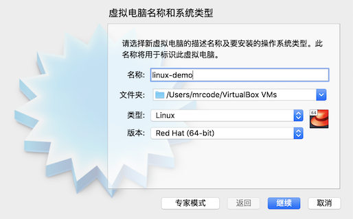

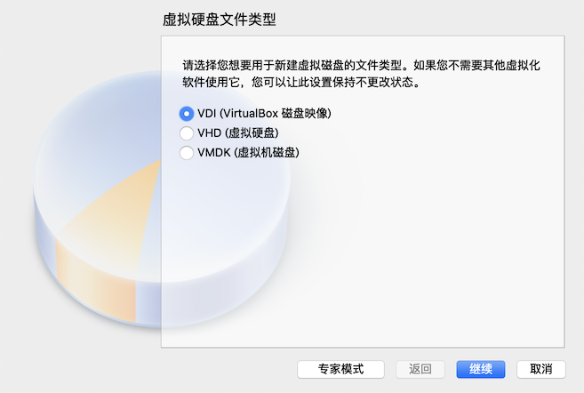


选中完成之后，就创建好一台虚拟机了，下面来细化配置

显卡内存更改为 60 MB

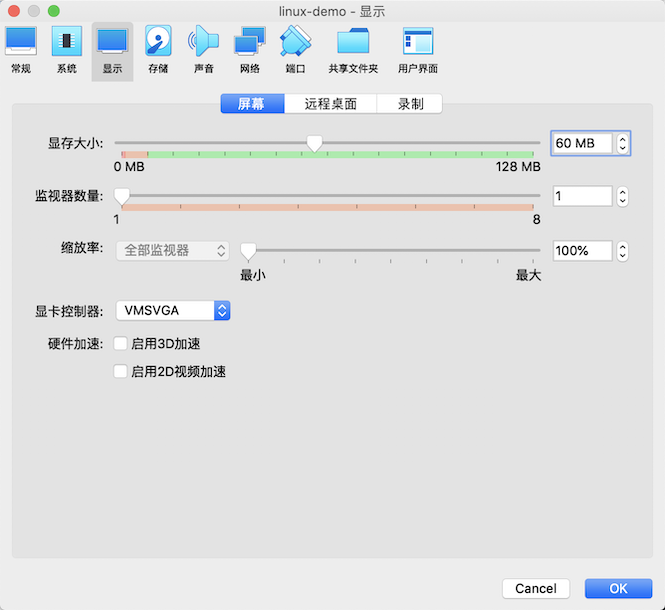


对于存储的选择，这里说明下：

- VDI（VirtualBox）：对应的文件名是 `sda`
- VHD (虚拟硬盘)：对应的文件名是 `sdb`
- VMDK（虚拟机磁盘）：对应的文件名是 `sdb`

注意这里没有书中所说的 vda ，也无法跟着弄 vda 的联系了，只要使用 sdb 替代

使用最终，选中控制器:SATA 右侧会出现添加新磁盘，更改为了如下图的 两颗磁盘

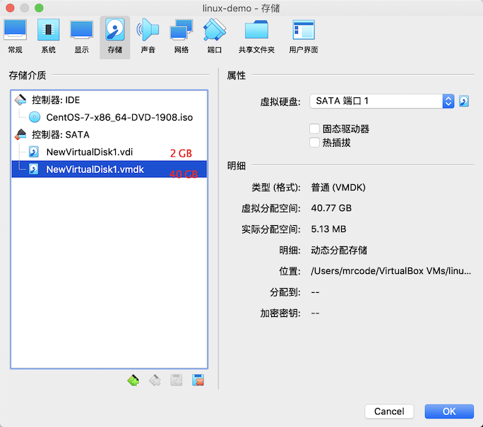

网络先选择桥接网卡，如果后面不能连接网络，笔者会在相关部分进行说明与写出替代方案

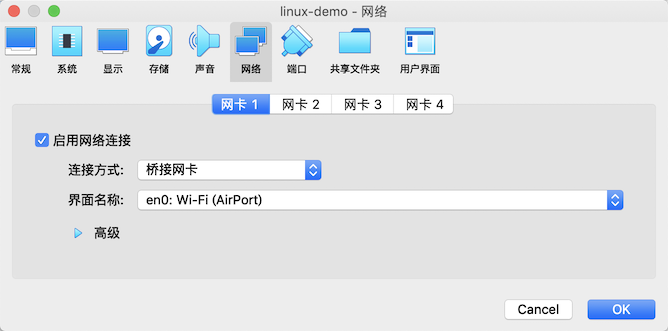

配置虚拟机基础信息就完成了

## 选择安装模式与开机 - inst.gpt
启动这台虚拟机，如果没有问题的话，应该看到如下界面

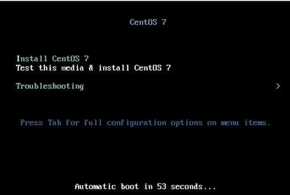

有 60 秒的时间可以选择不同的模式，从上而下分别是：

1. 正常安装 CentOs 7 流程
2. 测试次光盘后再进入 CentOS 7 的流程
3. 进入除错模式！选择此模式会出现更多的选项，分别是：

  - 以基本图形接口安装 CentOS 7
  - 救援 CentOS 系统（Rcscue a CentOS system）
  - 执行内存测试（Run a menmory test）
  - 由本级磁盘正常开机，不由光盘开机（Boot from local drive）

基本上除非你的硬件系统有问题，包括拥有比较特别的图形显示适配器等等，否则使用正常的 CentOS 7 流程即可，
在进入安装流程前，还需要做以下流程再继续

### 加入强制使用 GPT 分区表的安装参数
磁盘小于 2 TB，系统默认会使用 MBR 模式来安装，这里修改配置参数增加 `inst.gpt` 来使用 GPT 分区表，
注意每个参数需要有空格


输入完成之后，按回车，画面就会跑过一段侦测画面，侦测流程依据你的光驱速度、硬件复杂度而又不同，
反正就是等待个几秒钟，显示一堆绿色的 OK 后就会进入到语言选择界面

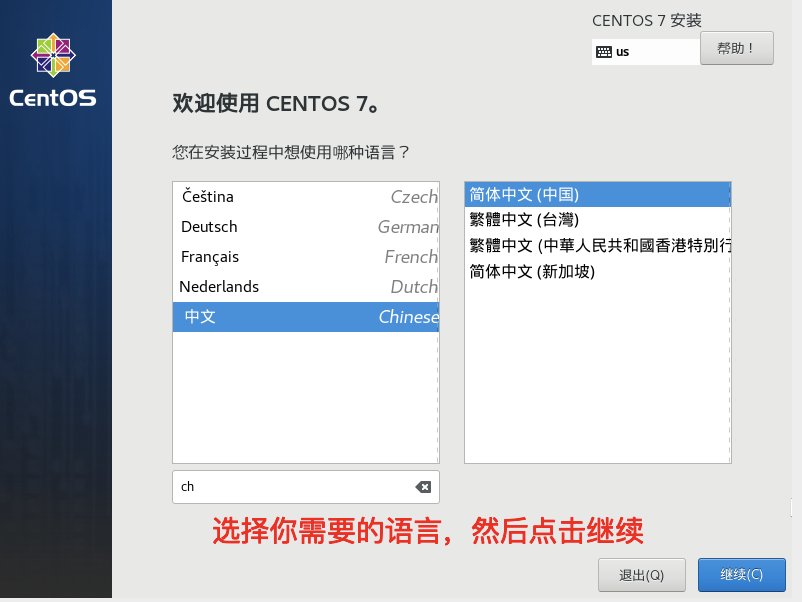

注意，由于我这里的虚拟机在安装过程中，画面显示很小，有时候看不全，就会直接使用书上的图片


## 在地设定之时区、语系与键盘布局
在地设定（简体中文是本地化）


本地化的时区、语言支持和键盘设置，会根据你前面的语言自动默认出来，一般都是都是正确的

特别的需要说明下，在键盘设置中，由于需要打中文，所以设置下汉语的快捷键，勾选你习惯的快捷键即可

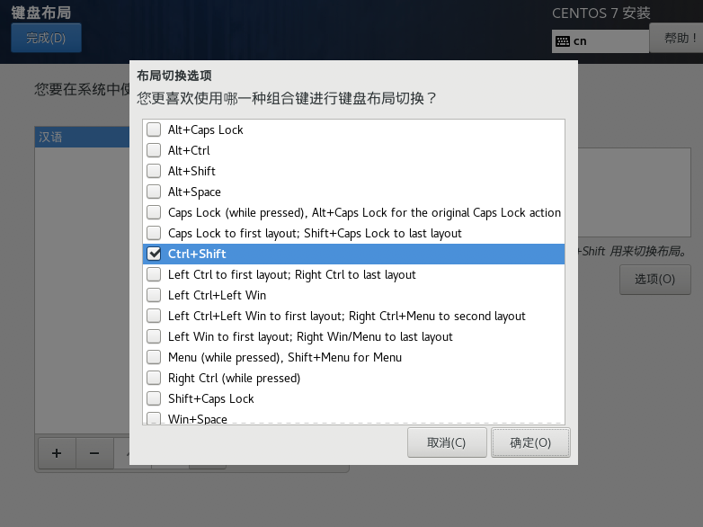

设置完就下图这样


## 安装源设定与软件选择


1. 在虚拟机设置了光盘开机并且设置了 centos 镜像
2. 如果你的安装程序以及预选设置好了网络，那么就可以选择填写一个网络地址的 centos 镜像来安装


默认是最小安装，只安装最简单的工能够，很适合高手慢慢搭建自己的环境，
我们是初学者，选择 GUI 的服务器，因此附加软件可以选择如下软件

- 含有 GUI 的服务器（图形界面，预设搭载 GNOME），这个是安装模式（左侧选择的基本环境）
- GNOME 桌面环境：Linux 常见的图形接口
- KDE Plasma Workspaces：另一套常见的图形接口

只有 KDE 在附加软件中找到了，其他的应该只是解释。还有图上红框的，书上没有解释，所以我也没有勾选

点击完成之后，安装程序会开始检查光盘里面有没有所选的软件，而且解决软件想依赖性的检查（就是讲你所选
的大项目地下的其他支持软件通过加载）

## 磁盘分区与文件系统

也就是进入系统/安装位置配置界面

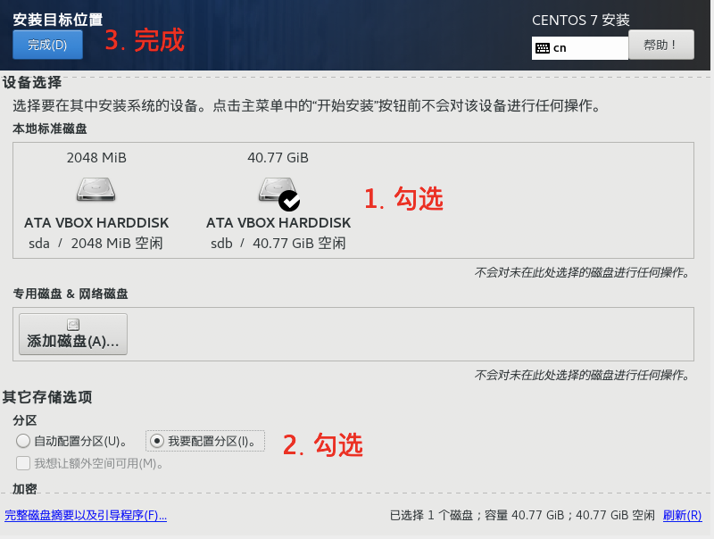

点击完成之后，就会出现手动分区画面

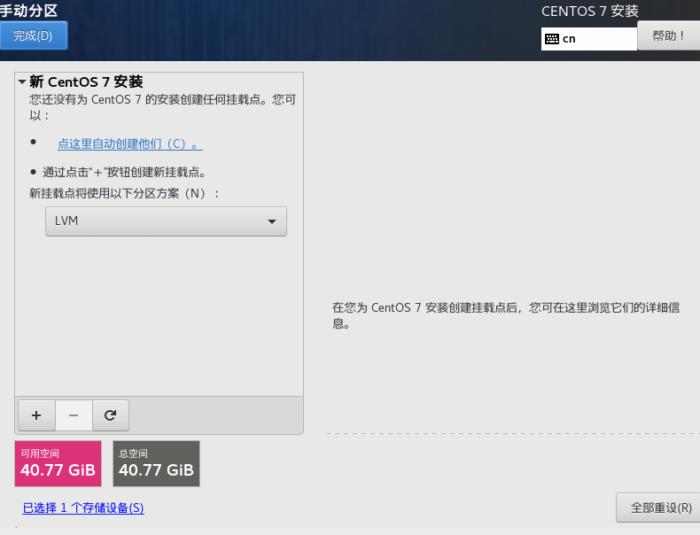

分区槽的新加与删除都是通过那个加号减号来操作，删除则会抹掉数据的

制作第一个 GPT 分区表最好要拥有的 BIOS Boot 分区


注意：挂载点有几个预设的，biosboot 也在里面，可以直接选择

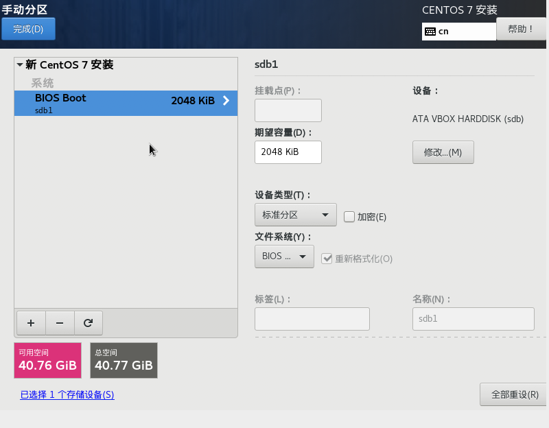

由于是 bios 使用，所以没有挂载点的路径显示

练习机使用标准分区和 LVM，三种装置类型的意义分别如下

- 标准分区：前面一直在说的分区槽，类似 /dev/vda1 之类的分区
- LVM：可以弹性增加/消减文件系统容量的装置设定，会在后面章节持续介绍 LVM
- LVM 简单配置

  与传统 LVM 固定分配内容不同，使用多少容量才分配磁盘多少容量给你，比如你实际数据只占用了 10G,并不会平白无故的占用 40 G 的大小，后续也会讲解

  但是这里笔者有一个疑问，在虚拟机创建磁盘的时候，就有固定和动态分配，
  那么这里的 lvm 还有啥意义呢？是介绍错了？而且进来默认就是 LVM 的

接下来配置其他的挂载点

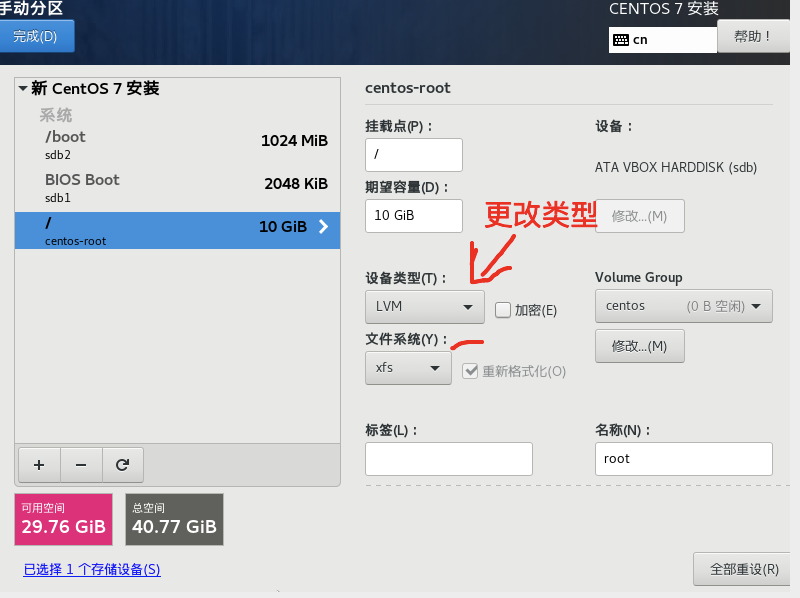

/boot 的设备类型还是使用标准分区，不用修改，「/」及其后面的需要修改为 LVM（按照前面的 [硬盘分区配置清单](./01.md) 来配置）

另外，上图中的文件系统就是在实际格式化的时候，我们可以格式化成什么文件系统的意思，这里分别谈谈（后面章节会持续说明）

- ext2/ext3/ext4

  Linux 早期适用的文件系统类型。由于 ext3/4 文件系统多了日志的记录，
  对于系统的复原比较快速。由于磁盘容量越来越大，ext 就有点不行了，除非你有特殊的需求，基本上不用这种方式了

- swap

  磁盘仿真成为内存，由于 swap 不会使用到目录树的挂载，所以不用指定挂载点
- BIOS Boot

  GPT 分区表可能会使用到的项目，若是使用 MBR 分区，则不需要这个
- xfs

  是目前 CentOS 预设的文件系统，最早是由大型服务器所开发出来的，
  优点就是对大容量磁盘管理好，格式化速度相当快，很适合 TB 级别的磁盘环境
- vfat

  同时被 Linux 与 Windos 所支持的文件系统类型。
  如果你的主机硬盘内同时存在 windows 与 linux 系统，为了数据交换，
  就可以建立一个 vfat 的文件系统

由于 /、/home、swap 都希望使用 CentOS 提供的 LVM 管理，因此需要做一下容量固定配置的修改

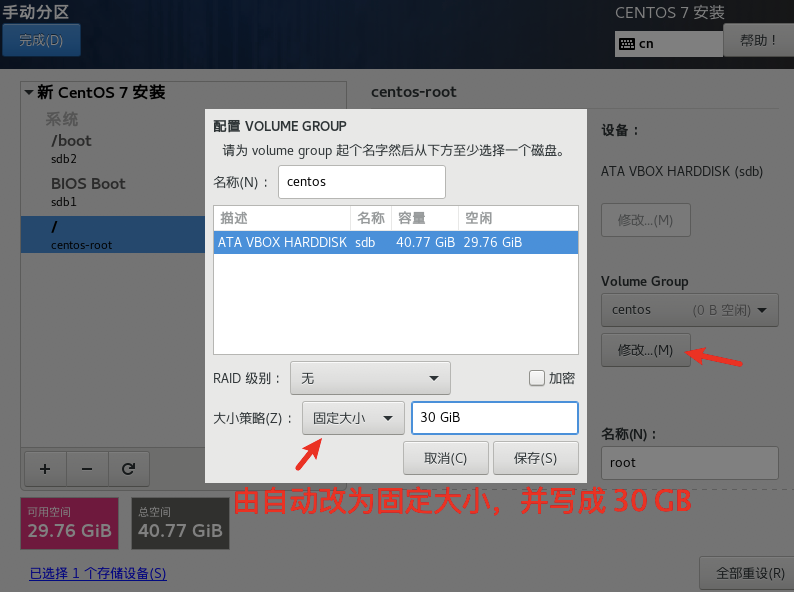

所以上图的固定配置，我不太能看懂了，这里固定的意义是什么？

这里分配 30GB 的容量，剩余 10 GB 的容量是未来章节需要用来练习的。

其他的分区以此建立完成，/home 与 swap 的设备类型也需要更改为 LVM


后续的配置，Volume Group 是用 / 中配置的 centos 默认的组


上图是按照分区清单分完的图，注意看下左下角的红色可用空间，
如果 /、/home、swap 没有配置成 LVM 的话，是不会显示成大约 9 GB 以上的空间的

点完菜，会出现一个弹框，里面是即将要做的事情，接受之后，就会按照这个来分区了


可用看到分区表使用的是 GPT 了，而且后面还有对应设备名称。

这里点击接受更改，回到之前进入的配置画面，以便选择其他的配置

## 核心管理与网络设定

### KDUMP

这个项目主要在处理，当 linux 系统因为核心问题导致的宕机事件时，会将该宕机事件的内存数据存储出来的一项特色功能。不过这个特色视乎比较偏向核心开发者在排错之用。

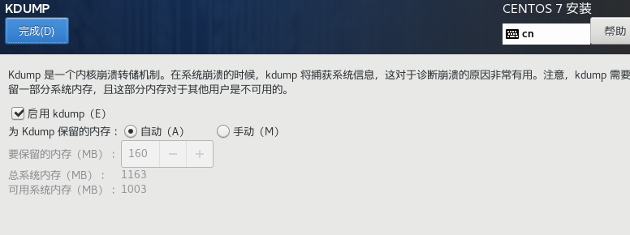

这里使用默认配置

### 网络和主机名


书上说，使用虚拟机，会显示 eth0，而我这里显示 enp0s3，和实体网卡的类似 p1p1、em1 等也对不上，
不知道是不是因为 mac 机器的原因吗？

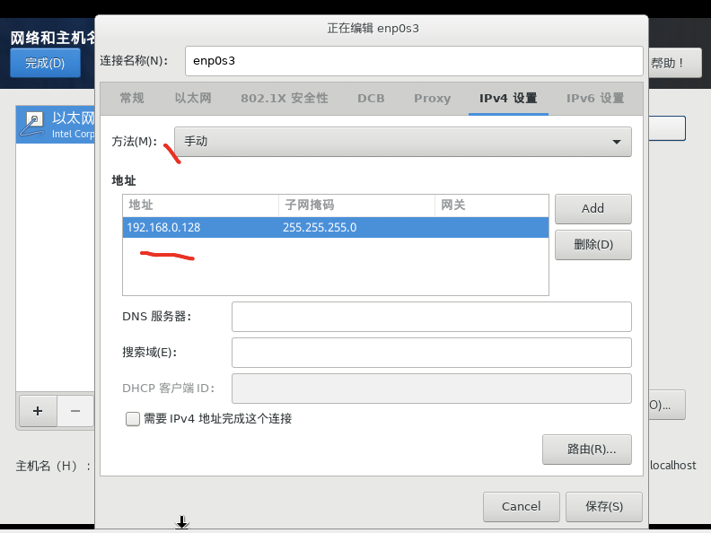

选择 IPV4 ，把 IP 设置为手动，也就是平常说的静态 IP

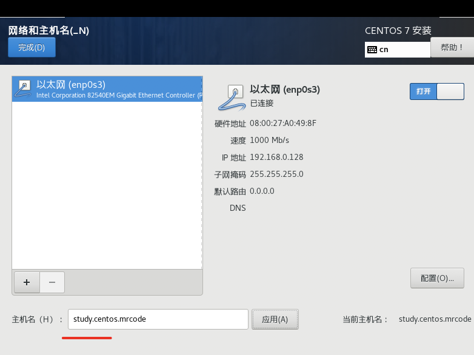

最后配置主机名

## 开始安装、设定 root 密码与新增可切换身份之一般用户
如果一切顺利的话，会看到如下图片（笔者的虚拟机显示画面太小了，上面部分在截图上看不到了）


点击开始安装，现在的安装引导做的还是挺方便的，省略了一堆的步骤。
点击开始安装后，就可以一边让系统安装，同时区设定其他项目了，
如下所示

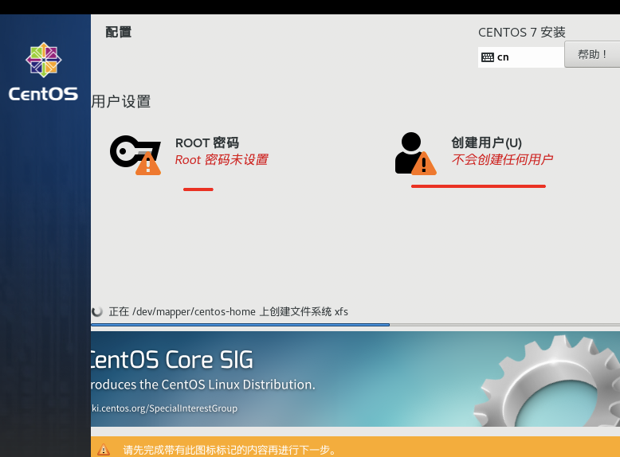

本次 root 密码设置为 123456（注：线上环境一定要配置特别复杂的密码）

这里新建一个普通账户


勾选称为管理员，可以使用自己的密码来切换身份成为管理员，而不用知道 root 的密码，
即使 root 的密码忘记了，还可以切换身份变成 root

配置完后如下图

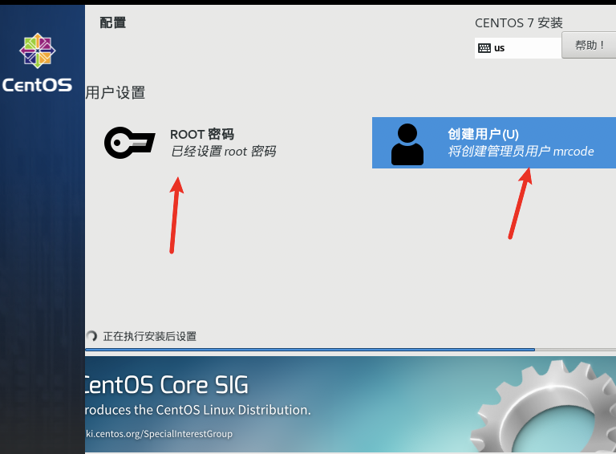

可以看到还在执行安装，等待安装完成后，会出现重启按钮，点击重启

## 准备使用系统前的授权同意

重启的时候出现了 找不到 loader 等相关的错误提示，后来找到问题是因为，之前磁盘的顺序不对


我们系统是装在 40 GB 磁盘上的，所以他的顺序需要在前面，才能作为第一启动磁盘，
修改 SATA 端口 好为 0 就会改动左侧的顺序了

对于前面说，虚拟机显示画面很小的问题，也找到解决方案了，缩放率配置大一点


在我的 mac pro 上，有些程序截图生成的图片会变成原始尺寸的两倍，而这里需要修改缩放率为 2 倍才行，
也搞不明白是为啥


点进去，接受许可，并点击完成配置，就会进入登录界面了。只有第一次登录会有该界面

::: tip
注意：上面使用的硬件配置，在笔者的 mac pro 上进入图形系统很卡，硬件还是分低了的缘故
:::

## 关于 kickstar
书籍中提到之前的安装步骤，通通都会记录到 `/root/anaconda-ks.cfg` 文件中，
这个文件可以提醒与协助未来想要重建一个一模一样的系统。（但是没有发现有这个文件）

kickstar 百度了下，大概是和上面类似的功能，先安装一台，记录这个步骤，然后批量按该步骤安装的功能

## 其他功能：RAM testing，安装笔记本电脑的核心参数（Option）
本节是了解内容，可以不用掌握

### 内存压力测试：memtest
就是测试这部主机是否稳定时，在主机上运行一些比较耗系统资源的程序，让系统在高负载的情况下去运作一阵子（可能是一天），测试稳定度的一种情况，就称为「烧机」

该功能在安装光盘内，还记得启动时选择的菜单吗？依次选择 troubleshooting -> Run a memory test

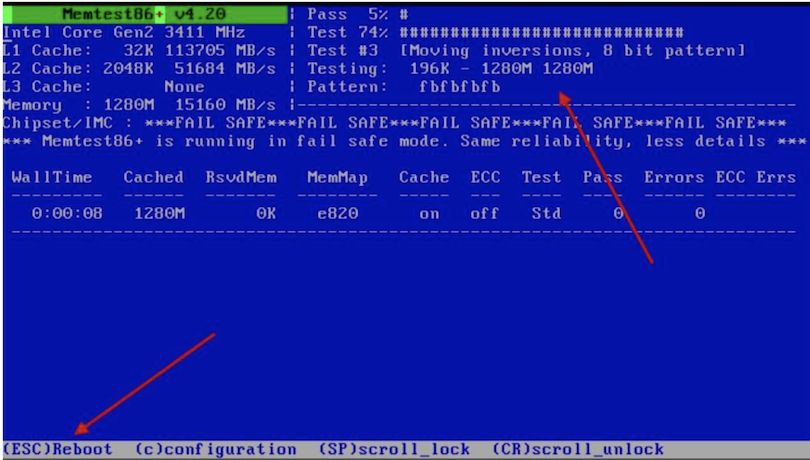

就会开始跑了，直到你按下 esc 按钮为止。只要这里不出事情，系统就比较稳定

### 安装笔记本电脑或则其他类 PC 计算机的参数

由于笔记本电脑加入了非常多的省电机制或则是其他的硬件管理机制，包括显示适配器常常是整合型的，
使用适合一般桌面计算机的 DVD 来安装 linux 时，可能导致出现问题，无法安装到 linux 到你的笔记本电脑中。

这个时候应该配置 linux  核心不要加载一些特殊功能即可。
最常用的方法就是，在使用 dvd 开机时，选择？？？什么，按 tab 键，加入以下的配置项

```
nofb apm=off acpi=off pci=noacpi
```

- apm（Advanced Power Management）：早期电源管理模块
- acpi（Advanced Configuration and Power Interface）：近期的电源管理模块
- nofb ：取消显示适配器上面的缓冲存储器的侦测
