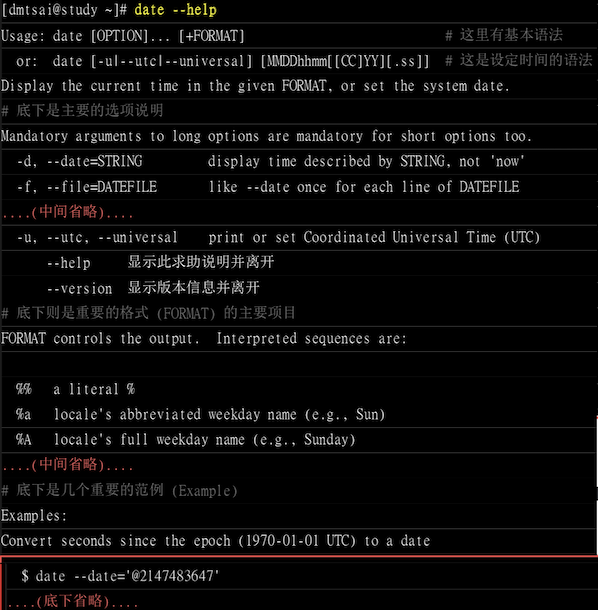
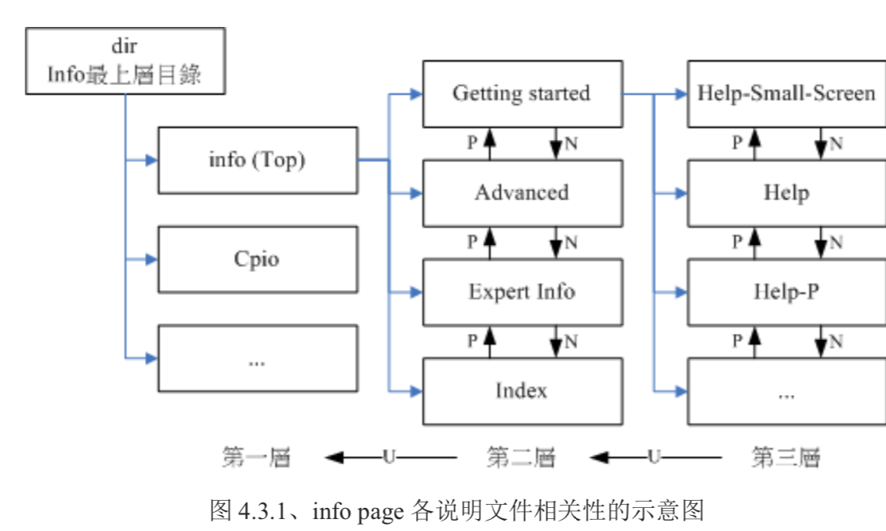

# Linux 系统的在线求助 man page 与 info page
Linux 下的指令是很多的，下面使用 g 补全可以看到有 225 个以 g 开头的命令

```bash
[mrcode@study ~]$ g
Display all 225 possibilities? (y or n)
```

这么多的指令，死记硬背肯定是不行的，由于 Linux 上大多数都是自由软件，因此开发者一般都会提供
文档等方式让你了解这些指令的用法

## 指令的 --help 求助说明



上图已经展示了，他的帮助文档。对于其他的指令也可以使用 --help 来查询.

但是 --help 用在协助你查询「你曾经用过的指令所具备的选项与参数」，如果是从来没有用过的指令，
或则要查询的根本就不是指令，而是文件的「格式」时，就需要通过 man page 了。

## man page

举例来说明

```bash
[mrcode@study ~]$ date --help
Usage: date [OPTION]... [+FORMAT]
  or:  date [-u|--utc|--universal] [MMDDhhmm[[CC]YY][.ss]]
Display the current time in the given FORMAT, or set the system date.

Mandatory arguments to long options are mandatory for short options too.
  -d, --date=STRING         display time described by STRING, not 'now'
```

上面的 date --help 中有一个 STRING ，但是这里并没有详细说明是什么，那么就可以通过
其他的在线求助系统，**man（manual 操作说明）** 来查询

```bash
[mrcode@study ~]$ man date
# 注意括号中的数字
DATE(1)                             User Commands                             DATE(1)

NAME   # 这个指令的完整名称，如下所示为 date 且说明简单用途为 设置与显示日期/时间
       date - print or set the system date and time

SYNOPSIS # 简介：这个指令的基本语法如下
       date [OPTION]... [+FORMAT]   # 单纯显示用法
       date [-u|--utc|--universal] [MMDDhhmm[[CC]YY][.ss]]  # 可以设置系统时间的方法

DESCRIPTION # 详细描述，刚刚谈到的选项与参数的用法
      Display the current time in the given FORMAT, or set the system date.

      Mandatory arguments to long options are mandatory for short options too.

      -d, --date=STRING   # 一个短横线为简写，两个为完整选项名称
             display time described by STRING, not 'now'

      -f, --file=DATEFILE
             like --date once for each line of DATEFILE
      省略....

      # 下面是格式化输出的详细说明

      FORMAT controls the output.  Interpreted sequences are:

      %%     a literal %

      %a     locale's abbreviated weekday name (e.g., Sun)

      %A     locale's full weekday name (e.g., Sunday)
ENVIRONMENT # 与这个指令相关的环境参数的说明
       TZ     Specifies the timezone, unless overridden by command  line  parameters.
              If neither is specified, the setting from /etc/localtime is used.
EXAMPLES # 一些示例用法
       Convert seconds since the epoch (1970-01-01 UTC) to a date

              $ date --date='@2147483647'

       Show the time on the west coast of the US (use tzselect(1) to find TZ)

              $ TZ='America/Los_Angeles' date
DATE STRING  # 这里就解释了上面那个 STRING 是什么
       The --date=STRING is a mostly free format human readable date string  such  as
       "Sun,  29  Feb  2004  16:21:42  -0800"  or "2004-02-29 16:21:42" or even

AUTHOR # 这个指令的作者
      Written by David MacKenzie.

COPYRIGHT # 受到著作权法的保护，用的就是 GPL
    Copyright © 2013 Free Software Foundation, Inc.  License GPLv3+: GNU GPL  ver‐
    sion 3 or later <http://gnu.org/licenses/gpl.html>.
    This  is  free software: you are free to change and redistribute it.  There is
    NO WARRANTY, to the extent permitted by law.
SEE ALSO # 这个重要，你还可以从哪里查到与 date 相关的说明文件的意思
       The full documentation for date is maintained as a  Texinfo  manual.   If  the
       info and date programs are properly installed at your site, the command

              info coreutils 'date invocation'

       should give you access to the complete manual.

GNU coreutils 8.22                   August 2019                              DATE(1)

```

这个文档就很长了，进入之后，就可以通过 shift + Page UP/Page Down 来前后翻页了，
也可以使用「空格」往下翻页，按键 q 退出 man 的环境，更多的 man 指令在后面会讲解

刚刚进入的 man 环境中的文档，就称为 man page，最开始有一个 DATE(1) ，这个数值是有含义的，如下

代号 | 含义
-----|-------------------------------------------------------------------------
1    | **用户在 shell 环境中可以操作的指令或可执行文件**
2    | 系统核心可呼叫的函数与工具等
3    | 一些常用的函数（function）与函式库（library）大部分为 C 的函数库（libc）
4    | 装置文件说明，通常在 /dev 下的文件
5    | **配置文件或则是某些文件的格式**
6    | 游戏（games）
7    | 惯例与协议等，例如 linux 文件系统、网络协议、ASCII code 等等的说明
8    | **系统管理员可用的管理指令**
9    | 跟 kernel 有关的文件

上面的表格内容是从 man 的说明文档里面翻译过来的，`man man` 就是查看自己的说明文档了，里面更详细

注意表格中的 1、5、8 这三个号码特别重要，应该是经常用到，需要背下来

man page 的内容分成几个部分来介绍指令，大致分成地下这几个部分

item        | 含义
------------|---------------------------------------------------------
NAME        | 简短的指令、数据名称说明
SYNOPSIS    | 简短的指令下达语法（syntax）简介
DESCRIPTION | 较为完整的说明，这部分最好仔细看
OPTIONS     | 针对 SYNOPSIS 部分中，有列举的所有可用的选项说明
COMMANDS    | 当这个程序（软件）在执行的时候，可用在此程序中下达的指令
FILES       | 这个程序或数据所使用或参考或链接到的某些文件
SEE ALSO    | 可以参考的，跟这个指令或数据有相关的其他说明
EXAMPLE     | 一些可以参考的范例

有时候，还会看到 authors 与 Copyright 等，不过有很多时候仅有 NAME 与 DESCRIPTION 等部分。
通常可以这样来查询

1. 先看 NAME 部分，略看下这个资料的意思
2. 再详看 DESCRIPTION，这部分会提到很多相关的资料与使用时机，可以学到很多小细节
3. 如果这个指令其实你很熟悉了（例如上面的 date），就可以主要查询下 OPTIONS 部分了，可以知道每个选项的含义
4. 最后，可以看下跟这个资料有关的还有哪些可以使用

   例如上面就告知我们还可以利用 `info coreutils date` 指令来进一步查阅
5. 最后可以看下 FILES 部分

那么在 man page 中还可以使用一些功能来帮助我们

- page up 与 page down 前后翻页
- /word 在任何时候，来主动搜寻关键词，如 `/string` 按回车后，就会高亮搜索到 string 的词语，并跳转过去

### man page 快捷键
下表总结一些常用按键

按键      | 进行工作
----------|----------------------------------------------------------------
空格键    | 向下翻页
Page Down | 向下翻页
Page Up   | 向上翻页
home      | 去第一页
end       | 去到最后一页
/string   | 向下搜寻 string 这个字符串，如果要搜索 vbird 就输入 /vbird
?string   | 向上搜寻 string
n,N       | 利用 / 或 ？来搜寻字符串时，可以用 n 来继续下一个搜寻，N 上一个
q         | 结束这次的 man page

### man page 文档路径
man page 搜索的不是在线的（前面书上说是在线求助），提供 man page 的数据通常放在 `/usr/share/man`
目录的。

可以修改 `/etc/man_db.conf`（由于差异性可能是 man.conf、manpath.conf、man.config 等）中参数
来修改 man page 提供数据的目录地址.

更详细的后面 bash 会讲解

### 搜寻特定指令/文件的 man page 说明文件
在某些情况下，你可能知道要使用某些特定的指令或则是修改某些特定的配置文件，但是忘记了该指令的完整名称。
就可以使用 man -f 来搜索指令，说不定就能找到你想要的

```bash
[mrcode@study etc]$ man -f man
man (1)              - an interface to the on-line reference manuals
man (1p)             - display system documentation
man (7)              - macros to format man pages
# 上面搜索到 3 个 同名的 man
# 可以使用括号中的标识来指定查询哪个 man
[mrcode@study etc]$ man 1 man
[mrcode@study etc]$ man lp man
```

- man -f ：匹配完整的指令（或文件）完整名称； 也就是上面结果的左侧部分
- man -k ：模糊匹配左右侧，如 `man -k man`


还有两个指令与 man page 有关，而这两个指令是 man 的简略写法

- `whatis [指令或者是数据]`  相当于 man -f
- `apropos [指令或则是数据]` 相当于 man -k

注意：这两个特殊指令必须要建立 whatis 数据库才行，需要使用 root 身份下达 `mandb` 指令

```bash
[mrcode@study etc]$ sudo mandb
[sudo] password for mrcode:
Purging old database entries in /usr/share/man...
mandb: warning: /usr/share/man/man8/fsck.fat.8.manpage-fix.gz: ignoring bogus filename
....

旧版 linux 是 makewhatis 指令
```

记住不要背命令，太多，背不住。记住常用的即可，比如 打印相关的命令，只记得 `lp（line print）`

- 使用 man lp 找相关说明
- 在用 lp （tab tab 补全）找相关的指令
- 再用相关的指令添加 --help

哈哈哈，笔者由于没有什么经验，也不知道要找什么，操作下来还是不知道在干什么

## info page
在所有的 unix like 系统中都可以使用 man 来查询指令或则是相关文件的用法。在 linux 中又提供了一种 info page

基本上 info 与 man 的用途其实差不多，但是是一个输出显示比较好的排版，
info page 将文件数据拆成一个一个的段落，每个段落用一个页面展示，各个页面中还有类似网页的超链接来跳转到不同的页面中，每个独立的页面也称为一个节点（node）。可以想象成 info page 是文本模式的网页显示数据

info 指令的文件默认是放在 `/usr/share/info` 目录下的


第一行数据含义：

- file ：表示这个文档的资料来自 info.info 文件提供的
- Node：这个页面属于 top 节点。info.info 内含有很多信息，top 只是其中一个节点内容
- Next：下一个节点的名称是 Getting Started，可以使用「N」按键到下个节点去
- Up：使用 「U」回到上一层
- Prev：前一个节点。

还有一个按键，「h」会进入简易按钮说明，上面列出来的跳转到上下节点，就是在这个里面有说明

```
1 Getting Started
*****************

This first part of this Info manual describes how to get around inside
of Info.  The second part of the manual describes various advanced Info
commands.  The third part briefly explains how to generate Info files
from Texinfo files, and describes how to write an Info file by hand.

* Menu:  

* Help-Small-Screen::   Starting Info on a Small Screen.

```

上面这种 `* Menu` 的，下面列出来的各个部分，就是可以跳转的，使用方向键，移动到上面再按回车，就跳过去了，
比如 移动到 `* Help-Small-Screen::` 这里按回车，就跳进去了，再按 u 就回到 men 这个界面了

还可以使用 tab 按钮快速在 men 下可选项上面移动

如果将各个阶段串联在一起绘制成图，就类似下图这样



### info page 快捷按键

在 info page 中按下 h 键可以看到，下面是整理的部分快捷键

按键      | 进行工作
----------|------------------------------------------------
空格键    | 向下翻页
page down | 向下翻页
page up   | 向上翻页
tab       | 在 node 之间移动，有 node 的地方，通常有 * 显示
enter     | 按回车进入选中 node
b         | 移动光标到该 info 画面中当中的第一个 node 处
e         | 移动光标到该 info 画面当中最后一个 node
n         | 前往下一个 node
p         | 前往上一个 node
u         | 向上移动一层
s(/)      | 在 info page 当中进行搜索
h,?       | 显示求助选单
q         | 结束这次的 info page

info page 是只有 linux 上才有的东西，CentOS 7 将 info page 的文件放置到 `/usr/share/info` 目录中

## 其他有用的文件（documents）
一般指令或软件制作者，都会将软件说明制作成「联机帮助文件」，但是不一定都需要，可能还有额外更多的说明文件，
而且有些软件不只会告诉你如何做，还会告诉你一些相关的原理

/usr/share/doc 这个目录下一般会放置这些说明文件，比如之前分区讲 grub2 开机管理软件有什么能使用的指令？
那么久可以到 `/usr/share/doc/grub2-tools-2.02`(笔者看到的就不是这个，但是的确有相关的)

该目录下的数据主要是以套件（packages）为主，比如 nano 这个软件的相关信息就在 `/usr/share/doc/nano-xx`(xx 表示软件版本)

## 总结

- 在终端机模式中，如果你知道某个指令，但是忘记了相关选项与参数，善用 --help 的功能来查询相关信息
- 当有任何你不知道的指令或文件格式，但是你又想了解他，请使用 man 或则是 info
- 如果你想要架设一些其他服务，或要利用一整组软件来达成某项功能时，请到 /usr/share/doc 查询看有没有相关说明

另外，这些文档中文文件很少，但是不要怕，翻译查阅把
