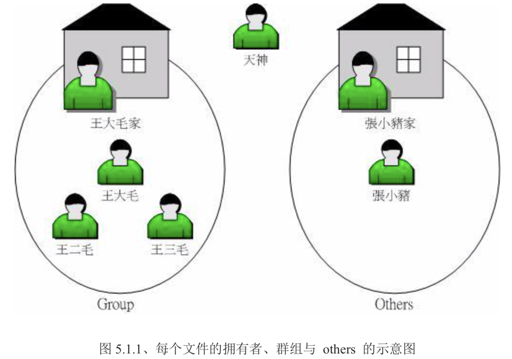

# 使用者与群组

## 文件拥有者
多人任务的场景下，如果没有权限，那么将是很恐怖的事情，
文件拥有者很简单的，只有你才有权利访问与修改。

## 群组概念
群组的最有用功能之一：就是在多人协作方面，只要有该组的权限，使用者就能行驶群组的权限

## 其他人的概念
可以想象成 if else 中的 else，

天神：指 root ，不是拥有者

## 用户身份与群组记录的文件
在 linux 系统当中，默认情况下，相关信息是存储在下面的目录下的

- `/etc/passwd`：账户信息（目前笔者还不知道里面有具体信息，看不太懂）
- `/etc/shadow`：账户密码，不过是加密了的
- `/etc/group`：所有组名

这三个目录可以说是 Linux 系统里面账户、密码、群组信息的集中地，不要随便删除
