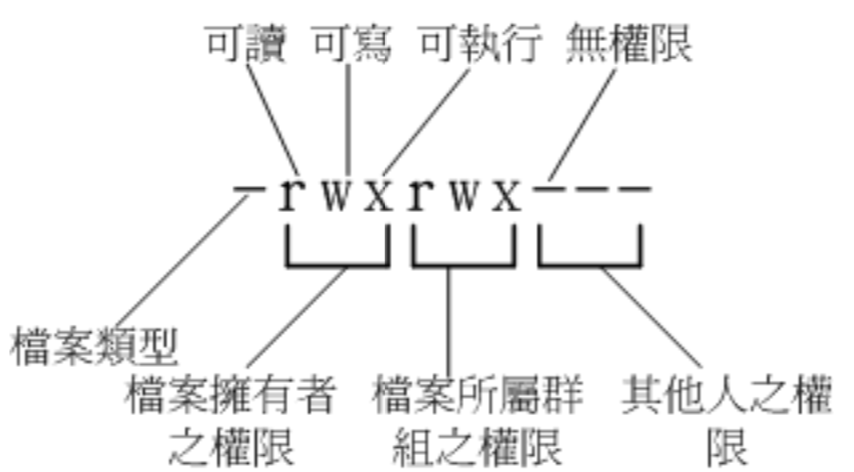

# Linux 文件权限概念
文件权限是如何针对使用者与群组来设定的呢？这个部分相当重要，如果不懂这部分，
那么你将老是听不懂别人在说什么。尤其是当你屏幕上出现了「Permission deny」的时候

## Linux 文件属性

```bash
# 切换到 root 账户
[mrcode@study root]$ su -
Password:
Last login: Mon Oct  7 22:18:11 CST 2019 on pts/0
[root@study ~]# pwd
/root

# 查看当前目录下的文件数据
[root@study ~]# ls -al
total 32
#    权限  连接 拥有者 群组 文件容量 修改日期    文档名
dr-xr-x---.  6 root root  219 Oct  4 22:48 .
dr-xr-xr-x. 17 root root  224 Oct  4 18:31 ..
-rw-------.  1 root root 2175 Oct  4 18:32 anaconda-ks.cfg
-rw-------.  1 root root    5 Oct  4 22:48 .bash_history
-rw-r--r--.  1 root root   18 Dec 29  2013 .bash_logout
-rw-r--r--.  1 root root  176 Dec 29  2013 .bash_profile
-rw-r--r--.  1 root root  176 Dec 29  2013 .bashrc
drwx------.  4 root root   31 Oct  4 22:48 .cache
drwxr-xr-x.  3 root root   18 Oct  4 22:48 .config
-rw-r--r--.  1 root root  100 Dec 29  2013 .cshrc
drwx------.  3 root root   25 Oct  4 18:38 .dbus
-rw-r--r--.  1 root root 2206 Oct  4 18:42 initial-setup-ks.cfg
drwxr-xr-x.  3 root root   19 Oct  4 22:48 .local
-rw-r--r--.  1 root root  129 Dec 29  2013 .tcshrc
```

由于后续的 chgrc、chown 等指令可能都需要使用 root 指令，所以这里使用 root 身份来学习，

- `su -`：切换到 root 身份
- exit：回到你自己的身份
- `ls -al`： list 的意思

  - a：当前目录下的所有文件，包括隐藏文件
  - l：显示详细信息，包括大小，属组，创建时间

### 文件的类型与权限
就是这一串了 `-rw-------` ，有十个字符



文件类型

- d：表示目录
- `-`：文件
- l：连接文档（link file）
- b：装置文件里面的可供存储的接口设备（可随机存取装置）
- c：装置文件里面的串行端口设备、例如键盘、鼠标（一次性读取装置）

接下来就是三个为一组的「rwx」，r 代表刻度 read、w 可写 write、x 可执行 execute，如果没有则使用横线占位

- 第一组：文件拥有者的权限;

  `-rw-r--r--`：就表示可读写，但是不可执行
- 第二组：加入此群组之账户的权限
- 第三组：非本人且没有加入本群组之其他账户的权限

### 连接

表示有多少文档名连接到此节点（i-node)

每个文件都会将他的权限与数学记录到文件系统的 i-node 中，不过这里使用的目录树是使用文件名来记录，
因此每个文档名就会连接到一个 i-node，关于 i-node 后续会讲解

### 拥有者

该文档属于谁

### 所属群组
该文档属于哪个组

### 文件容量，默认单位 bytes
### 修改日期
这个文件的建档日期或则是最佳的修改日期

```bash
# 日期为 月 日 时间，但是这个文件被修改的时间距离现在太久了则只会显示年份了
drwxr-xr-x.  3 root root   19 Oct  4 22:48 .local
-rw-r--r--.  1 root root  129 Dec 29  2013 .tcshrc
```

如果想显示完整的日期时间格式，可以利用 ls 的选项，`ls -l --full-time`

```bash
[root@study ~]# ls -l --full-time
总用量 8
-rw-------. 1 root root 2175 2019-10-04 18:32:06.481779774 +0800 anaconda-ks.cfg
-rw-r--r--. 1 root root 2206 2019-10-04 18:42:03.993000000 +0800 initial-setup-ks.cfgs
```

前面说到过语系的问题，可以修改 `/etc.local.conf` 中的 LANG 变量来永久修改

### 文档名

没什么好说的，特殊是 一个点 `.`，表示隐藏文件，
至于更多的用法，自行查看 ls --help 或则 man ls 或 info ls 等文档了（小提示，当语系为`LANG=zh_CN.UTF-8` 时，文档里面有部分描述是中文的）


::: tip
非常重要的是权限，上面的也稍微记录下
:::

### 权限识别练习

```
-rw-r--r--.  1 root root   18 Dec 29  2013 .bash_logout
drwxr-xr--.  1 root testgroup   18 Dec 29  2013 groups/
```

- 第一个文件：只有 root 可读写，但是没有执行权限
- 第二个目录：

  - root：可读可写
  - testgroup：可读，不能写，**可执行，因此可以能够进入该目录**
  - 取他人：只有 r，可读，但是没有 x，所以都不能进入此目录

### Linux 文件权限的重要性

与 windows 系统不一样的是，在 linux 系统中，每一个文件都加了很多的属性，特别是群租的概念，
最大的用途就是在数据安全性上面

- 系统保护的功能

  举个简单例子，在你的系统中，关于系统服务的文件通常只有 root 才能读写或执行，
  例如 `/etc/shadow` 这个账户管理的文件，这个文件的是个字符都是横线，不能读写执行，
  但是 root 不受限制
- 团队开发软件或数据共享的功能

  就是多人协作的时候，希望每个人都可以使用某一些目录下的文件，而其他人不开放。
  比如 testgroup 团队有三个人 t1、t2、t3 ，那么就可以将团队所需的文件权限设置为 `-rwxrws---`
  该组内的都可读写与执行（等等，这里怎么是 s? 后续会讲解）
- 未将权限设置妥当的危害

  很简单，比如只有 root 才能做的开关机，新增、或删除用户等等的指令，那么随意人都可以用的话，
  就乱套了

## 如何改变文件属性与权限

一个文件的属性与权限有很多，那么我们可以修改哪些呢？这里先介绍几个常用与群组、拥有者、各种身份的权限修改指令

- chgrp：改变文件所属群组
- chown：改变文件拥有者
- chmod：改变文件的权限、SUID、SGID、SBIT 等等的特性

### 改变所属群组 chgrp

语法如下：

```bash
chgrp [-R] 文件或目录

-R：递归变更，如果是目录，则变更该目录以及目录下的所有文件
```

```bash
# 注意看这里，还补全群组
[root@study ~]# chgrp us
usbmuxd  users    
[root@study ~]# chgrp users initial-setup-ks.cfg
[root@study ~]# ls -al initial-setup-ks.cfg
-rw-r--r--. 1 root users 2206 10月  4 18:42 initial-setup-ks.cfg
[root@study ~]# chgrp root initial-setup-ks.cfg
[root@study ~]# ls -al initial-setup-ks.cfg
-rw-r--r--. 1 root root 2206 10月  4 18:42 initial-setup-ks.cfg
```

::: tip
在改变群组的时候，这个组名，必须存在 /etc/group 中
:::
### 改变文件拥有者 chown

::: tip
同样需要改变为存在  /etc/passwd 中有记录的用户名称
:::

语法如下

```bash
chown [-R] 账户名称 文件或目录
chown [-R] 账户名称:组名 文件或目录
```

```bash
[root@study ~]# ls -al initial-setup-ks.cfg
-rw-r--r--. 1 root root 2206 10月  4 18:42 initial-setup-ks.cfg
# 修改为 mrcode 所拥有
[root@study ~]# chown mrcode initial-setup-ks.cfg
[root@study ~]# ls -al initial-setup-ks.cfg
-rw-r--r--. 1 mrcode root 2206 10月  4 18:42 initial-setup-ks.cfg
# 同时修改拥有者和群组
[root@study ~]# chown root:root initial-setup-ks.cfg
[root@study ~]# ls -al initial-setup-ks.cfg
-rw-r--r--. 1 root root 2206 10月  4 18:42 initial-setup-ks.cfg
```


那么什么时候使用 chown 和 chgrp 呢？他们都可以修改组，其实只是一个包含了另一个的功能了而已，
拿这个案例来讲解下

一般我们复制文件使用 cp 命令（`cp 来源文件 目标文件`），那么我需要把某个文件拷贝给 mrcode

```bash
[root@study ~]# cp initial-setup-ks.cfg initial-setup-ks-mrcode.cfg
[root@study ~]# ls -al initial-setup-ks*
-rw-r--r--. 1 root root 2206 10月  4 18:42 initial-setup-ks.cfg
# 注意看这个拷贝出来的拥有者和群组还是 root，就算我给了 mrcode，他也不能读取，权限不够
-rw-r--r--. 1 root root 2206 10月  7 23:30 initial-setup-ks-mrcode.cfg
# 那么使用 chown 同时修改拥有者和群组为 mrcode
[root@study ~]# chown mrcode:mrcode initial-setup-ks-mrcode.cfg
[root@study ~]# ls -al initial-setup-ks*
-rw-r--r--. 1 root   root   2206 10月  4 18:42 initial-setup-ks.cfg
-rw-r--r--. 1 mrcode mrcode 2206 10月  7 23:30 initial-setup-ks-mrcode.cfg
```

### 改变权限 chmod
chmod 指令改变权限有两种形式，一种使用数字，一种使用符号

#### 数字类型改变文件权限

- r = 4
- w = 2
- x = 1

每种身份 owner、group、others 各自的三个权限 r、w、x 分数是需要累加的，
例如权限是 `-rwxrwx---` ，那么分数为：

- owner：rwx = 4 + 2 + 1 = 7
- group：rwx = 4 + 2 + 1 = 7
- ohters：--- = 0 + 0 + 0= 0

语法为

```
chmod [-R] xyz 文件或目录

xyz：就是刚刚的数值类型的权限范围，为 rwz 属性数值的相加
-R：递归
```

常用权限数值：

- `-rw-rw-r--` 664 ：一般文件，可读可写无执行
- `-rwxr-x-r-x` 755：shell 脚本文件，拥有者可读写执行，其他的都只能可读可执行，不可编辑
- `-rwxr------` 740：不希望该文件被其他人看到（能看到文件，但是不能读取里面的内容）

修改示例就是 `chmod 740 text.txt`
