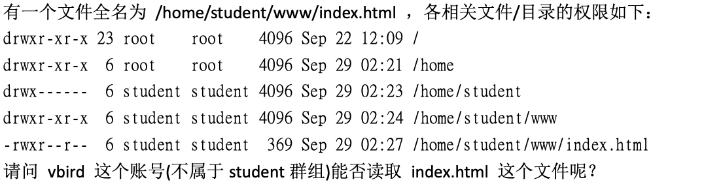

# 极为重要的复习！权限与指令间的关系
权限对于使用者账户来说是非常重要的，因为可以限制使用者不能读取、建立、删除、修改文件或目录。

那么什么指令在什么样的权限下才能够运行？

## 一、让用户能进入某目录称为「可工作目录」的基本权限

- 可使用的指令：例如 cd 等变换工作目录的指令
- 目录所需权限：用户对这个目录至少具有 x 的权限
- 额外需求：如果想在该目录内利用 ls 查阅文件名，则还需要有目录的 r 权限

## 二、用户在某个目录内读取一个文件的基本权限

- 可使用的指令：例如 cat、more、less 等
- 目录所需权限：至少具有 x 权限
- 文件所需权限：至少具有 r 权限

## 三、让使用者可以修改一个文件的基本权限（修改文件内容）

- 可使用的指令：例如 nano 或未来要介绍的 vi 编辑器等
- 目录所需权限：至少具有 x 权限
- 文件所需权限：至少具有 r、w 权限

## 四、让一个使用者可以建立一个文件的基本权限

- 目录所需权限：至少具有 w、x 权限，重点是 x 权限

## 五、让用户进入某目录并执行该目录下的某个指令之基本权限

- 目录所需要的权限：至少具有 x 权限
- 文件所需要的权限：至少具有 x 权限

## 实践与练习

例题 1：让一个使用者 mrcode 能够进行 `cp /dir1/file1 /dir2` 的指令时，
请说明各个文件或目录所需要的最小权限是什么？

cp 是需要读取 file1 的文件内容，并且需要再 dir2 中建立文件

- dir1：具有 x 权限
- file1：具有 r 权限
- dir2：具有 w、x 权限

例题 2：

需要这样分析，由于目录结构由根目录一层一层读取的，因此：

- /home：other 具有 x ，那么就可以进入该目录
- /home/studen 其他人都没有权限，因此不可进入该目录

所以不能读取到 index.html 这个文件，只要更新 /home/studen 目录权限为 711 的最小权限即可
