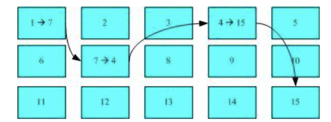
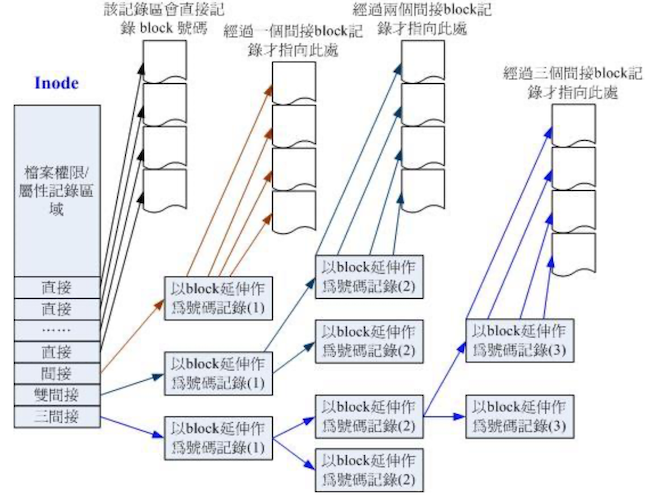
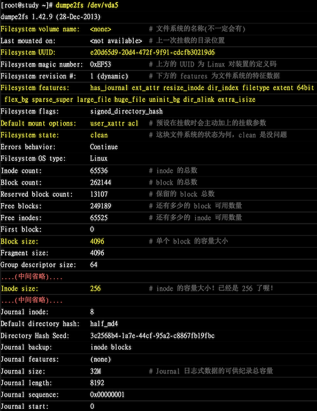

# 认识 Linux 文件系统
最传统的 linux 磁盘文件系统是 EXT2 ，所以要了解 Linux 的文件系统，就要先由 EXT2 开始，而文件系统是建立在磁盘上面的，因此我们得了解磁盘的物理组成才行

- [磁盘物理组成](../00/)
- [磁盘分区](../02/)

前面讲解了以上两个知识点，那么本节重点就在于 inode、block 和 superblock 等文件系统的基本部分

## 磁盘组成与分区的复习
### 磁盘组成
磁盘的组成主要有：

- 圆形的磁盘（主要记录数据的部分）
- 机械手臂，与机械手臂上的磁盘读取头（可擦写磁盘上的数据）
- 主轴马达，可以转动磁盘，让机械手臂的读取头在磁盘上读写数据

数据存储与读取的重点在于磁盘，那么磁盘上的物理组成则为（假设为单盘片）：

- 扇区（Sector）为最小的物理存储单位，且依据磁盘设计的不同，目前主要有 512 bytes  与 4 k 两种格式
- 将扇区组成一个圆，那就是磁柱（Cylinder）
- 早期的分区主要以磁柱为最小单位，现在的分区通常使用扇区为最小分区单位（每个扇区都有其号码）
- 磁盘分区表主要有两种格式：

  - MBR 分区表：限制较多
  - GPT 分区表：新的限制较少
- MBR 分区表中，第一个扇区很重要，里面主要有：

  1. 主要开机区（Master boot record ，MBR），占用 446 bytes
  2. 分区表（partition table），占用 64 bytes

- GPT 分区表除了分区数量扩充较多外，支持的磁盘容量也可以超过 2 TB

磁盘文件名部分，所有实体磁盘的文件名都已经被模拟成 `/dev/sd[a-p]` 的格式，
第一课磁盘文件名为 /dev/sda。而分区槽则为 `/dev/sda[1-128]`（以第一颗磁盘为例）。

虚拟持平通常为  `/dev/vd[a-p]` 格式。如有使用到软件磁盘阵列的话，还有 `/dev/md[0-128]` 的磁盘文件名。使用的是 LVM 时，则为 `/dev/VGNAME/LVNAME` 等格式。

关于磁盘阵列与 LVM 后面会继续介绍，这里主要介绍以实体磁盘及虚拟磁盘为主。

- `/dev/sd/[a-p][1-128]`：为实体磁盘的磁盘文件名
- `/dev/vd/[a-d][1-128]`：为虚拟磁盘的磁盘文件名

### 磁盘分区

GPT 分区表支持大容量的磁盘，小磁盘默认会使用 MBR 的分区，可以使用配置强制使用 GPT 分区表

## 文件系统特性
为什么在分区完成之后需要格式化（format）才能够使用这个文件系统？因为每种操作系统所设定的文件属性、权限不同，为了存放这些文件所需的数据，因此就需要将分区槽进行格式化成操作系统能够利用的「文件系统格式」

windows 使用 FAT16，包括现在的 NTFS 文件系统，Linux 的正统文件系统则为 Ext2（Linux second extended file system，EXT2fs），
在默认情况下，windows 操作系统不会认识 linux 的 ext2 的

传统的磁盘与文件系统之应用中，一个分区槽只能被格式化为一个文件系统，
所以我们可以称之为说一个 filesystem 就是一个 partition。
新技术的出现，如 LVM 与 软件磁盘阵列（software raid），这些技术可以将一个分区槽格式化
为多个文件系统（如 LVM），也可以将多个分区槽合并成一个文件系统（LVM、RAID）。
所以目前在格式化时已经不再说成针对 partition 来格式化了，通常我们可以称呼
**一个可被挂载的数据为一个文件系统而不是一个分区槽**

文件系统的运作与操作系统的文件数据有关。较新的操作系统的文件数据除了文件实际内容外，
通常有非常多的属性（例如 linux 的 rwx 群组等）。

文件系统通常会将这两部分数据分别存放在不同的区块：

- inode： 权限与属性放置处
- data block ：实际的数据
- superblock（超级区块）：记录整个文件系统的整体信息，包括 inode 与 block 的总量、使用量、剩余量等

每个 inode 与 block 都有编号，简介如下：

- superblock

  记录此 filesystem 的整体信息，包括 inode、block 的总量、使用量、剩余量、文件系统的格式与相关信息等
- inode

  记录文件的属性，一个文件占用一个 inode，同时记录此文件的数据所在的 block 号码
- block

  实际记录文件的内容，若文件太大时，会占用多个 block

下图是 inode 与 block 区块图解说明。文件系统先格式化出 inode（灰色） 与 block（蓝色）区块；


假设 inode 4 中记录了 2、7、13、15 这 4 个 block 的号码，操作系统就能够依据此来排列磁盘的阅读顺序，可以一口气将 4 个 block 内容读出来。

这种数据存取方法称为「索引式文件系统（indexed allocation）。那么一般使用的 U 盘，
通常为 FAT 格式，这种文件系统没有 inode 存在，所以没法讲这个文件的所有 block 在一开始就读取出来。每个 block 号码都记录在前一个 block 中，读取方式如下图所示



它只能一个一个将 blcok 读出来后，才会知道下一个 block 在哪里。如果同一个文件数据写入的 block 分散太过厉害，则磁盘读取头可能需要多转好几圈才能读完整个文件内容

**磁盘碎片** 整理就是如此，文件写入的 block 太过于离散了，此时文件读取的效能将会变得很差。可以通过磁盘碎片整理程序将同一个文件所属的 blocks 汇总在一起，这样读取会比较容易

那么 EXT2 是否需要磁盘碎片整理呢？基本不太需要！因为 ext2 是所索引式文件系统。
但是如果文件系统使用太久，常常删除、编辑、新增文件时，还是有可能造成文件数据太过离散的问题。但是貌似基本上没有做过这个碎片整理的操作

## Linux 的 Ext2 文件系统（inode）

ext2 就是使用这种 inode 为基础的文件系统，并且文件系统一开始就将 inode 与 block 规划好了，除非重新格式化（或则利用 resize2fs 等指令变更文件系统大小），
否则 inode 与 block 固定后就不再变动。

当文件系统数据高达数百 GB 时，将所有的 inode 与 block 通通放置在一起很不理智，而且这么多数量的 inode 与 blcok ，不太统一管理。

因此 ext2 文件系统在格式化的时候，基本上是分区为多个区块组（block group）的，
每个区块群组都有独立的 inode、block、superblock 系统。这样分成一群一群的比较好管理，整个来说 ext2 格式化后有点像下图这样


在整体规划中，**文件系统最前面有一个启动扇区（boot sector）**，
这个启动扇区可以安装开机管理程序，这是个非常重要的设计，因为能将不同的开机管理程序安装
到个别的文件系统最前端，而不用覆盖整颗磁盘唯一的 MBR，正因为这样才能够制作出多重引导环境

每个区块群组（block group）的 6 个主要内容如下

### data block 资料区块
data block 是用来存放文件内容的地方，EXT2 中所支持的 block 大小有 1k、2k 及 3k 三种。在格式化时 block 的大小就固定了，并都有编号，方便 inode 的记录。

由于 block 大小的差异，会导致该文件系统能够支持的最大磁盘容量与最大单一文件容量并不相同。限制如下：

Block 大小         | 1 KB  | 2KB    | 4kb
-------------------|-------|--------|------
最大单一文件限制   | 16 GB | 256 GB | 2TB
最大文件系统总容量 | 2 TB  | 8 TB   | 16 TB

虽然 ext2 已经能够支持大于 2GB 以上的单一文件容量，有些应用程序依然使用旧的限制，
无法读取超过 2GB 的文件

block 的基本限制如下：

- 原则上，block 的大小与数理在格式化完成就不能够再改变了（除非重新格式化）
- 每个 block 内最多只能放置一个文件的数据
- 如果文件大于 block 的大小，则一个文件会占用多个 block 数量
- 若文件小于 block ，则该 block 的剩余容量就不能够再被使用（磁盘空间会浪费）

原理如上，那么假设你的 ext2 文件系统使用 4k block，有 10000 个小文件（均为 50 bytes），此时硬盘浪费多少容量？

```
一个 block 只能存储一个文件，每个 block 会浪费：4096 - 50 = 4046 byte
所有文件总量为：50 bytes * 10000 = 488.3 kbytes
此时浪费容量为：4046 bytes * 10000 = 38.6 MBytes

总共不到 1 MB 的总文件容量却浪费近 40 MB 的容量
```

在什么场景下回出现以上所说的问题？比如在 BBS 网站中的数据，使用纯文本记录每篇留言，
当留言内容都都很少时，就会产生很多的小文件（留言越多产生小文件越多）

那么将 block 设置为 1k ，可能也不妥当，因为大型文件会占用数量更多的 block，
而 inode 也需要记录更多的 block 号码，此时将可能导致文件系统不良的读写效能

所以在进行文件系统的格式化时，需要按你的使用场景来预计使用情况，如基本上都是几百兆的文件，那么就选择 4k 的（目前硬盘容量都很大了，所以一般都会选择 4k，而不管场景了）

### inode table
inode 记录文件的属性和实际数据的 block 号码，基本上记录的文件信息至少有以下：

- 该文件存取模式（read、write、excute）
- 文件拥有者与群组（owner、group）
- 文件的容量
- 文件建立或状态改变实际（ctime）
- 最近一次的读取实际（atime）
- 最近修改的时间（mtime）
- 定义文件特性的旗标（flag），如 SetUID 等
- 该文件真正内容的指向（pointer）

inode 的数量与大小在格式化时以及固定，还有以下特点：

- 每个 inode 大小均固定为 128 bytes（新的 ext4 与 xfs 可设定到 256 bytes
- 每个文件仅会占用一个 inode
- 因此文件系统能建立的文件数量与 inode 的数量有关
- 系统读取文件时需要先找到 inode，并分析 inode 所记录的权限与用户是否符合，符合才会读取 block 的内容

下面简略分析 ext2 的 inode、block 与文件大小的关系。

inode 记录的数据非常多，但是仅 128 bytes，记录一个 block 号码花掉 4 byte；
假设有一个文件有 400 MB 且米格 block 为 4k 时，至少需要 10 万笔 block 号码要记录，但是 inode 的 128 byte 怎么能够记录下这么多的号码？

系统将 inode 记录 block 号码的区域定义为 12 个直接、一个间接、一个双间接、一个三间接记录区，如下图所示



- 直接：该区域内直接存取 block 号码
- 间接：该区域内记录了一个 block 号码，该 block 才是记录文件内容的 block 号码
- 双间接：当文件太大时，在第二层中来记录 block 号码
- 三间接：当文件更大时使用，在第三层中记录数据内容的 block 号码

这样子的 inode 能够指定多少个 block 呢？以 1k block 来说明：

- 12 个直接指向：12 * 1k = 12k

  总共可以记录 12 笔记录，总额为 12k
- 间接：256 * 1k = 256k

  每个 block 号码需要 4 byte 来记录，因此 1k 的大小能够记录 256 个。
- 双间接：256 * 256 * 1k = 256 的 2 次方

  第一层 block 会指定 256 个第二层，每个第二层可以指定 256 个号码
- 三间接：256 * 256 * 256 * 1k = 256 的 3 次方

- 总额：直接 + 间接 + 双间接 + 三间接

  12 + 256 + 256 * 256 + 256 * 256 * 256 = 16 GB

在 ext2 中，当 block 格式化为 1k 大小时，能够容量的最大单文件为 16 GB,
在前面的文件系统限制表总的说明大小一致！但是该方法不能用在 2k 以及 4k block 大小的计算中，因为大于 2k 的 block 将会受到 ext2 文件系本身的限制（啥限制？笔者没看明白）

所以新系统能使用 ext4 还是使用最新的文件系统，ext4 的 inode 容量扩大到 256 bytes 了，可以记录更多的文件系统信息，包括新的 acl 以及 SELinux 类型等，单一文件容量高达 16 TB 且单一文件系统总容量可达 1 EB

### Superblock 超级区块
superblock 是记录真个 filesystem 相关信息的地方，没有 superblock 就没有这个 filesystem 了，记录的主要信息有：

- block 与 inode 的总量
- 未使用与已使用的 inode 、block 数量
- block 与 inode （block 1、2、4k，inode 为 128 、256 bytes）
- filesystem 的挂载时间、最近一次写入时间的时间、最近一次检验磁盘（fsck）的时间等
- 一个 valid bit 数值，若此文件系统已被挂载，则 valid bit 为 0，否则为 1

superblock 的大小为 1024 bytes，它非常重要，这个文件系统的基本信息都写在这里，
如果 superblock 挂掉，那么可能需要花费很多时间去挽救。后续使用 dumpe2fs 指令来观察

此外，每个 block group 都可能含有 superblock ，一个文件系统只应该有一个 superblock，多出来的只是备份（这样才可以有救援的机会）；第一个 block group 内会含有 superblock 之外，
后续的 block group 不一定含有 superblock，如果含有则是作为第一个 block group 内
superblock 的备份

### Filesystem Description 文件系统描述说明
该区段可以描述每个 block group 的开始与结束的 block 号码，以及说明每个区段
（superblock、bitmap、inodemap、data block）分别介于哪一个 block 号码之间。
这部分也可以使用 dumpe2fs 指令来观察

### block bitmap 区块对照表
新增文件时会用到 block ，如何选择到一个空的 block 来记录文件数据，就是通过 block bitmap 来知道的。

同样，删除文件时，原本占用的 block 号码需要释放，bitmap 中对应的标志就需要修改

### inode bitmap （inode 对照表）
与 block bitmap 类似，记录 inode 的使用情况

### dumpe2fs 查询 ext 家族 superblock 信息的指令

由于目前 centos7 使用了 xfs 为预设文件系统，所以本次学习无法进行试验，
dumpe2fs 只支持 ext 家族信息查询。

后续讲过格式化内容之后，就可以自己切除一个 ext4 的文件系统来实践这里的指令

这里的 ext 文件系统为 1GB 容量，使用默认方式进行格式化，观察内容如下：

```bash
dumpe2fs [-bh] 装置文件名
```
选项参数：

- b：列出保留为坏轨的部分
- h：仅列出 superblock 的数据，不会列出其他区段的内容

实践练习：

```bash
# 通过该指令查看目前系统有被格式化的装置
# 这里使用一块 1GB ext4 文件系统内容
blkid
# 能看到如下的信息
/dev/vda5: UUID="e20-xxx-333c---" TYPE="ext4"

dumpe2fs /dev/vda5
# 信息非常之多，笔者也没有练习场景，就先截图了
```



利用 dumpe2fs 可以查询到非常多的信息，group 也有号码，这里看 group0 的信息：

- group0 所占用的 block 号码由 0 到 32767 号，superblock 则在第 0 号的 block 区块
- 文件系统描述说明在 第 1 号 block 中
- block bitmap 与 inode bitmap 则在 129 及 145 的 block 号码上
- inode table 分布与 161-672 的 block 号码中
- 由于

  1. 一个 inode 占用 256 bytes
  2. 总共有 672 - 161 + 1（161 本身） = 512 个 block 话在 inode table 上
  3. 每个 block 的大小为 4096 bytes（4k）

  由这些数据可以算出 inode 的数量共有 512 * 4096/256 = 8192 个 inode
- group0 目前可用的 block 有 28521 个，可用的 inode 有 8181 个
- 剩余的 inode 号码为 12-8192 号

想要了解更多信息的话，参考本章最后一小节，否则知道这些信息以及足够了

## 与目录树的关系
前面讲到，每个文件都会占用一个 inode，按文件内容分配多个 block 给文件使用，
在前面的权限章节中有说到，目录记录文件名，而文件是实际记录数据内容的地方，
那么目录与文件在文件系统中是如何记录数据的？

### 目录

当新建一个目录时，**文件系统会分配一个 inode 与至少一块 block 给该目录**，
其中，inode 记录该目录的相关权限与属性和分配的 block 号码，而 block 则记录该目录下的文件名
与该文件名占用的 inode 号码数据。

```
目录所占用的 block 内容记录如下的信息

inode number | 文件名
-------------|--------
522222       | ks.cfg
533333       | setup.cfg
```

可以使用指令来观察上面所示的信息

```bash
# 观察 root 目录下文件所占用的 inode 号码
[root@study ~]# pwd
/root
[root@study ~]# ls -li
总用量 12
25165890 -rw-------. 1 root   root   2175 10月  4 18:32 anaconda-ks.cfg
25165899 -rw-r--r--. 1 root   root   2206 10月  4 18:42 initial-setup-ks.cfg
25377248 -rwxr-xrwx. 1 mrcode mrcode 2206 10月  7 23:30 initial-setup-ks-mrcode.cfg
```

这里有点懵逼，我自己不记得自己当时分区选的是 1k 还是 2k 还是 4k 的了，
而且我这里看也不是书上说的是几乎都是 1024 的倍数（使用 ll 指令查看），
（难道这里书上用的是是 ext 文件格式的问题？）

```bash
[root@study ~]# ll -d / /boot /usr/sbin/ /proc/ /sys/
dr-xr-xr-x.  17 root root   224 10月 11 05:03 /      # 咋和书上不一致？不是 4k
dr-xr-xr-x.   5 root root  4096 10月  4 18:32 /boot   # 1 个 4k block
dr-xr-xr-x. 190 root root     0 10月 16 21:35 /proc/  # 内存数据不占用磁盘容量
dr-xr-xr-x.  13 root root     0 10月 16 21:35 /sys/
dr-xr-xr-x.   2 root root 20480 10月  4 18:25 /usr/sbin/  # 这里也是不一样，是 5 个 4k
```

### 文件
当在 ext2 建立一个一般文件时，ext2 会分配一个 inode 与相对于该文件大小的 block 数量给该文件。
例如：我的一个 block 为 4Kbytes ，创建一个 100KBytes 的文件，会得到 一个 inode 与 25 个 block 来
存储该文件，同时请注意：inode 仅有 12 个直接指向，还需要多一个 block Kauai自以为区块号码记录

### 目录树读取

上面的知识点中并没有说到文件夹会存在 inode 中，文件名的记录是在目录的 block 中的。
因此在前面章节「文件与目录的权限」说明中，才会提到新增、删除、更名文件名 **与目录的 w 权限有关**。

因此我们要读取某个文件时，必须经过目录的 inode 与 block，才能找到要读取文件的 inode 号码，
最终才会读到正确的 block 内的数据

由于目录树是由根目录开始读起的，需要一层一层往下读，举例来说明读取 /etc/passwd 这个文件时的流程：

```bash
[root@study ~]# ll -di / /etc /etc/passwd
      64 dr-xr-xr-x.  17 root root  224 10月 11 05:03 /
16797761 drwxr-xr-x. 143 root root 8192 10月  4 18:38 /etc
18256917 -rw-r--r--.   1 root root 2323 10月  4 18:31 /etc/passwd
```

假设上面 passwd 文件是由 mrcode 这个一般身份使用者读取：

1. `/` 的 inode

  透过挂载点的信息找到 inode 号码为 128 的 64 的根目录，且 inode 规范的权限让我们可以读取该
  block 的内容（有 r 与 x）
2. `/` 的 block

  经过上个步骤取得 block 号码，并找到该内容有 /etc 目录的 inode 号码（16797761）
3. `etc/` 的 inode

  读取 16797761 号的 inode 得知 mrcode 具有 r 与 x 权限，因此可以读取 etc/ 的 block 内容
4. `etc/` 的 block

  经过上个步骤取得 block 号码，并找到该内容有 passwd 文件的 inode 号码（18256917）
5. passwd 的 inode

  读取 18256917 号 inode 得知 mrcode 具有 r 的权限，因此可以读取 passwd 的 block 内容
6. passwd 的 block

  最后将该 block 内容的数据读取出来

### filesystem 大小与磁盘读取效能
关于文件系统的使用效率上，例如规划一个 100GB 的文件系统时，由于磁盘上面的数据总是来来去去的，
所以整个文件系统上面的文件通常无法连续写在一起（block 号码不会连续的意思），
如果写入的 block 真的很分散，此时就有文件 **数据离散** 的问题发生了

如前所述，虽然 ext2 在 inode 处已经将该文件所记录的 block 号码都记录上了，
所以资料可以一次性读取，但是太过离散，确实会发生读取效率低落的问题。
因为磁盘读取头需要再整个文件系统中来来去去频繁读取，如果真的发生了这样的问题，
那么可以将整个 filesystem 内的数据全部复制出来，将该 filesystem 重新格式化，在复制回去，即可解决


此外，如果 filesystem 真的太大了，当一个文件分别记录在该文件系统的最前面和最后面的 block 号码中，
此时会造成磁盘的机械手臂移动幅度过大，也会造成读取低落的问题。所以 partition 的规划并不是越大越好，
而是需要针对用途来规划才行


## ext2、3、4 文件的存取与日志式文件系统的功能

前面谈到读取，如果新建一个文件或目录时，文件系统是如何处理的呢？
这个时候需要 block bitmap 与 inode bitmap 来帮忙了，例如：新增一个文件，此时文件系统的行为是：

1. 先确定用户对于新增文件的目录是否具有 w 与 x 的权限，若有的话才能新增
2. 根据 indoe bitmap 找到没有使用 inode 号码，并将新文件的权限、属性写入
3. 根据 block bitmap 找到没有使用中的 block 号码，并将实际的数据写入 block 中，并且更新 inode 的 block 指向数据
4. 将刚刚写入的 inode 与 block 数据同步更新 inode bitmap 与 block bitmap ，并更新 superblock 的内容

一般来说，将 inode table 与 data block 称为数据存放区，
superblock、block bitmap 、inode bitmap 等区段称为 metadata（中介资料，元数据？），
因为 superblock、block bitmap 、inode bitmap 的数据经常变动，每次新增、移除、编辑都可能会影响
到这三个部分的数据，因此才被称为中介数据

### 数据的不一致（inconsistent）状态
因为意外原因导致上述的新增动作没有全部完成，比如突然停电等，如写入的数据仅有 inode table 和 data block，
字后一个同步更新的步骤没有做完，此时就会发生 metadata 的内容与实际数据存放区不一致（Inconsistent） 的情况了

在早期 ext2 文件系统中，会在系统重新启动的时候，由 superblock 当中的记录的 valid bit（是否有挂载）
与 filesystem state（clean）等状态来判断是否强制进行数据一致性的检查！若有需要检查则以 e2fsck 程序来进行。

不过这样的机制很耗时，要针对 metadata 区域与实际数据存放区来进行比对，要搜索整个 filesystem，
当你文件系统有 100GB 以上，文件数量又多时，就很耗时。
比如该服务器上有对外提供的服务，那么就会延迟对外提供服务了

那么日志式文件系统就兴起了（看来每一个设计都不是完美的，都是在使用中优化的）

### 日志式文件系统（Journaling filesystem）

为了解决不一致的情况发生，而且回复要快速；在 filesystem 中规划处一个区块专门记录写入或修订文件时
的步骤，就可以简化一下一致性检查步骤了：

1. 预备：当系统要写入一个文件时，会先在日志记录区块中记录某个文件准备要写入的信息
2. 实际写入：开始写入文件的权限与数据；开始更新 metadata 的数据
3. 结束：完成数据与 metadata 的更新后，在日志记录区块当中完成该文件的记录

这样一来，只要检查日志记录区块，就可以知道哪个文件发生了问题，能达到快速修复 filesystem 的能，
这就是日志式文件最基础的功能

ext2 不能，需要通过他的升级版本 ext3、4 版本来实现，前面使用 dumpe2fs 输出的信息，
发现 superblock 里面还有下面类似的信息，有 32 M 的容量在处理日志

```
Journal inode:  8
Journal backup: inode blocks
Journal features:
Journal size: 32M
Journal length:
```

## 文件系统的运作
现在知道目录树与文件系统的关系；在 [第 0 章节](../00/) 中知道，所有的数据都要加载到内存后，
CPU 才能对该数据进行处理。如果你常常编辑一个很大的文件，在编辑中又频繁的要系统写入到磁盘中，
由于磁盘写入速度比内存慢很多，因此你会常常耗在等待磁盘写入、读取上。效率太低

为了解决这个问题，linux 使用 asynchronously 方式（异步处理）：
当系统加载一个文件到内存中，如果没有被更动过，则在内存区段的文件数据会被设置为感觉（clean）的。
但如果内存中的文件数据被更动过了（例如编辑过），此时内存中的数据会被设定为脏的（Dirty），
此时所有的动作都还在内存中执行，并没有写到磁盘中。系统不定时的将内存中设定为 Dirty 的数据写回磁盘

因此 linux 系统上面文件系统与内存有非常大的关系：

- 系统会将常用的文件数据放置到主存储器的缓冲区，加速文件系统的读写
- 因此 linux 的物理内存最后都会被用光，这是正常的，可加速系统性能
- 可以手动使用 sync 来强迫内存中设置为 dirty 的文件回写到磁盘中
- 若正常关机时，关机指令会主动调用 sync 将内存的数据回写到磁盘中
- 但若不正常关机时（如断电、宕机等不明原因），由于数据尚未回写到磁盘内，因此重新启动后可能会花很多时间在进行磁盘检验，甚至可能导致文件系统的损坏（非磁盘损坏）

## 挂载点意义 mount point
每个 filesystem 都有独立的 inode、block、superblock 等信息，这个文件系统要能够链接到目录树
才能被我们使用。将文件系统与目录树结合的动作我们成为「挂载」

::: tip
到这里笔者才明白，目录树只是一个系统软件，文件系统是物理硬盘中管理硬盘中数据怎么存储的软件，
他们两个需要通过挂载，目录树才能操作这个硬件
:::

重点：挂载点一定是目录，该目录为进入该文件系统的入口

例如：依据本书前面章节安装 Centos7 的话，那么应该会有三个挂载点，分别是：/、/boot、/home ，
对应的装置文件名为 LVM、LVM、/dev/vda2（笔者上没有找到与书上一致的虚拟磁盘，这里描述可能不一致）。
那么观察这三个目录 inode 号码时，可发现如下情况：

```bash
[root@study ~]# ls -lid / /boot/ /home/
# 书上是 128 号
64 dr-xr-xr-x. 17 root root  224 10月 11 05:03 /
64 dr-xr-xr-x.  5 root root 4096 10月  4 18:32 /boot/
64 drwxr-xr-x.  4 root root   42 10月  8 23:01 /home/
```

这里三个目录的号码都是一样的（有序 xfs 最顶层的目录之 inode 一般为 64），但是我们的确是分了三个挂载点，而且他们的文件系统格式也不一样，
这里难道是说明每个 filesystem 是独立的，他们的号码也是独立的？如果是这样，那么这里就能说得过去了
（这里笔者有点懵逼）

使用文件系统的观点来看，同一个 filesystem 的某个 inode 只会对于到一个文件内容，
可以通过 inode 号码来确定不同文件名是否为相同的文件

```bash
[root@study ~]# ls -lid / /. /..
64 dr-xr-xr-x. 17 root root 224 10月 11 05:03 /
64 dr-xr-xr-x. 17 root root 224 10月 11 05:03 /.
64 dr-xr-xr-x. 17 root root 224 10月 11 05:03 /..

# 这个能看清楚了，/usr 上层目录就是 /  为 64
[root@study /]# ls -lid /usr/ /usr/. /usr/..
25377249 drwxr-xr-x. 13 root root 155 10月  4 18:21 /usr/
25377249 drwxr-xr-x. 13 root root 155 10月  4 18:21 /usr/.
      64 dr-xr-xr-x. 17 root root 224 10月 11 05:03 /usr/..

```

## 其他 Linux 支持的文件系统与  VFS
虽然 linux 的标准文件系统是 ext 家族，事实上还支持很多文件系统格式，尤其是近来推出的几种
速度很快的日志式文件系统，如 SGI 和 XFS 文件系统，可以使用更小型文件的 Reiserfs 文件系统，
以及 windows 的 FAT 文件系统等。常见的支持文件系统有：

- 传统文件系统：ext2、minix、MS-DOS、FAT（用 vfat 模块）、iso9660（光盘）等
- 日志式文件系统：ext3/4、ReiserFS、windows NTFS、IMB JFS、SGI XFS、ZFS
- 网络文件系统：NFS、SMBFS

想要知道你的 linux 支持哪些文件系统，可以查看下面目录

```bash
[root@study /]# uname -r
3.10.0-1062.el7.x86_64
[root@study /]# ls -l /lib/modules/3.10.0-1062.el7.x86_64/kernel/fs/

# 系统目前已加载到内存中支持的文件系统有;出来挺多格式的
[root@study /]# cat /proc/filesystems
```

那么 Linux 的核心是如何管理这些认识的文件系统的？整个 linux 系统都是通过一个名为
Virtual Filesystem Switch（VFS） 的核心功能去读取 filesystem 的。使用者并不需要知道每个
partition 上的 filesystem 是什么，VFS 会做好读取动作

假设 / 使用的是 /dev/hda1 用 ext3，而 /home 使用 /dev/hda2 用 reiserfs ，
那么你取用 /home/mrcode/.bashrc 时，你没有特别指定用什么文件系统的模块来读取，整个就是 VFS
的功能。 VFS 简略图示如下


## XFS 文件系统简介

为什么从 CentOS 7 将预设文件系统由 ext4 变成了 XFS 文件系统了呢？为啥舍弃支持度最完整的 ext ？
原因如下

### Ext 家族优点：支持度最广，但格式化超慢
ext 文件系统对于文件格式化的处理，采用预先规划处所有的 inode、block、meta data 等数据，
未来系统可以直接取用，不需要再进行动态配置的作为。

在早期容量不大的时候没有问题，在大容量磁盘上来预先分配，尤其是在 PB 或 EB 级别的磁盘，
格式化就很慢了（书上说格式化 70 TB的磁盘阵列为 ext4 文件系统，出去喝完咖啡回来还没有格式完）

另外，虚拟化应用广泛起来，而作为虚拟化磁盘来源的巨型文件（单一文件好几个 GB 以上）也常见起来。

所以改用了 xfs 这一个较适合高容量磁盘与巨型文件效能较佳的文件系统了

::: tip
速度方面可能仅在格式化，文件系统复原速度等方面有很大区别，很慢
:::

### XFS 文件系统的配置

xfs 是一个日志式文件系统，最早是被开发来用于高容量磁盘以及高性能文件系统之用，
此外几乎所有 ext4 文件有的功能，xfs 都可以具备

xfs 文件系统在资料的分布上，主要规划为 3 个部分：

- 一个资料区（data section）
- 一个文件系统活动等录区（log section）
- 一个实时运作区（realtime section）

#### 资料区（data section）
#### 文件系统活动等录区（log section）
#### 实时运作区（realtime section）
