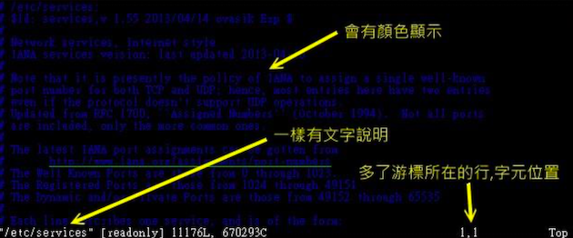
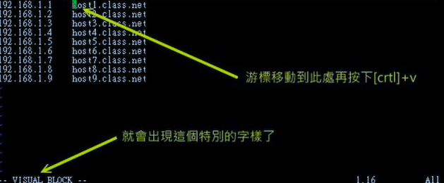
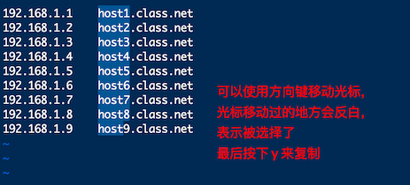
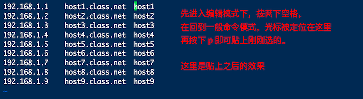
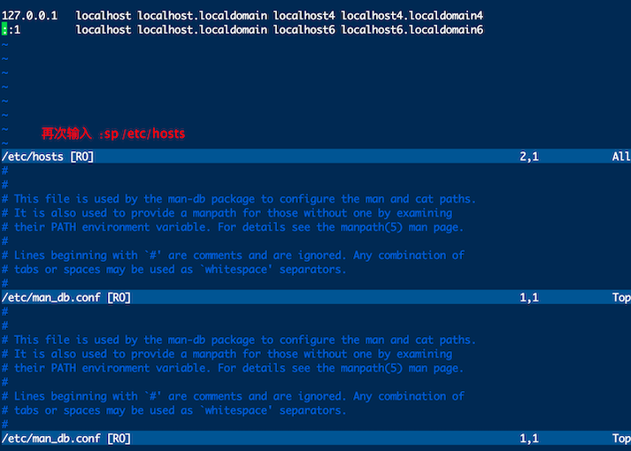

# vim 额外功能

其实，目前大部分的distribution 都以 vim 取代 vi 的功能了，因为 vim 具有颜色显示、支持许多程序语法（syntax）等功能

那么怎么分辨是否当前 vi 被 vim 取代了呢？

通过 alias 分辨

```bash
[mrcode@study vitest]$ alias
alias egrep='egrep --color=auto'
alias fgrep='fgrep --color=auto'
alias grep='grep --color=auto'
alias l.='ls -d .* --color=auto'
alias ll='ls -l --color=auto'
alias ls='ls --color=auto'
alias vi='vim'			# 可以看到这里 vi 调用的就是 vim
alias which='alias | /usr/bin/which --tty-only --read-alias --show-dot --show-tilde'
# 原来上一个章节，笔者使用的不是 vi 而是 vim
```

通过界面分布



上面显示了光标所在行和当前行第几个字符，这个其实就是 vim 了，而且上面的文字颜色也变成了蓝色

## 区块选择（Visual Block)

上面提到的简单 vi 操作过程中，几乎提到的都是以行为单位来操作的。那么如果想要搞定一个区块范围呢？如下面这个文件内容

```
192.168.1.1    host1.class.net
192.168.1.2    host2.class.net
192.168.1.3    host3.class.net
192.168.1.4    host4.class.net
192.168.1.5    host5.class.net
192.168.1.6    host6.class.net
192.168.1.7    host7.class.net
192.168.1.8    host8.class.net
192.168.1.9    host9.class.net
```

假设想要将 host1，host2 等复制，并且加到每一行的后面，即每一行的结果变成 `192.168.1.1    host1.class.net host2.class.net...` 。在传统或现代的窗口型编辑器似乎不容易达到这个需求，在 vim 中可以使用 Visual Block 区块功能。当按下 v 或 V 或则 ctrl+v 时，光标移动过的地方就会开始反白，按键含义如下

|   按键   | 含义                                 |
| :------: | ------------------------------------ |
|    v     | 字符选择，会将光标经过的地方反白选择 |
|    V     | 行选择，会将光标经过的行反白选择     |
| ctrl + v | 区块选择，可以用长方形的方式选择     |
|    y     | 将反白的地方复制起来                 |
|    d     | 将反白的地方删除                     |
|    p     | 将刚刚复制的区块，在光标所在处贴上   |

实践练习区块怎么使用







该功能很强，在 idea 编辑器中也提供了类似的功能，区块编辑

## 多文件编辑

想象这样一个场景：要将刚刚 host 内的 IP 复制到 /etc/hosts 这个文件去，那么该如何编辑？我们知道在 vi 内可以使用 :r filename 来读入某个文件的内容，不过是将整个文件读入，如果只想要部分内容呢？这个时候就可以使用 vim 的多文件编辑功能了。使用 vim 后面同时接好几个文件来同时开启，相关按键有

|  按键  | 含义                            |
| :----: | ------------------------------- |
|   :n   | 编辑下一个文件                  |
|   :N   | 编辑上一个文件                  |
| :files | 列出目前这个 vim 开启的所有文件 |

没有多文件编辑的话，实现将 A 文件内的 10 条消息移动到 B 文件中，通常需要开两个 vim 窗口来复制，但是无法在 A 文件下达 nyy 再跑到 B 文件去 p 的指令。

练习多文件编辑

```bash
# 开启两个文件，host 是我们刚刚编辑的那个
vi host /etc/hosts
# 使用 files 指令查看编辑的文件有哪些
# 在一般指令模式下输入 :files 指令
:files
  1 %a   "host"                         line 1
  2      "/etc/hosts"                   line 0
Press ENTER or type command to continue
# 上面列出了两个，并告知按下任意键会回到 vim 的一般指令模式中

1. 回到一般指令模式中，跳转到第一行，输入 4yy 复制 4 行数据
2. 输入 :n 会来到第二个编辑的文件，也就是 /etc/hosts
3. 按下 G 跳转到最后一行，再按 p 贴上 4 行数据
4. 按下多次 u 来取消刚才的操作，也就是恢复 /etc/hosts 中数据到原样
5. 最终按下 :q 离开 vim 编辑器
```

# # 多窗口功能

在开始逐个小节前，先来想象两个情况：

1. 当我有一个文件非常的大，查阅到后面的数据时，想要*对照*前面的数据，是否需要使用 ctrl + f 与 ctrl + b 或 pageup、pagedown 功能键来前后翻页对照？
2. 我有两个需要对照看的文件，不想使用前一小节提到的多文件编辑功能

vim 有「分区窗口」的功能，在指令行模式输入 `:sp filename`即可，filename 存在则开启另一个文件，不存在则出现的是相同的文件内容

使用 vim /etc/man_db.conf，然后输入 「:sp」就会出现上下各一个窗口，两个窗口都是同一个文件内容


再次输入 `:sp /etc/hosts` 则会再分出来一个窗口


可以使用 ctrl + w + ↑ 和 ctrl + w + ↓ 组合键来切换窗口（笔者测试使用 ctrl + w 可以切换 ctrl + w + 箭头触发了宿主机的 ui 切换功能）

多窗口情况下的按键功能

|      按键       | 说明                                                         |
| :-------------: | ------------------------------------------------------------ |
| :sp [filename]  | 开启一个新窗口，不加 filename 则默认打开当前文件，否则打开指定文件 |
| ctrl + w + j/↓  | 使用方法：先按下 ctrl 不放，再按下 w 后放开所有的按键，再按下 j 或向下的箭头键，则光标可移动到下方的窗口 |
| ctrl + w + k/上 | 同上                                                         |
|  ctrl  + w + q  | 就是 :q 结束离开。比如：想要结束下方的窗口，先使用 ctrl + w + j 移动到下方窗口，输入 :q 或则按下 ctrl + w + q 离开 |

## vim 的挑字补全功能

我们知道在 bash 环境下可以按下 tab 按钮来达成指令、参数、文件名的补全功能，还有 windows 系统上的各种程序编辑器，如 notepad++，都会提供：语法检验和根据扩展名来挑字的功能。

在语法检验方面，vim 已经使用颜色来达成了，建议可以记忆的 vim 补齐功能如下：

|       组合按键       | 补齐内容                                                  |
| :------------------: | --------------------------------------------------------- |
| ctrl + x -> ctrl +n  | 通过目前正在编辑的这个「文件的内容文件」作为关键词，补齐; |
| ctrl + x -> ctr + f  | 以当前目录内的「文件名」作为关键词，予以补齐              |
| ctrl + x -> ctrl + o | 以扩展名作为语法补充，以 vim 内置的关键词，予以补齐       |

用法：先输入关键词如 host 再按 ctrl + x，再按 ctrl + n，如果有可补齐的待选文案，会显示下拉列表给你选择

实践练习：使用 css 美化功能时，突然想到有个北京的东西要处理，但是忘记了背景 CSS 关键语法，就可以用如下的模式来处理

```bash
# 一定要是 .html 否则不会使用正确的语法检验功能
vi htmltest.html  
```


## vim 环境设置与记录：`~/.vimrc`、`~/.viminfo`

有没有发现：如果以 vim 软件来搜寻一个文件内部的某个字符串时，这个字符串会被反白，而下次我们再次以 vim 编辑这个文件时，该搜索的字符串反白的情况还是存在的，甚至于在编辑其他文件时，如果也存在该字符，也会主动反白。另外，当我们重复编辑同一个文件时，当第二次进入该文件时，光标竟然在上次离开的那一行上面

这是因为 vim 会主动将你曾经做过的行为记录在 `~/.viminfo` 文件中，方便你下次可以轻松作业

此外，每个 distribution 对 vim 的预设环境都不太相同，例如：某些版本在搜寻关键词时并不会高亮度反白，有些版本则会主动帮你进行缩排的行为。这些其实都可以自定设置的，vim 的环境设置参数有很多，可以在一般模式下输入「:set all」来查询，不过可设置的项目太多了，这里仅列出一些平时比较常用的一些简单设置值，供你参考

vim 的环境设置参数

|                item                | 含义                                                         |
| :--------------------------------: | ------------------------------------------------------------ |
|         :set nu、:set nonu         | 设置与取消行号                                               |
|   :set hlsearch、:set nohlsearch   | hlsearch 是 high light search （高亮度搜索）。设置是否将搜索到的字符串反白设置。默认为 hlsearch |
| :set autoindent、:set noautoindent | 是否自动缩排？当你按下 Enter 编辑新的一行时，光标不会在行首，而是在于上一行第一个非空格符处对齐 |
|            :set backup             | 是否自动存储备份文件，一般是 nobackup 的，如果设置为 backup，那么当你更改任何一个文件时，则源文件会被另存一个文件名为 filename~ 的文件。如：编辑 hosts，设置 :set backup ，那么修改 hosts 时，在同目录下就会产生 hosts~ 的文件 |
|             :set ruler             | 右下角的状态栏说明，是否显示或不显示该状态的显示             |
|            :set shwmode            | 是否要显示 ---INSERT-- 之类的提示在左下角的状态栏            |
|        :set backpace=(012)         | 一般来说，如果我们按下 i 进入编辑模式后，可以利用退格键（baskpace）来删除任意字符的。但是某些 distribution 则不允许如此。此时，可以通过 backpace 来设置，值为 2 时，可以删除任意值；0 或 1 时，仅可删除刚刚输入的字符，而无法删除原本就已经存在的文字 |
|              :set all              | 显示目前所有的环境参数设置                                   |
|     :syntax on 、 :syntax off      | 是否依据程序相关语法显示不同颜色                             |
|    :set bg=dark、:set bg=light     | 可以显示不同颜色色调，预设是 light。如果你常常发现批注的字体深蓝色是在很不容易看，就可以设置为 dark |

总之这些常用的设置非常有用处，但是在行模式下设置只是针对当前打开的 vim 有效果；想要修改默认打开就生效的话，可以修改 `~/.vimrc` 这个文件来达到（如果此文件不存在，请手工创建）