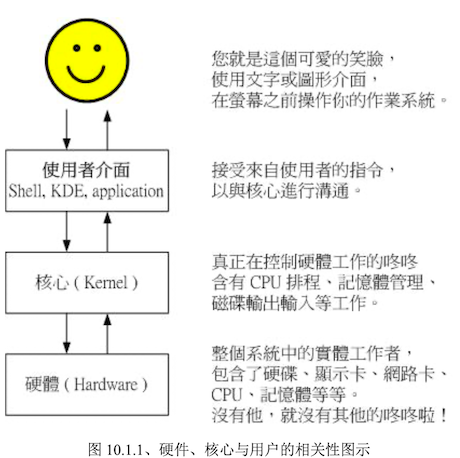

# 认识 BASH 这个 Sehll

在第一章讲到：管理整个计算机硬件的其实是操作系统的核心（kernel），一般使用者只能通过 shell 来与核心沟通。那么有系统有多少 shell 可用呢？以及为什么要使用 bash？本章告诉你答案

## 硬件、核心与 Shell

什么是 Shell？几乎上都听听到过，因为只要有操作通，那么就离不开 Shell 这个东西。在讨论 Shell之前，先来了解一下计算机的运作状况。举个例子：当你要计算机传输出来「音乐」的时候，你的计算机需要什么东西呢？

1. 硬件：有「声卡芯片」设备，才能发声
2. 核心管理：操作系统支持这个芯片组，以及提供芯片的驱动程序
3. 应用程序：需要使用者（就是你）输入发生声音的指令

这就是基本的一个输出声音所需要的步骤，可以用如下图示来说明：



在第 0 章的操作系统章节曾提到过：操作系统其实是一组软件，控制整个硬件与管理系统的活动检测，如果这组软件能被用户随意的操作，若使用者应用不当，将会使得整个系统崩溃！所以不能随便被一些没有管理能力的终端用户随意使用

但是可以考虑使用程序来指挥核心，在第 0 章所提供的操作系统图示中，可以发现应用程序其实是在最外层，就如同鸡蛋的外壳一样，因此也就被称呼为壳程序（Shell）

其实壳程序的功能只是提供用户操作系统的一个接口，因此整个壳程序需要可以呼叫其他软件的功能，如前面提到过的很多指令，包括 man、chmod、chown、vi、fdisk、mkfs 等指令，这些指令都是独立的应用程序，但是可以通过壳程序（指令行模式）来操作这些应用程序

也就是说，只要能够操作应用程序的接口都能够成为壳程序。狭义的壳程序指的是指令方面的软件，包括本章要介绍的 bash 等。广义的壳程序包括图形界面软件。

## 为何要学习文字接口的 shell？

文字接口的 shell 不好学，但是学了之后好处多多，因此需要克服这个困难

## # 文件接口的 shell：大家都一样

为什么要学习 shell？x window 下的 ui 工具点一点就可以达到目的，比如 Webmin 是真的好用，他可以帮我很建议的设置我们的主机，甚至是一些很进阶的设置都可以帮我们搞定

但是这里还是需要再强调下：x window 与 web 接口的工具，它虽然功能强大，只是把所有利用到的软件整合到一起的一组程序而已，并非一个完整的套件，所以某些当你升级或则是使用其他套件管理模块（如 tarball 而非 npm 文件等）时，就会造成设置的困扰了。甚至不同的 distribution 所设计的 x window 接口也都不相同，这样也造成学习方面的困扰

而几乎各家 distribution 使用的 bash 都是一样的，如此一来几乎上能够轻轻松松的转换不同的 distribution

### 远程管理：文字接口就是比较快

Linux 的管理常常需要通过远程联机，而联机时文字接口的传输速度一定比较快，而且不容易出现断线或则是信息外流的问题，因此 shell 真的是得学习的一项工具，而且会让你更深入 Linux。

### Linux 的任督二脉：shell

所谓技多不压身，书到用时方恨少。此外，如果你真的有心要将你的主机管理好，那么良好的 shell 程序编写是一定需要的！

例如作者的经验来说，管理的主机不到十台，但是如果每台书籍都要花上几十分钟来查询他的登录文件信息以及相关的信息，可能会疯掉，太没有效率。但是通过 shell 提供的数据流重导向以及管线命令，分析登录信息只要花费不到十分钟就可以看完所有的主机的重要信息了

由于学习 shell 的好处真的多多，想要管理好系统的话，shell 就像是打通任督二脉一样，任何武功都能随你应用

## 系统的合法 shell 与 /etc/shells 工能

由于早年 Unix 年代，发展众多，所以 shell 依据发展者的不同就有许多版本，例如 Bourne SHell（sh）、在 Sun 里头预设的 CSHell、商业上常用的 K Shell、TCSH 等，每一种 Shell 都各有其特点。而 Linux 使用的这一种版本就称为「Bourne Again SHell（简称 bash），是 Bourne Shell 的增强版，也是基于 GNU 的架构下发展出来的

### shell 简单历史

第一个流行的 shell 是由 Steven Bourne 发展出来的，所以称为 Bourne shell（简称 sh）。后来另一个广泛流传的 shell 是由柏克莱大学的 Bill Joy 设计依附于 BSD 版的 Unix 系统中的 shell，该 shell 语法类似 c 语言，所以才得名为 C shell（简称 csh）。 Sun 主要是 BSD 的分支之一，而且 Sun 主机势力庞大，所以 csh 流传广泛

### 目前 Linux 可以使用的 shells

以 CentOS 7 为例，有多少我们可以使用的 shells 可以通过检查 /etc/shells 文件，至少有以下几个

- /bin/sh：已被 /bin/bash 所取代
- /bin/bash：Linux 预设的 shell
- /bin/tcsh：整合 C Shell 提供更多的功能
- /bin/csh：已被 /bin/tcsh 取代

虽然各家 shell 的功能都差不多，但是在某些语法下达方面则所有不同，因此建议需要选择一种 shell 来熟悉。Linux 预设就是使用的 bash，因此最初学会它就非常了不起了。

为什么系统上合法的 shell 要写入 /etc/shells 这个文件？因为系统某些服务在运行过程中，回去检查使用者能够使用的 shells

举例来说：某些 FTP 网站回去检查使用者的可用 shell，而如果你不想让这些用户使用 FTP 以外的主机资源时，可能会给予该使用者一些怪怪的 shell，让使用者无法以其他服务登录主机。这个时候，你就可以将那些怪怪的 shell 写到 /etc/shells 中。举例来说， CentOS 7 的 /etc/shells 里头就有个 /sbin/nologin 文件的存在，这个就是我们说的怪怪的 shell

我这个使用者上面时候可以取得 shell 来工作呢？还有预设会取得哪一个 shell 呢？在登录终端的时候，系统就会给一个 shell 进行工作，而这个登录取得的 shell 就记录在 /etc/passwd 文件内

```bash
[mrcode@study ~]$ cat /etc/passwd
root:x:0:0:root:/root:/bin/bash
bin:x:1:1:bin:/bin:/sbin/nologin
daemon:x:2:2:daemon:/sbin:/sbin/nologin
adm:x:3:4:adm:/var/adm:/sbin/nologin
lp:x:4:7:lp:/var/spool/lpd:/sbin/nologin
...
```

如上所示，每一行的最后一个数据，就是你登录后可以取得的预设 shell，系统账户 bin 与 daemon 等就是使用哪个怪怪的 /sbin/nologin ，关于使用者这部分的内容，在后续 第十三章的账户管理中讲解

## Bash shell 的功能

Linux 预设的 /bin/bash  是 GNU 计划中重要的工具软件之一，目前也是 Linux distribution 的标准 shell，主要兼容于 sh，并且依据一些使用者需求加强的 shell 版本。主要有点有如下几个

### 命令编修能力（history）

能记录使用过的指令，只要在指令列按「上下键」可以浏览历史记录，默认的指令记忆条数可达 1000 个。

指令记录在你的家目录内的 `.bash_history` ，该文件记录的是前一次登录以前所执行过的指令，而当前这一次的指令被暂存在内存中，当你成功注销系统后，指令记录才会存入该文件中

这种工作机制的优点：最大好处可以查询曾经做过的举动，如此可以知道你的执行步骤，那么就可以追踪你曾经下达过的指令，以作为除错的重要流程，但是如果被黑客入侵，只要翻阅你曾经执行过的指令，刚好你的指令又与系统有关（比如登录 mysql 的密码在指令列上），那么很容易数据库密码就被泄露了

那么该功能和历史记录数是好是坏？只能是仁者见仁智者见智了

### 命令与文件补全功能（tab 按键的好处）

在 bash 中常常使用 tab 补全功能，可以让你效率提升，并且减少输入时数据错误的几率，

- 命令补全：tab 接在一串指令的第一个字的后面
- 文件补全：tab 接在一串指令的第二个字以后时
- 若安装 bash-completion 软件，则在某些指令后面使用 tab 按键时，可以进行「选项/参数的补齐」功能

### 命令别名设置功能（alias）

假如我需要知道这个目录下的所有文件（包含隐藏文件）以及所有的文件属性，那么必须下达 `ls -al`这样的指令，可以通过 alias 来自定义命令取代上面的命令

```bash
alias lm='ls -al'
# 这里使用 lm 取代了 ls -al
```

### 工作控制、前景背景控制（job control、foreground、background）

这部分在 第十六章 Linux 过程控制中详细讲解。使用前、背景可以让工作进行得更为顺利，而工作控制（jobs）用途则更广，可以让我们随时将工作丢到背景中执行，而不怕不小心使用了 ctrl + c 来停掉该程序。此外，可以在单一登录的环境中，达到多任务的目的

### 程序化脚本（shell scripts）

在 DOS 年代将一堆指令写在一起的批处理文件，在 Linux 下的 shell scripts 则发挥更强大的功能，可以将你平时管理系统常需要下达的连续指令写成一个文件，该文件并且可以通过对谈交互式的方式来进行主机的侦测工作。也可以借由 shell 提供的环境变量及相关指令来进行设计，以前在 DOS 下需要程序语言才能写的东西，在 Linux 下使用简单的 shell scripts 就可以实现，这部分在 第十二章 讲解

### 通配符（wildcard）

举例来说：想要知道 /usr/bin 下有多少以 X 开头的文件，使用`ls -l /usr/bin/X*` 就可以知道，此外还有其他可用的通配符

## 查询指令是否为 Bash shell 的内置命令：type

可以通过 man bash 查看联机帮助文档，内容很多，让你看几天几夜也无法看完，不过该 bash 的 man page 中，还有其他文件的说明，比如 cd 指令也在该 man page 内。在输入 man cd 时，最上方也出现一堆的指令介绍，这是由于方便 shell 的操作内置了这些指令

可以通过 type 指令来观察某个指令是否是内置指令

```bash
type [-tpa] name

- 不加任何选项与参数时，type 会显示出 name 是外部指令还是 bash 内置指令
- t：type 会将 name 以下面这些字眼显示出他的意义
	file：表示为外部指令
	alias：为别名
	builtin：bash 内置指令
- p：如果后面接的 name 为外部指令时，才会显示完整文件名
- a：根据 PATH 变量定义的路径中，将含有 name 的指令都列出来，包含 alias
```

实践练习

```bash
# 查询 ls 这个指令是否为 bash 内置
# 未加任何参数，列出 ls 的最主要使用情况
[mrcode@study ~]$ type ls
ls is aliased to `ls --color=auto'
# 仅列出执行时的依据
[mrcode@study ~]$ type -t ls
alias
[mrcode@study ~]$ type -a ls
ls is aliased to `ls --color=auto'	# 最先使用 aliased
ls is /usr/bin/ls		# 还找到外部指令在 /bin/ls

# 查看 cd 的情况
[mrcode@study ~]$ type cd
cd is a shell builtin			# cd 是 shell 内置指令
```

## 指令的下达与快速编辑按钮

[前面讲过怎么下达指令](../04/)，这里仅以反斜杠来说明下指令下达方式

```bash
# 如果指令串太长的话，如何使用两行来输出
[mrcode@study ~]$ cp /var/spool/mail/root /etc/crontab \
> /etc/fstab /root
```

使用 `\` 来跳脱回车键，前面的 `>` 是跳脱模式下的标识符，还有组合按键帮助我们快速实现功能

|         组合键         | 功能与示范                                               |
| :--------------------: | -------------------------------------------------------- |
| `ctrl + u`、`ctrl + k` | 快速删除：分别是从光标处向前删除指令串，及向后删除指令串 |
| `ctrl + a、`ctrl + e`  | 快速移动：分别是让光标移动到整个指令串的最前面和最后面   |

总之，当我们顺利的在终端机 tty 上面登录后，Linux 就会依据 /etc/passwd 文件的设置给我一个 shell（预设是 bash），可以通过 man 来查询指令的使用方式，根据上面下达指令的方式来操作 shell

