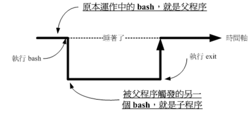

# Shell 的变量功能

变量是 bash 环境中非常重要的一个概念，

## 什么是变量

简单说，某一个特定字符串代表不固定的内容；比如：`y = ax+b` 等号左边的是变量，右边的是变量的内容，使用简单的变量来取代另一个比较复杂或则是容易变动的数据，这样做的好处就是方便！

### 变数的可变性与方便性

举例来说，我们每个账户的邮件信箱预设是以 MAIL 这个变量来进行存取的，当不同的账户登录取得的变量内容如下所示

```bash
dmtsai 的 MAIL = /var/spool/mail/dmtsai 
root 的 MAIL = /var/spool/mail/root
mrcode 的 MAIL = /var/spool/mail/mrcode
```

好处是则是邮件处理程序读取 MAIL 变量就能为对应的账户处理了

### 影响 bash 环境操作的变量

某些特定变量会影响到 bash 的环境，例如前面多次提到的 PATH 变量，它会影响指令是否能找到。

为了区别与自定义变量的不同，环境变量通常以大写字符来表示

### 脚本程序设计（shell script）的好帮手

写过程序的都知道，变量在程序中的重要性，比如在 shell script 中，前面几行定义变量，后面的大量逻辑处理使用变量，那么修改变量的内容，就能让后续的处理逻辑改变，达到非常方便的效果

## 变量的取用与设置：echo 、变量设置规则、unset

### 变量的取用：echo

```bash
echo $variable
echo $PATH
echo ${PATH}			# 作者推荐使用这种方式取用
```

关于 echo 的功能也较多，自行 man echo，这只是用来显示变量内容

```bash
# 在屏幕上显示你的环境变量 HOME 与 MAIL
[mrcode@study ~]$ echo $HOME
/home/mrcode
[mrcode@study ~]$ echo ${MAIL}
/var/spool/mail/mrcode
```

变量的修改使用等号赋值

```bash
[mrcode@study ~]$ echo ${myname}
											# 这里没有任何数据，该变量不存在或未设置
[mrcode@study ~]$ myname=mrcode
[mrcode@study ~]$ echo ${myname}
mrcode

# 在 bash 中，当一个变量名称未被设置时，预设内容就是 空
```

需要注意的是：每一种 shell 的语法都不相同，在 bash 中 echo 一个不存在的变量不会保存，并显示空，其他的可能就会报错了

### 变量的设置规则

- 变量与变量内容以一个「=」来连接

  ```bash
  myname=Mrcode
  ```

- 等号两边不能直接接空格符号

  ```bash
  myname = Mrcode		# java 语法格式强迫症不要这样写
  ```

- 变量名称只能是英文字母与数字

- 变量内容若有空格可以使用双引号或单引号限定，但是以下除外

  - 「$」在双引号中可以保留原本的特性

    ```bash
    var="lang is $LANG"
    则使用 echo $var 则得到输出信息为：lang is utf8 等的字样
    ```

  - 「‘」在单引号内的特殊字符仅为一般字符

    ```bash
    var='lang is $LANG'
    则输出信息为：lang is $LANG
    ```

- 可用跳脱字符「\」把特殊字符变成一般字符

  ```bash
  # 就是转义符
  myname=mrcode\ Tsai  # 这里将空格转义成普通字符了
  ```

- 在一串指令的执行中，还需要使用其他额外的指令所提供的信息时，可以使用反单引号「`指令`」或「$(指令)」

  ```bash
  # 取得核心版本的设置
  [mrcode@study ~]$ echo  $version
  
  [mrcode@study ~]$ version=$(uname -r); echo $version
  3.10.0-1062.el7.x86_64
  ```

- 若该变量为扩增变量内容时，则可使用如下方式累加变量

  ```bash
  PATH="$PATH:/home/bin"
  PATH=${PATH}:/home/bin
  ```

- 若该变量需要再其他子程序执行，则需要以 export 来使变量变成环境变量

  ```bash
  export PATH
  ```

- 通常大写字符为系统默认变量，自行设定变量可以使用小写字符，方便判断（纯粹按个人风格决定）

- 取消变量使用 unset

  ```bash
  # 如取消 myname 的设置
  unset myname
  ```

实践练习

```bash
# 练习 1：设置变量 name，内容为Mrcode
[mrcode@study ~]$ 12name=mrcode			# 变量命名语法问题
bash: 12name=mrcode: command not found...
[mrcode@study ~]$ name = Mrcode
bash: name: command not found...		# 变量命名语法问题
[mrcode@study ~]$ name=Mrcode			# 成功

# 练习 2：接上面，把内容修改为 Mrcode's name，就是内容中含有特殊字符
[mrcode@study ~]$ name=Mrcode's name
> c^C
# 单引号与双引号必须要成对出现，上面只有一个单引号，按下回车键时，还可以继续输入内容
# 不能达到题目要求，记得使用 ctrl + c 结束
[mrcode@study ~]$ name="Mrcode's name"
# 在双引号中，单引号变为一般字符
[mrcode@study ~]$ name=Mrcode\'s\ name
#使用转义符转义特殊字符

# 练习 3： 在 PATH 变量中累加 /home/dmtsai/bin 这个目录
PATH=$PATH:/home/dmtsai/bin
PATH="$PATH":/home/dmtsai/bin
PATH=${PATH}:/home/dmtsai/bin
# 上面三种格式都可以，但是下面的例子就不见得了

# 练习 4：将 name 的内容多出 yes
[mrcode@study ~]$ echo $name
Mrcode's name
[mrcode@study ~]$ name=$nameyes
[mrcode@study ~]$ echo $name

[mrcode@study ~]$ 
# 如没有双引号或则 {} 则完全变成了一个变量 nameyes
# 正确的如下
name="$name"yes
name=${name}yes

# 练习 5：如何让我刚刚设置的 name=Mrcode 可以用在下个 shell 程序？
[mrcode@study ~]$ name=Mrcode
[mrcode@study ~]$ bash				# 进入所谓的子程序
[mrcode@study ~]$ echo $name
		# 这里并没有获取到刚刚设置的值
[mrcode@study ~]$ exit			# 退出子程序
exit
[mrcode@study ~]$ echo $name
Mrcode
[mrcode@study ~]$ export name		# 导出变量
[mrcode@study ~]$ bash
[mrcode@study ~]$ echo $name		# 在子程序中找到了
Mrcode
[mrcode@study ~]$ exit
exit
```

什么是子程序？像上面那样，在当前这个 shell 下，去启用另一个新的 shell，新的哪个 shell 就是子程序了。在一般的状态下，父程序的自定义变量是无法在子程序内使用的。可以通过 export 将变量变成环境变量，就可以在子程序中使用了。

至于子程序相关概念，在第十六章程序管理中讲解。

```bash
# 练习 6：如何进入到你目前核心的模块目录？
cd /lib/modules/3.10.0-1062.el7.x86_64/kernel/
# 由于每个 linux 能够拥有多个核心版本，且几乎 distribution 的核心版本都不相同
# 所以上面的指令无法通用，这个时候可以使用其他额外指令语法来达成
cd /lib/modules/`uname -r`/kernel
cd /lib/modules/$(uname -r)/kernel
```

其实上面的指令可以说是做了两次动作：

1. 先进行反单引号内的动作「uname -r」，并得到核心版本 3.10.0-1062.el7.x86_64
2. 在上述结果带入原指令，得到 `cd /lib/modules/3.10.0-1062.el7.x86_64/kernel/`

::: tip
为啥推荐` ${}` 方式？方便识别 在复杂的变量引用中，没有分割符来分割非常的不方便识别
:::

```bash
# 练习 7：取消刚刚设置的 name 变量内容
[mrcode@study kernel]$ unset name
[mrcode@study kernel]$ echo $name

[mrcode@study kernel]$ 

# 练习 8：输出 locate crontab 所找到的相关文件的权限
# locate 可以查找文件，并同时查看他们的文件权限
[mrcode@study kernel]$ locate crontab
/etc/anacrontab
/etc/crontab
/usr/bin/crontab
/usr/share/doc/man-pages-overrides-7.7.3/crontabs
/usr/share/doc/man-pages-overrides-7.7.3/crontabs/COPYING
/usr/share/man/man1/crontab.1.gz
/usr/share/man/man1p/crontab.1p.gz
/usr/share/man/man4/crontabs.4.gz
/usr/share/man/man5/anacrontab.5.gz
/usr/share/man/man5/crontab.5.gz
/usr/share/vim/vim74/syntax/crontab.vim

[mrcode@study kernel]$ ls -ld `locate crontab`
-rw-------. 1 root root   541 Aug  9 07:07 /etc/anacrontab
-rw-r--r--. 2 root root   451 Jun 10  2014 /etc/crontab
-rwsr-xr-x. 1 root root 57656 Aug  9 07:07 /usr/bin/crontab
# 这个是个目录，上面使用 -d 参数的效果就是，不输出该目录下的明细，只输出目录信息
drwxr-xr-x. 2 root root    21 Oct  4 18:25 /usr/share/doc/man-pages-overrides-7.7.3/crontabs
-rw-r--r--. 1 root root 17738 Aug  9 08:47 /usr/share/doc/man-pages-overrides-7.7.3/crontabs/COPYING
-rw-r--r--. 1 root root  2626 Aug  9 07:07 /usr/share/man/man1/crontab.1.gz
-rw-r--r--. 1 root root  4229 Jun 10  2014 /usr/share/man/man1p/crontab.1p.gz
-rw-r--r--. 1 root root  1121 Jun 10  2014 /usr/share/man/man4/crontabs.4.gz
-rw-r--r--. 1 root root  1658 Aug  9 07:07 /usr/share/man/man5/anacrontab.5.gz
-rw-r--r--. 1 root root  4980 Aug  9 07:07 /usr/share/man/man5/crontab.5.gz
-rw-r--r--. 1 root root  2566 Aug  9 11:17 /usr/share/vim/vim74/syntax/crontab.vim

# 练习 9：如何简化一条命令
# cd /cluster/server/work/taiwan_2015/003 假设这条命令是经常用到的，但是特别长，如何简化？
work="/cluster/server/work/taiwan_2015/003"
cd work
# 使用变量方式，来达成效果
# 该变量可以记录在 bash 的配置文件 「~/.bashrc」中，那么以后可随时使用 cd $work 进入该目录
```

## 环境变量的功能

环境变量可以帮我打到很多功能，如：家的目录变换、提示字符的显示、执行文件搜寻的路径等，可以使用 env 与 export 来查询当前 shell 环境中有多少默认的环境变量

### 用 env 观察环境变量与常见环境变量说明

```bash
[mrcode@study kernel]$ env
XDG_SESSION_ID=5			
HOSTNAME=study.centos.mrcode		# 主机名
SELINUX_ROLE_REQUESTED=
TERM=xterm											# 终端机使用的环境是什么类型
SHELL=/bin/bash									# 目前这个环境下，使用的 Shell 是哪一个程序？
HISTSIZE=1000										# 历史指令记录数量
SSH_CLIENT=192.168.0.105 53699 22
SELINUX_USE_CURRENT_RANGE=
QTDIR=/usr/lib64/qt-3.3
OLDPWD=/home/mrcode							# 上一个工作目录所在
QTINC=/usr/lib64/qt-3.3/include
SSH_TTY=/dev/pts/0
QT_GRAPHICSSYSTEM_CHECKED=1
USER=mrcode											# 使用者名称
LS_COLORS=rs=0:di=01;34:ln=01;36:mh=00:pi=40;33:so=01;35:do=01;...		# 颜色显示
MAIL=/var/spool/mail/mrcode
PATH=/usr/lib64/qt-3.3/bin:/usr/local/bin:/usr/bin:/usr/local/sbin:/usr/sbin:/home/mrcode/.local/bin:/home/mrcode/bin:/home/dmtsai/bin
PWD=/lib/modules/3.10.0-1062.el7.x86_64/kernel #该用户目前所在的工作目录,使用 pwd 取出
LANG=en_US.UTF-8								# 语系设置
KDEDIRS=/usr
SELINUX_LEVEL_REQUESTED=
HISTCONTROL=ignoredups
SHLVL=1
HOME=/home/mrcode								# 登录用户家的目录
LOGNAME=mrcode									# 登录者登录的账户名称
QTLIB=/usr/lib64/qt-3.3/lib
XDG_DATA_DIRS=/home/mrcode/.local/share/flatpak/exports/share:/var/lib/flatpak/exports/share:/usr/local/share:/usr/share
SSH_CONNECTION=192.168.0.105 53699 192.168.0.128 22
LESSOPEN=||/usr/bin/lesspipe.sh %s
XDG_RUNTIME_DIR=/run/user/1000
QT_PLUGIN_PATH=/usr/lib64/kde4/plugins:/usr/lib/kde4/plugins
_=/usr/bin/env								# 上一次使用的指令最后一个参数（或指令本身）

```

env 是 environment 环境 的简写，上面列出来所有的环境变量，使用 export 也是一样的内容，只不过 export 还有其他额外的功能，上面这些变量的作用如下

- HOME

  代表用户的家目录。使用 `cd 或 cd ~` 也能回到自己的家，这个就是取用的 HOME 变量

- SHELL

  目前这个环境使用的 SHELL 是哪个程序，Linux 预设使用 /bin/bash

- HISTSIZE：历史命令可记录的总数量

- MAIL：使用 mail 指令收信时，系统会读取的邮件信箱文件（mailbox）

- PATH

  执行文件搜索的路径，目录与目录中间以冒号「:」分割，由于文件搜索是按 PATH 变量内的目录查询的，所以目录的顺序也很重要

- LANG

  语系信息，很多程序都会用到。比如，启动某些 perl 的程序语言文件，会主动分析语系数据文件，如果发现有他无法解析的编码语系，可能会产生错误

- RANDOM

  随机树生成器的变量，目前大多数 distribution 都会有随机数生成器，就是 /dev/random 文件。可以通过该随机数文件相关的变量（$RANDOM）来获取随机数值。

  在 BASH 环境下，该变量范围为 0~32767 之前

  ```bash
  [mrcode@study kernel]$ echo $RANDOM
  9229
  # 想要 0 ~ 9 怎么办？
  # 使用 declare 指令来让字符串转成计算公式 6593*10/32768 然后就能得到数值了
  [mrcode@study kernel]$ declare -i number=$RANDOM*10/32768 ; echo $number
  6
  
  ```

### 用 set 观察所有变量（含环境变量与自定义变量）

bash 不只有环境变量，还有一些与操作接口有关的变量，以及用户自己定义的变量存在。

```bash
# 使用 set，除了环境变量之外，还会将其他咋 bash 内的变量都显示出来
# 下面只是其中一部分重要的，内容太多
[mrcode@study kernel]$ set
BASH=/bin/bash		# bash 的主程序放置路径
# bash 的版本
BASH_VERSINFO=([0]="4" [1]="2" [2]="46" [3]="2" [4]="release" [5]="x86_64-redhat-linux-gnu")
BASH_VERSION='4.2.46(2)-release'
COLUMNS=126				# 在目前终端机环境下，使用的字段有几个字符长度
HISTFILE=/home/mrcode/.bash_history # 历史命令记录文件
HISTFILESIZE=1000		# 上面那个文件能存储历史命令的数量
HISTFILE=1000			# 在目前环境中，内存中能记录的历史命令最大数量
IFS=$' \t\n'		# 预设的分隔符
LINES=20				# 目前的终端机下的最大行数
MACHTYPE=x86_64-redhat-linux-gnu	# 安装的机器类型
OSTYPE=linux-gnu		# 操作系统的类型
PS1=’[\u@\h \W]\$ ‘	# PS1 就厉害了，是命令提示字符，也就是我们常见的 [root@www ~]#、 [mrcode ~]$ 的设置，可以修改的
PS2=’> ‘		# 使用跳脱符号 \，在第二行开始显示的提示字符
$		# 目前这个 shell 使用的 PID
?		# 刚刚执行完指令的回传值
...
其他的请自行查阅

```

一般来说，无论是否为环境变量，只要跟我们这个 shell 的操作接口有关的变量，通常都会被设置为大写字符。也就是说，基本上，在 Linux 预设的情况中，使用`{大写的字母}`来设置的变量一般为系统内定需要的变量。上面的变量中有如下几个比较重要

#### PS1 提示字符的设置

命令提示字符，当我们每次按下 Enter 键去执行某个指令后，最后要再次出现提示字符时，就会主动去读取这个变数值了。相关设置可以通过 man bash 查询 PS1 的相关说明，下面列出一些符号含义：

- `\d`：可显示出「星期、月、日」的日期格式，如：「Mon Feb 2」
- `\H`：完整的主机名。如：本次练习机名称「study.centos.mrcode」.
- `\h`：仅取主机名第一个小数点之前的名字，如上面的则取「study」
- `\t`：显示时间，24 小时格式的 HH:MM:SS
- `\T`：显示时间，12 小时格式
- `\A`：显示时间，24 小时格式 HH:MM
- `\@`：显示时间，12 小时格式 am/pm 格式
- `\u`：目前使用者的账户名称，如 mrcode
- `\v`：BASH 的版本信息，如 4.2.46(1)-release 仅取「4.2」
- `\w`：完整的工作目录名称，由根目录写起的目录名称。但家目录会以 ~ 取代
- `\W`：利用 basename 函数取得工作目录名称，所以仅会列出最后一个目录名
- `\#`：下达的第几个指令
- `\$`：提示字符，如果是 root 时，则为 `#` ,否则就是 `$`

预设内容为 `[\u@\h \W]\$`，对照上表来看，`[mrcode@study ~]$ ` 这个为啥会显示成这样了

假设我们需要有类似如下的提示符号时，可以通过以下方式设置

```bash
# [mrcode@study /home/mrcode 16:50 #12]
[mrcode@study ~]$ cd /home/
[mrcode@study home]$  PS1='[\u@\h \w \A #\#]\$ '
[mrcode@study /home 02:26 #6]$ 
# 后面的 #6 信息，更新频率为 1 秒一次，输入一次命令算一次

```

#### `$` 关于本 shell 的 PID

该符号本身就是个变量，代表的是「目前这个 Shell 的线程代号」也就是 PID（Process ID）。更多概念后续讲解

```bash
[mrcode@study /home 02:29 #11]$ echo $$
28948
```

#### `?`关于上个执行指令的回传值

在 bash 中该变量非常重要，表示「**上一个**执行的指令所**回传**的值」，当我们执行某些指令时，这些指令都会回传一个执行后的代码。一般来说，如果成功的执行该指令，则会回传一个 0 值，如果执行过程中发生错误，则会回传「错误代码」。简单说：非 0 则执行有错误

```bash
[mrcode@study /home 02:31 #13]$ echo $SHELL
/bin/bash				# 执行成功
[mrcode@study /home 02:31 #14]$ echo $?
0								# 显示 0
[mrcode@study /home 02:32 #15]$ 12name=mrcode
bash: 12name=mrcode: command not found...				# 执行失败
[mrcode@study /home 02:32 #16]$ echo $?
127							# 显示非 0
[mrcode@study /home 02:32 #17]$ echo $?
0								# 显示 0，? 只取代上一个命令的执行返回代码，不会累积，只能被使用一次

```

#### `OSTYPE、HOSTTYPE、MACHTYPE`主机硬件与核心的等级

在第 0 章中谈到过 CPU 等级，个人主机的 CPU 主要分为 32/64 位，其中 32 位又分为 i386、i586、i686 ，而 64 位则称为 x86_64。由于不同等级的 CPU 指令集不太相同，因此你的软件可能会针对某些 CPU 进行优化，以取得更佳的软件性能。所以软件就有 i386 、x86_64 之分了。

要留意的是，较高阶的硬件通常会向下兼容旧的软件，但较高阶的软件可能无法在旧机器上面安装

#### `export` 自定义变量转成环境变量

evn 与 set 表示环境变量与自定义变量，他们的差异在于「该变量是否会被子程序所继续引用」。

当你登录 Linux 并取得一个 bash 之后，你的 bash 就是一个独立的程序，这个程序的识别使用的是一个称为程序标识符（PID）。接下来你再这个 bash 下下达的任何指令都是由这个 bash 所衍生出来的，那些被下达的指令就被称为子程序了。



如上，在原本的 bash 下执行另一个 bash，结果操作的环境接口会跑到第二个 bash 去（就是子程序），原本的 bash 就 sleep 了。整个指令运作的环境是实线的部分！若要回到原本的 bash 去，只有将第二个 bash 结束掉（exit 或 logout）才行。更多的程序概念后续讲解

因为**子程序仅会继承**父程序的**环境变量**，子程序**不会继承**父程序的**自定义变量**；这里就会出现在这种父子切换中可能一不小心就会出现找不到变量等的情况发生

可以使用 export 将自定义变量变成环境变量，那么子程序就会继承了。

```bash
export 变量名称
# 如果 export 后面不带任何值，则会显示所有的环境变量
```

## 影响显示结果的语系变量 locale

笔者在使用 man 命令等指令时，mrcode 和 root 账户一个显示英文，一个显示中文，使用 locale 查询如下

```bash
[mrcode@study /home 02:59 #20]$ locale
LANG=en_US.UTF-8
LC_CTYPE="en_US.UTF-8"
LC_NUMERIC="en_US.UTF-8"
LC_TIME="en_US.UTF-8"
LC_COLLATE="en_US.UTF-8"
LC_MONETARY="en_US.UTF-8"
LC_MESSAGES="en_US.UTF-8"
LC_PAPER="en_US.UTF-8"
LC_NAME="en_US.UTF-8"
LC_ADDRESS="en_US.UTF-8"
LC_TELEPHONE="en_US.UTF-8"
LC_MEASUREMENT="en_US.UTF-8"
LC_IDENTIFICATION="en_US.UTF-8"
LC_ALL=
[mrcode@study /home 02:59 #21]$ su -
Password: 
Last login: Tue Oct 29 20:45:07 CST 2019 on pts/0
[root@study ~]# man bash
[root@study ~]# locale
LANG=zh_CN.UTF-8							# 主语言环境
LC_CTYPE="zh_CN.UTF-8"				# 字符（文字）编码
LC_NUMERIC="zh_CN.UTF-8"			# 数字系统
LC_TIME="zh_CN.UTF-8"					# 时间系统
LC_COLLATE="zh_CN.UTF-8"			# 字符串的比较与排序
LC_MONETARY="zh_CN.UTF-8"			# 货币显示
LC_MESSAGES="zh_CN.UTF-8"			# 信息显示内容，如菜单、错误信息等
LC_PAPER="zh_CN.UTF-8"
LC_NAME="zh_CN.UTF-8"
LC_ADDRESS="zh_CN.UTF-8"
LC_TELEPHONE="zh_CN.UTF-8"
LC_MEASUREMENT="zh_CN.UTF-8"
LC_IDENTIFICATION="zh_CN.UTF-8"
LC_ALL=											# 整体语系
[root@study ~]# 
# locale -a 可以显示 linux 主机内有的语系文件，文件放置在 /usr/lib/locale 
```

发现一个账号是 en_US.UTF-8 一个是 zh_CN.UTF-8 ，以上可单独设置的变量有好多个，但是有 LANG 和 LC_ALL 是全局的，当其他都没有设置的时候，就会以这两个的语系为准

默认的语系配置文件在下面文件中

```bash
[root@study ~]# cat /etc/locale.conf 
LANG="zh_CN.UTF-8"

```

如果只是暂时在 tty 中显示指定的语系，而不是持久化的更改时，直接使用环境变量赋值方式

```bash
[mrcode@study /home 03:09 #22]$ LANG="zh_CN.UTF-8"
# 作者说在 Centos7 中可能需要使用如下的方式才可以
# 从 zh_TW.UTF-8 修改为 en_US.UTF8;
LANG=en_US.UTF8;
export LC_ALL=en_US.UTF8

```

## 变量的有效范围

在 export 指令中就提到了这个概念，如：父子变量不会被继承，需要使用 export 导出为环境变量。

某些书籍中会谈到全局变量（global variable）与局部变量（local variable），在本章：

- 环境变量 = 全局变量
- 自定义变量=局部变量

为啥环境变量的数据可以被子程序所引用呢？是因为内存配置的关系，理论上是这样的：

- 当启动一个 shell，操作系统会分配一块内存给 shell 使用，此内存变量可让子程序取用
- 若在父程序中利用 export 功能，可以让自定义变量的内容写到上述的区块中（环境变量）
- 当加载另一个 shell 时，子 shell 可以将父 shell 的环境变量所在的区块导入自己的环境变量区块中

但是需要注意的是：这里的环境变量与「bash 的操作环境」不太一样，如 PS1 并不是环境变量，可以看成是对 bash 程序的配置

## 变量键盘读取、数组与宣告：read、array、declare

上述的变量都是由指令直接设置的，可以让用户使用键盘输入，如某些程序执行过程中，会等待使用者输入 yes/no 之类的信息。

### read

交互式指令，阻塞等待用户输入信息。该指令在 shell script 中经常用到。关于 script 在 第十三章介绍

```bash
read [-pt] variable

选项与参数

-p：后面可以接提示符
-t：后面可以接等待的秒数

```

实践练习

```bash
# 范例 1：让用户由键盘输入一个内容，将该内容变成名为 atest 的变量
[mrcode@study ~]$ read atest
this is a test				# 光标闪烁，等待你的输入
[mrcode@study ~]$ echo ${atest}		# 这里打印刚刚用户输入的信息
this is a test

# 范例 2：提示使用者 30 秒内输入自己的大名，将该输入字符串作为名为 named 的变量内容
[mrcode@study ~]$ read -p "Please keyin your name: " -t 30 named
Please keyin your name: mrcode		# -p 的提示信息
[mrcode@study ~]$ echo ${named}
mrcode

# -t 30 ，如果 30 秒之后没有输入，则自动略过
```

### declare 、 typeset

declare 或 typeset 都是声明变量的类型。如果使用 declare 后面并没有接任何参数，那么 bash 会主动将所有变量名称与内容显示出来，就好像使用 set 一样。语法如下

```bash
declare [-aixr] variable

选项与参数

-a：将后面的 variable 的变量定义为数组 array 类型
-i：定义为整数数字 integer 类型
-x：用法与 export 一样，将后面的 variable 变成环境变量
+x：将环境变量变成普通的自定义变量
-r：将变量设置为 readonly 类型，该变量不可被更改内容，也不能 unset
-p：显示变量的定义和类型
```

实践与练习

```bash
# 范例 1 ：让变量 sum 进行 100 + 300 + 50 的加总结果
[mrcode@study ~]$ sum=100+300+50
[mrcode@study ~]$ echo ${sum}
100+300+50			# 发现没有生效，变成了字符串
# 使用 declare 声明后，成功
[mrcode@study ~]$ declare -i sum=100+300+50
[mrcode@study ~]$ echo ${sum}
450
```

在默认的情况下， bash 对于变量有几个基本的定义：

- 变量类型默认为字符串
- bash 环境中的数值运算，预设最多仅能达到整数形态，所以 1/3 结果是 0

```bash
# 范例 2：将 sum 变成环境变量
[mrcode@study ~]$ declare -x sum
[mrcode@study ~]$ export | grep sum    # 这里是在 export 指令的信息下搜索 sum
declare -ix sum="450"			# 看到使用了 declare -ix 来声明

# 范例 3：将 sum 变成只读属性，不可更动
[mrcode@study ~]$ declare -r sum
[mrcode@study ~]$ sum=123
-bash: sum: readonly variable

# 范例 4：将 sum 变成非环境变量的自定义变量
[mrcode@study ~]$ declare +x sum			# 将 - 变成 + 就是去掉环境变量
[mrcode@study ~]$ declare -p sum			# -p 显示某个变量的定义和类型
declare -ir sum="450"

```

declare 功能很有用，在 shell script 中经常使用。如果不小心将变量设置为「只读」，通常需要注销再登录才能复原该变量的类型

###  array

废话不多说，笔者是个程序员，就不记录那么低级的概念

```bash
# 语法
var[index]=countent
```

实践与练习

```bash
# 范例：设置 var[1] ~ var[3] 的变量
[mrcode@study ~]$ var[1]="small min"
[mrcode@study ~]$ var[2]="big min"
[mrcode@study ~]$ var[3]="nice min"
[mrcode@study ~]$ echo "${var[1]},${var[2]},${var[3]}"
small min,big min,nice min

```

## 与文件系统及程序的限制关系：ulimit


