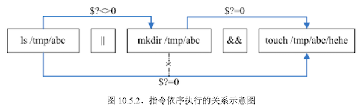

# 数据流重导向

数据流重导向（redirect），将数据传导到其他地方去，将某个指令执行后应该要出现在屏幕上的数据，给传输到其他的地方。

例如文件或则是装置（打印机之类的），数据流重导向在 Linux 的文本模式下很重要，尤其是想要将某些数据存储下来时，就更有用了

## 什么是数据流重导向？


执行一个指令时，这个指令可能会由文件读入资料，经过处理之后，再将数据输出到屏幕上。

- standard output：标准输出 STDOUT
- standard error output：标准错误输出 STDERR

### standard output 与 standard error output

可以简单理解为：

- 标准输出：指令执行所回传的正确的信息
- 标准错误输出：指令执行失败后，所回传的错误信息

比如，我们的系统默认有 /etc/crontab 但无 /etc/mrcode ，此时若下达 `cat /etc/crontab /etc/mrcode` 指令时，cat 会执行：

* 标准输出：读取 /etc/crontab 后，将该文件内容显示到屏幕上
* 标准错误输出：因为无法找到 /etc/mrcode ，因此在屏幕上显示错误信息

可见不管正确或错误信息都输出到屏幕上，那么可以通过数据流重导向将 stdout 与 stderr 分别传送到其他文件或装置去，就达到了分别输出的目的，语法如下：

- 标准输入（stdin 简写）：代码为 0，使用 `<` 或 `<<`
- 标准输出（stdout）：代码为 1，使用 `>` 或 `>>`
- 标准错误输出（stderr）：代码为 2，使用 `2>` 或 `2>>`

为了理解 stdout 与 stderr，下面进行练习

```bash
# 范例 1：观察你的系统根目录 / 下各目录的文件名、权限与属性，并记录下来
[mrcode@study ~]$ ll / 			# 会把结果输出到屏幕
[mrcode@study ~]$ ll / > ~/rootfile		# 会吧结果输出到指定的 rootfile 文件中
[mrcode@study ~]$ ll ~/rootfile
-rw-rw-r--. 1 mrcode mrcode 1078 Dec  1 22:53 /home/mrcode/rootfile

```

上面的指令流程：

1. 该文件若不存在，系统会自动创建文件
2. 该文件若存在，那么会清空内容，再写入数据

标准输出和标准错误输出，单个符号**是覆盖**数据，2 个符号的是**追加**数据；

```bash
# 范例 2：利用一般身份账户查找 /home 下是否有 .bashrc 的文件存在
# 为了这个练习有效果，我在 abc 目录下用 root 身份创建了 .bashrc 空文件
# 并且，把 abc 目录的权限都改为只有 root 才能读取
[mrcode@study home]$ ll
total 4
drwx------.  2 root   root     32 Dec  1 23:01 abc
drwx------. 18 mrcode mrcode 4096 Dec  1 22:53 mrcode
[mrcode@study home]$ find /home/ -name .bashrc 			
/home/mrcode/.bashrc												# 标准输出
find: ‘/home/abc’: Permission denied				# 标准错误输出

# 使用数据流重导向指令，发现标准输出不显示在屏幕了
# 但是标准错误输出还显示在屏幕上
[mrcode@study home]$ find /home/ -name .bashrc > list
-bash: list: Permission denied			# 这里报错了，是因为 home 目录是普通用户是无法写数据的
# 写在 mrcode 自己的目录下
[mrcode@study home]$ find /home/ -name .bashrc > ./mrcode/list
find: ‘/home/abc’: Permission denied

# 范例 3： 使用标准输出 和 标准错误输出都输出到文件中
[mrcode@study home]$ find /home/ -name .bashrc > ./mrcode/list 2> ./mrcode/listerr
```

### /dev/null 垃圾桶黑洞装置的特殊写法

就是可以将任何信息吃掉的黑洞装置

```bash
# 范例 4：将错误的数据丢弃，屏幕上显示正确的数据
[mrcode@study ~]$ find /home/ -name .bashrc 2> /dev/null
/home/mrcode/.bashrc
```

那么能否将正确和错误的数据都写到同一个文件呢？需要特殊的写法才行

```bash
# 范例 5：将指令的数据全部写入 list 文件中

# 错误的写法，可能会交叉写入该文件，数据错乱
[mrcode@study ~]$ find /home/ -name .bashrc > list 2> list

# 正确的写法
[mrcode@study ~]$ find /home/ -name .bashrc > list 2>&1
# 正确的写法
[mrcode@study ~]$ find /home/ -name .bashrc &> list
```

### standard input ：`<` 与`<<`

简单来说：将原本需要由键盘输入的数据，该由文件内容来代替。

```bash
# 范例 6：利用 cat 指令来建立一个文件的简单流程
[mrcode@study ~]$ cat > catfile
testing
cat file test
# 这里使用快捷键 ctrl + d 来离开
```

上面使用 `cat > catfile` ，使用了数据流重导向，catfile 文件会被建立，内容是需要键盘输入，也就是上面的两行内容。这里可以使用标准输入来取代键盘的敲击 

```bash
# 范例 7：用 stdin 代替键盘输入，建立新文件的简单流程
[mrcode@study ~]$ cat > catfile < ~/.bashrc
[mrcode@study ~]$ ll catfile ~/.bashrc
-rw-rw-r--. 1 mrcode mrcode 231 Dec  1 23:28 catfile
-rw-r--r--. 1 mrcode mrcode 231 Aug  8 20:06 /home/mrcode/.bashrc
# 大小一模一样，几乎像是用 cp 来复制一样
```

而 `<<` 表示接受的输入字符。比如：我要用 cat 直接将输入的信息输出到 catfile 中，且当由键盘输入 eof 时，该次输入就结束

```
[mrcode@study ~]$ cat > catfile << 'eof'
> This is a test
> Ok new stop
> eof
[mrcode@study ~]$ cat catfile
This is a test
Ok new stop
# 只有两行数据，不会存在关键词一行
# 这里就有点类似判定结束标准输入的功能
```

`<<`可以代替快捷键 ctrl + d，来终止输入，那为什么要使用命令输出重导向呢？

- 屏幕输出的信息很重要，而且我们需要将它存下来的时候
- 背景执行的程序，不希望他干扰屏幕正常的输出结果的时候
- 一些系统的例行命令（例如在 /etc/crontab 中的文件）的执行结果，希望他可以存下来时
- 一些执行命令可能已知错误信息时，想以`2>/dev/null`丢弃时
- 错误信息与正确信息需要分别输出时

当然还有其他的使用场景，最简单的就是网友们经常问到：为何我的 root 都会受到系统 crontab 寄来的错误信息呢？这个是场景的错误，而如果我们已经知道这个错误信息是可以忽略的时，`2> errorfile` 这个功能就很重要了吧

```bash
# 问：假设要将 echo `error message` 以 standard error output 的格式来输出，怎么做？
答：既然有 2>&1 来将 2> 转到 1> 去，
   那么就应该有 1>&2，可以这样做

[mrcode@study ~]$ echo 'error message' 1>&2
error message
[mrcode@study ~]$ echo 'error message' 2> /dev/null 1>&2

```

## 命令执行的判断依据：`;`、`&&`、`||`

很多指令想要一次输入去执行，而不想分此执行，基本上有两种方法：

- 第十二章要介绍的 shell script 脚本执行
- 通过本章的知识点来完成

###  `cmd;cmd` 不考虑指令相关性的连续指令下达

比如子关机的时候希望可以执行两次 sync 同步写入磁盘后，再 shutdown 计算机

```bash
sync; sync; shutdown -h now
```

这个是两个指令之前没有关系的执行，前一个执行完成后，就执行后一个；如果是这样的情况：在某个目录下创建文件，如果目录存在，则创建文件，如果不存在则不做任何操作，该指令就无法完成了

### `$?`(指令回传值)与 `&&` 和 `||`

前面章节讲到过指令回传值：若前一个指令执行的结果为正确，在 Linux 下会回传一个 `$?=0` 的值。可以通过判断这个值来是否执行后面的指令

逻辑操作符这里就不过多解释了

- `&&`：前一个执行正确，后面才会执行
- `||`：前一个执行正确，后面的不会执行

```bash
# 范例 1：使用 ls 查阅 目录 /tmp/abc 是否存在，若存在则用 touch 建立 /tmp/abc/hehe
[mrcode@study ~]$ ls /tmp/abc && touch /tmp/abc/hehe
ls: cannot access /tmp/abc: No such file or directory
# 只有 ls 报错了，后续的指令没有报错，说明没有被执行

[mrcode@study ~]$ mkdir /tmp/abc
[mrcode@study ~]$ ls /tmp/abc && touch /tmp/abc/hehe
[mrcode@study ~]$ ll /tmp/abc/
total 0
-rw-rw-r--. 1 mrcode mrcode 0 Dec  2 00:22 hehe

# 范例 2：测试 /tmp/abc 是否存在，若不存在则建立该目录，若存在则不做操作
[mrcode@study ~]$ rm -r /tmp/abc/

[mrcode@study ~]$ ls /tmp/abc || mkdir /tmp/abc
ls: cannot access /tmp/abc: No such file or directory
# 报错没有找到目录，后面没有报错，但是查看缺创建了，证明执行了

[mrcode@study ~]$ ll -d /tmp/abc/
drwxrwxr-x. 2 mrcode mrcode 6 Dec  2 00:24 /tmp/abc/

# 而下面这个没有报错，后面也没有报错，说明只执行了前面的指令
[mrcode@study ~]$ ls /tmp/abc || mkdir /tmp/abc


# 范例 3：我不清楚 /tmp/abc 是否存在，但就是要建立 /tmp/abc/hehe 文件
[mrcode@study ~]$ ls /tmp/abc || mkdir /tmp/abc/ && touch /tmp/abc/hehe

```

范例三，对于的表达式对于 java 或则 js 来说，理解不太一样，如下分析：

- 第一种情况：/tmp/abc 不存在
  1. ls /tmp/abc 回传 `$?≠0`，结果为 false
  2. 则执行创建操作，由于会成功，故 `$?=0`，结果为 true
  3. 则执行创建 hehe 文件
- 第二种情况：/tmp/abc 存在
  	1. ls /tmp/abc 回传 `$?=0`，结果为 true
   	2. `||` 遇到 true 后面的不会执行，**但是** 结果会往后传递
   	3. 前一个结果为 true，那么久执行创建



只要注意：linux 指令是从左往右执行的，只有相邻的指令会被特殊符号阻断

```bash
## 例题：以 ls 测试 /tmp/mrcode 是否存在，存在则显示 exist, 不存在则显示 not exist
[mrcode@study ~]$ ls /tmp/mrcode && echo 'exist' || echo 'not exist'
ls: cannot access /tmp/mrcode: No such file or directory
not exist

[mrcode@study ~]$ mkdir /tmp/mrcode
[mrcode@study ~]$ ls /tmp/mrcode && echo 'exist' || echo 'not exist'
exist
# 可以看到的确只有相邻的两个指令会被阻断

# 如果搞不清楚他们的逻辑的话，就会出现下面这种情况
[mrcode@study ~]$ ls /tmp/mrcode || echo 'exist' && echo 'not exist'
ls: cannot access /tmp/mrcode: No such file or directory
exist
not exist
# 两种都出现了，不存在，则执行 exist，后面并且关系，再次执行
[mrcode@study ~]$ mkdir /tmp/mrcode
[mrcode@study ~]$ ls /tmp/mrcode || echo 'exist' && echo 'not exist'
not exist
# 存在，则不执行 exit，true 往后传递，则执行 not exist
```

