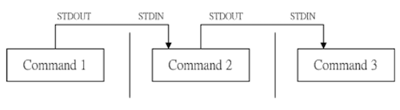

# 管线命令（pipe）

bash 命令执行的时候有输出数据，如果这群数据必须经过几道手续之后才能得到我们想要的格式，这就可以使用管线命令（pipe）来完成了

假设我们想知道 `/etc/` 下有多少文件，可以使用 `ls /etc/` 来查询，不过因为文件太多了，输出占满整个屏幕，导致最开始是什么文件看不到了，这就可以通过管线命令结合 less 指令来达成

```bash
[mrcode@study ~]$ ls -al | less
```

如此一来， `ls -al` 指令输出后的内容，能够被 less 读取，并且利用 less 的功能，可以前后翻动相关信息

管线命令**仅能处理**由前一个指令传来的**正确信息**（standard output），对于 standard error 没有直接处理的能力，整体管线命令可以使用下图表示



在每个管线后面接的第一个数据必定是「指令」，而且这个指令必须能接受 standard input 的数据才可以，这样的指令则是「管线命令」，例如 less、more、head、tail 等都是可以接受 standard input 的管线命令。而 ls、cp、mv 等就不是管线命令了，因为他们不不会接受来自 stdin 的数据。管线命令主要有两个比较需要注意的地方：

- 管线命令仅会处理 standard output ，对于 standard error output 会忽略
- 管线命令必须要能接受来自前一个指令的数据成为 standard input 继续处理才行

如果硬要 standard error 可以被管线命令所使用可以使用如下方式

```bash
2>&1   让标准错误输出转成标准输出
```

那么下面来玩一些管线命令，以下知识点对系统管理费用有用

## 截取命令 cut、grep

