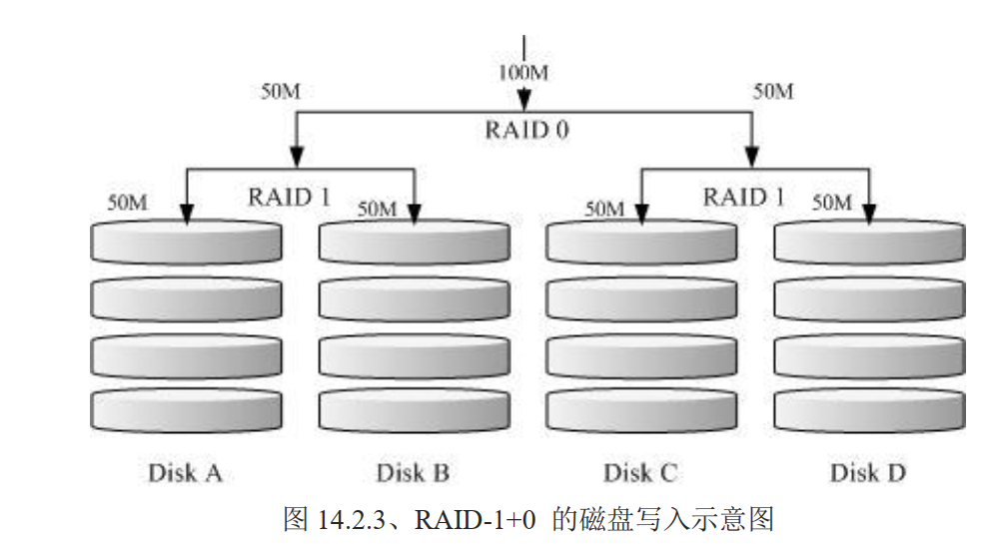

# 软件磁盘阵列（Software RAID）

## 什么是 RAID

Redundant Arrays of Inexpensive Disks 简称 RAID，翻译为：容错式链家磁盘阵列。

RAID 通过一种技术（软件或硬件），将多个较小的磁盘整合成为一个较大的磁盘，而且还具有数据保护功能。根据等级不同，整合后的磁盘具有不同的功能，基本常见的 level 有如下几种：

### RAID-0 等量模式 stripe：效能最佳

该模式如果使用相同型号与容量的磁盘来组成时，效果较佳。RAID 将磁盘切出等量的区块（chunk），一般可设置为 4K~1M 之间，当一个文件要写入 RAID 时，该文件会依据 chunk 的大小切割好，再依序放到各个磁盘里。会优先等量存放到各个磁盘上去，比如：有两块磁盘都是 100G，你有一个文件 100M，那么每个磁盘会分到 50MB 的容量，但是如果一块磁盘是 50G，另外一块是 100G，由于是等量，但是由于磁盘小磁盘先被放满，那么其他数据就会落到另一块磁盘上，这种情况下效能就降低了，因为所有压力由一块磁盘承担了。


这种模式下，越多的硬盘组成的 RAID-0 理论上效能会越好，因为每块磁盘负责的数据量更低了，但是 **只要有任何一块磁盘顺坏，在 RAID 上面的所有数据都会丢失而无法读取**。

因为等量分散在每块硬盘上，坏掉一块硬盘，意味着有部分数据丢失了，那么一个文件的部分数据丢失了，不完整了，可能该文件也就损坏了

### RAID-1 映像模式 mirror：完整备份

建议使用相同磁盘容量，最好是一样的磁盘，如果是不同容量的磁盘组成，那么总容量将以最小的那一块为主。

这种模式主要是：让同一份数据，完整的保存在两块磁盘上。比如：100MB 的文件，且目前只有 两块硬盘组成 RAID-1 时，那么每块硬盘上都会写入 100MB 的数据。由于两块磁盘内容一模一样，好像镜子映照出来一样，所以也称为 mirror 模式


如图，一份数据被写入到两块磁盘中，如果使用软件来做磁盘阵列，那么效能会大大降低，因为只有一个南桥，一份数据要写入两次。如果使用的是 RAID（磁盘阵列卡）时，阵列卡会主动复制一份儿不使用系统的 I/O 总线，效能就还可以。

由于是映像数据，当其中一块硬盘损坏，数据还是完整的。

RAID-1 最大的优点大概就在于数据的备份。用空间换安全。写入效能不佳，但是读取效能还不错，多个 processes 在读取同一份数据时，RAID 会自行取得最佳的读取平衡

### RAID 1+0，RAID 0+1

RAID-0 效能佳，数据不安全。RAID-1 数据安全，但效能不佳。将两者组合起来就形成了：

- RAID 1 + 0：先让两块磁盘组成 RAID 1（共有两组），再让这两组 RAID 1 再组成一组 RAID 0
- RAID 0 + 1：则与上面相反



此种方式，最坏的可能性是同时坏掉 b 和 c，也就是 RAID 1 中的其中一块。那么数据都能保证完整。此种方式也是目前存储设备厂商推荐的方法

假设你有 20 快磁盘组成的系统，每两块组成一个 RAID 1，总共有 10 组可以自己复原的系统，再让这 10 组组成一个新的 RAID 0，速度立刻拉升 10 倍了。同时注意：因为每组 RAID 1 是个别独立存在的，因此任何一块磁盘损坏，数据都是从另一块磁盘直接复制过来重建，并不像 RAID5/RAID6 必须要整组 RAID 的磁盘共同重建一块独立的磁盘系统，而且 RAID 1 与 RAID 0 不需要经过计算的（striping），读写效率也比其他的 RAID 等级好太多了，这也是为什么会推荐 RAID1 + 0 方式了

### RAID 5：效能与数据备份的均衡考虑

RAID 5 至少需要三块以上的磁盘才能够组成这种类型的磁盘阵列。数据写入类似 RAID 0，不过每个循环的写入过程中（striping），在每块磁盘还加入一个同位检查数据（Parity），该数据会记录其他磁盘的备份数据，用于当有磁盘损坏时的救援。


每个循环写入时，都会有部分的同为检查码 parity 被记录，并且记录的同位检查码每次都记录在不同的磁盘，当任何一个磁盘损坏时，可以由其他磁盘的检查码来重建原磁盘内的数据，由于有同位检查码，RAID 5 的总容量会是整体磁盘数量减 1 快磁盘。原本 3 块磁盘，只剩下 3-1 =2 快磁盘的容量。当磁盘损坏数量大于等于 2 块时，整组 RAID 5 的数据就损坏了。因此 RAID 5 预设只能支持一块磁盘损坏的情况

读写效能上的比较：

- 读：由于多快磁盘，效率堪比 RAID-0
- 写：有同位检查码 parity的计算，写入效能与系统的硬件关系较大，尤其当使用软件磁盘阵列时，parity 是通过 CPU 去计算而非专职的磁盘阵列卡，所以写效率需要评估

RAID 5 仅能支持一块磁盘的损坏，因此出现了 RAID 6，RAID 6 使用 2 块磁盘作为 parity 的存储。所以当两块磁盘损坏时，数据还完整

### Spare Disk：预备磁盘的功能

当磁盘阵列损坏时，需要更换新的硬盘，并重建原本的数据。

更换上新的硬盘并顺利启动磁盘阵列后，磁盘阵列会主动重建（rebuild）原本损坏那块磁盘的数据到新的磁盘上，这是磁盘阵列的有点。必过，需要手动插拨硬盘（更换坏掉的硬盘），如果你的系统支持热插播，那么不需要关机就可以完成数据重建

为了让系统可以实时的在坏掉硬盘时主动重建，就需要预备磁盘（spare disk）。就是一块或多块磁盘不包含在原本的磁盘阵列等级中的磁盘，当磁盘阵列中的磁盘顺坏时，则会被主动拉进磁盘阵列中，将坏的磁盘移除磁盘阵列，并重建数据。

同样，如果你的磁盘阵列支持热插拨，拔掉旧硬盘，换上新硬盘，并设置为 spare disk。就更方便了

举例来说“有一个磁盘阵列可允许 16 快磁盘的数量，只有 10 块硬盘（每块 250G），用了 9 快硬盘组成 RAID 5。 1 快硬盘作为 spare disk，那么该磁盘阵列总容量为  (9-1)*250G=2000G。两年后看信号灯才发现坏掉了一块磁盘，那么之前预备的那块 spare disk 被自动拉进磁盘阵列了。 对数据没有任何影响

### 磁盘阵列的优点

如果要磁盘阵列，应该考虑：

1. 数据安全与可靠性：不是指网络信息安全，而是当硬件（磁盘）损坏时，数据是否能保证不丢失
2. 读写效率：例如 RAID 0 可以加强读写效率，让你的系统 I/O 部分得到改善
3. 容量：可以让多块磁盘组合起来，也就意味着单一文件系统可以有相当大的容量

尤其是数据的可靠性与完整性更是使用 RAID 的考虑重点。

各个等级优缺点如下

项目 | RAID 0 | RAID 1 | RAID 10 | RAID 5 | RAID 6
:-:|:-:|:-:|:-:|:-:|:-:
最少磁盘|2|2|4|3|4
最大容错磁盘（1）|无|n-1|n/2|1|2
数据安全性（1）|完全没有|最佳|最佳|好|比 RAID5 好
理论写入效率（2）|n|1|n/2|< n-1|< n-2
理论读取效率（2）|n|n|n|< n-1|< n-2
可用容量（3）|n|1|n/2|n-1|n -2
一般应用|强调效率单数据不重要|资料与备份|服务器、云系统常用|资料与备份|资料与备份

注意：因为 RAID5/6 读写需要经过 parity 的计算器，因此读写效率不会刚好满足使用的磁盘数量

另外，根据使用情况的不同，一般推荐的磁盘阵列的等级也不同；比如几百 GB 单一大文件数据，会选择在 RAID 6 ，能满足读写需求还有数据完整性保证。如果是在云程序环境中，因为需要确保每个虚拟机能够快速反应及提供数据完整性，因此 RAID5/6 效率较弱的等级是不考虑的，总结来说，大概就剩下  RAID 10 能满足云环境的效率需求了。在某些更特别的环境下，如果搭配 SSD 那么读写效率上会更好


## software、hardware RAID

磁盘阵列分为软件与硬件磁盘阵列

硬件磁盘阵列 hardware RAID 是通过磁盘阵列卡来达成数组的目的。上面有一块专门的芯片处理 RAID 任务，那么很多任务（如 RAID 5 的同为检查码计算）就不会重复消耗原本系统的 I/O 总线。理论上效率更好。另外一般的中高阶磁盘阵列卡都支持热插拨

磁盘阵列卡好的上万，低价的可能只能支持到 RAID 0 与 1，同时还需要磁盘阵列卡的驱动程序，才能使用

由于磁盘阵列有很多优秀的功能，但是很贵，因此就出现了软件仿真磁盘阵列功能，

软件磁盘阵列 software RAID 主要通过软件来仿真数组的任务，因此会耗费较多的系统资源，如 CPU 运算和 IO 总线等资源。由于个人计算机的发展快速，这些限制还不算严重，可以玩一玩软件磁盘阵列

以 CentOS 提供的软件 mdadm 磁盘阵列来说，它会以 partition 或 disk 为磁盘单位，意味着你不需要两块以上的磁盘，只需要有两个以上的分区槽（partition）就能过设计你的磁盘阵列。它支持的等级有 RAID0/1/5 spare disk 等，而且提供的管理机制还能达到类似热插拨的功能，可以在线（文件系统正常使用）进行分区槽的抽换。

硬件磁盘阵列在 Linux 下看起来就是一块实际的大磁盘，因此硬件磁盘阵列文件名为 `/dev/sd[a-p],因为使用到 SCSI 的模块的原因。

软件磁盘阵列时系统仿真的，因此使用的文件名是系统的装置文件，文件名为 `/dev/md0  /dev/md1 ...`

Intel 的南桥附赠的磁盘阵列功能，在 windows 视乎是完整的磁盘阵列，但是在 Linux 下被视为是软件磁盘阵列的一种，因此如果你有设置过 Intel 的南桥芯片磁盘阵列，那么在 Linux 下会是 `/dev/md126、/dev/md127` 之类的装置文件名，而他的分区槽是 `/dev/md126p1、/dev/md126p2` 之类

## 磁盘阵列的设置

很简单，一个指令即可

```bash
mdadm --detail /dev/md0
mdadm --create /dev/md[0-9] --auto=yes --level=[015] --chunk=NK --raid-devices=N --spare-devices=N /dev/sdx /dev/hdx...

选项与参数：

	--create：创建 RAID 关键词
	--auto=yes：决定建立后面接的软件磁盘阵列装置。也就是 `/dev/md0 、/dev/md1 ...`
	--chunk=NK：决定装置的 chunk 大小，也可以当成 stripe 大小，一般是 64K 或 512K
	--raid-devices=N：使用几个磁盘（partition）作为磁盘阵列的装置
	--spare-devices=N：使用几个磁盘作为备用（spare）装置
	--level=[015]：设置这组磁盘阵列的等级。支持很多，不过建议只要用 0、1、5
	--detail：后面接的那个磁盘阵列装置的详细信息
```

如上语法中，谈到后面接装置名，这些装置文件可以是整块磁盘（如 /dev/sdb），也可以是分区槽（如 `/dev/sdb1`） 之类，但是这些装置文件名的总数必须要等于 `--raid-devices`  与 `--spare-devices` 的个数综合才行。

下面使用测试机创建一个 RAID5 的软件磁盘阵列，磁盘阵列规划如下：

- 利用 4 个 partition 组成 RAID5
- 每个 partition 约 1GB，需确定每个 partition 一样大较佳
- 利用 1 个 partition 设置为 spare disk
- chunk 设置为 256K
- spare disk 的大小与其他 RAID 所需 partition 一样大
- 将此 RAID 5 装置挂载到 `/srv/raid` 目录下


