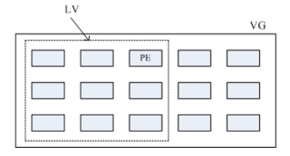

#  逻辑滚动条管理员（Logical Volume Manager）

有一个场景：当初规划主机的时候，只给了 `/home` 目录 50G，后续不够用了，要怎么办？

很多人会这样做：加一块新硬盘，重新分区、格式化，将 `/home` 的数据完整复制过去，将原本的 partition 卸载重新挂载新的 partition。

万一第二次又分多了，导致容量浪费了，又要减掉一部分容量？是不是还需要重来一次？

有更简单的方法来解决这个问题，就是使用 LVM，它的重点在于「可以弹性的调整 filesystem 的容量，并非在于效能与数据保全上面。

LVM 可以整合多个实体 partition 在一起，让这些 partitions 看起来像是一个磁盘一样，而且可以在未来新增或移除其他的实体 partition 到这个 LVM 管理的磁盘中。

## 上面是 LVM：PV、PE、VG、LV 的意义

Logical Volume Manager 翻译为逻辑滚动条管理员，简称 LVM。LVM 将几个实体的 partitions（或 disk）通过软件组合成一块看起来是独立的大磁盘（**VG**）,然后将这块大磁盘再经过分区成为可使用分区槽（**LV**），最终就能挂载使用了。

但是为什么这样的系统可以进行 filesystem 的扩充或缩小呢？它与一个称为 **PE** 的项目有关

### Physical Volume PV 实体滚动条

实际的 partition（或 DISK）需要调整系统标识符（system ID）成为 8e（LVM 的标识符），再经过 pvcreate 的指令将他转成 LVM 最底层的实体滚动条（LV），之后才可以将这些 PV 加以利用，调整 system ID 的方式是通过 gdisk

### Volume Group VG 滚动条组

LVM 大磁盘是将许多 PV 整合成这个 VG ，所以 VG 是 LVM 组合起来的打磁盘。在预设情况下，使用 32 位的 Linux 系统时，基本上 LV 最大仅能支持到 65534 个 PE ，若使用预设的 PE 为 4MB 的情况下，最大容量可以达到约 256Gb，而在 64 位的 Linux 上，LV 几乎没有什么容量限制了

### Physical Extent PE 实体范围区块

LVM 预设使用 4MB 的 PE 区块，LV 在 32 位系统上最多有 65534 个 PE（lvml 的格式），因此预设的 LVM 的 LV 有 4M*65534/1024M=256G.

PE 是整个 LVM 最小的存储块，我们写入的数据都是写入 PE 的，简单说，PE 类似系统里面的 block。

所以调整 PE 会影响到 LVM 的最大容量，不过在 CentOS 6.x 以后，直接使用 lvm2 的各项格式功能，以及系统变成了 64 位，因此整个限制以及不存在了

### Logical Volume LV 逻辑滚动条

最终的 VG 还会被被切成 LV，LV 是最后可以被格式化使用的类似分区槽的东西，由于 PE 是整个 LVM 的最小存储单位，那么 LV 的大小就与 LV 内的 PE 总数有关。为了方便用户利用 LVM 来管理其系统，因此 LV 的装置文件名通常指定为 `/dev/vgname/lvname`的样式

LVM 可弹性的变更 filesystem 的容量是通过「交换 PE」来进行数据转换，将原本 LV 内的 PE 转移到其他装置中以降低 LV 容量，或将其他装置的 PE 加到此 LV 中以加大容量。VG、LV 与 PE 的关系类似下图：



如上图，VG 内的 PE 会分给虚线部分的 LV，如果未来这个 VG 要扩充的话，加上其他的 PV 即可。而最重要的 LV 如果要扩充的话，也是通过加入 VG 内没有使用到的 PE 来扩充的

### 实操流程

通过 PV、VG、LV 的规划之后，再利用 mkfs 将 LV 格式化为可以利用的文件系统，而这个文件系统的容量在未来还可以扩充或减少，而且里面的数据还不会被影响，整个流程由基础到最终的结果可以这样看：


当数据写入 LV 时，有两种机制写入到硬盘中：

- 线性模式（linear）

  假如将 `/dev/vda1、/dev/vdb1` 这两个 parition 假如到 VG 中，并且整个 VG 只有一个 LV 时，那么线性模式就是：当 `/dev/vda1` 的容量用完之后，`/dev/vdb1`的硬盘才会被使用到，这也是我们建议的模式

- 交错模式（triped）

  就好理解了，一份数据分割在多个硬盘上，理论上读写效率会好点

基本上，**LVM 最主要的用途是实现一个可以弹性调整容量的文件系统上**，而不是建立一个有效率为主的磁盘；因为数据分割在多个硬盘上，只要坏掉一块硬盘，那么基本上会损失掉很多数据。不适合 LVM

##  LVM 实验流程

LVM 必须核心有支持且需要安装 lvm2 软件，较新的 distribution 已经预设 LVM 相关软件安装了。

上一节实验 RAID 有 5 个分区，这里还是建议修改下 systemID 比较好，将 RAID 的 fd 改为 LVM 的 8e，实验流程如下：

- 使用 4 个 partition，每个 partition 容量为 1GB，且 system ID 需要为 8e
- 全部的 partition 整合为一个 VG，VG 名称设置为 vmrcode；且 PE 的大小为 16MB
- 建立一个名为 vmrcode 的 LV，容量大约 2G
- 最终这个 LV 格式化 xfs 的文件系统且挂载 `/srv/lvm` 中

0. disk 阶段，实际的磁盘

  这里需要准备把之前的 5 个分区删掉，重新格式化出来；有关分区相关操作请参考[第 7 章的硬盘分区、格式化章节](../07/03/)
  
  ```bash
  # 最终分区出来的信息如下
  Number  Start (sector)    End (sector)  Size       Code  Name
     1            2048            6143   2.0 MiB     EF02  
     2            6144         2103295   1024.0 MiB  0700  
     3         2103296        65026047   30.0 GiB    8E00  
     4        65026048        67123199   1024.0 MiB  8E00  Linux LVM
     5        67123200        69220351   1024.0 MiB  8E00  Linux LVM
     6        69220352        71317503   1024.0 MiB  8E00  Linux LVM
   7        71317504        73414655   1024.0 MiB  8E00  Linux LVM
     8        73414656        75511807   1024.0 MiB  8E00  Linux LVM
  
  # 前面说的 8e 就是这里的 Code 字段，是在建立分区的时候指定的 8E00,也就是 LVM 格式
  ```

1. PV 阶段

   下面是与 PV 有关的指令

   - pvcreate：将实体 partition 建立成为 PV
   - pvscan：搜索目前系统里面任何具有 PV 的磁盘
   - pvdisplay：显示目前系统上 PV 状态
   - pvremove：将 PV 属性移除，让该 partition 不具有 PV 属性

   ```bash
   # 检查有无 PV 在系统上
   [root@study ~]# pvscan 
     PV /dev/sda3   VG centos          lvm2 [30.00 GiB / 14.00 GiB free]
     Total: 1 [30.00 GiB] / in use: 1 [30.00 GiB] / in no VG: 0 [0   ]
   # 在安装的时候就使用了 LVM 了， /dev/sda3 就是
   
   # 将 /dev/sda{4-7} 建立成为 pv 格式
   [root@study ~]# pvcreate /dev/sda{4,5,6,7}
     Physical volume "/dev/sda4" successfully created.
     Physical volume "/dev/sda5" successfully created.
     Physical volume "/dev/sda6" successfully created.
     Physical volume "/dev/sda7" successfully created.
   [root@study ~]# pvscan 
     PV /dev/sda3   VG centos          lvm2 [30.00 GiB / 14.00 GiB free]
     PV /dev/sda6                      lvm2 [1.00 GiB]
     PV /dev/sda4                      lvm2 [1.00 GiB]
     PV /dev/sda5                      lvm2 [1.00 GiB]
     PV /dev/sda7                      lvm2 [1.00 GiB]
     Total: 5 [34.00 GiB] / in use: 1 [30.00 GiB] / in no VG: 4 [4.00 GiB]
    # 最后一行显示整体 PV 的量 / 已经被使用到的 VG 的 PV 量 / 剩余 PV 量
     
    # 更详细的列出系统上每个 PV 的个别信息
    [root@study ~]# pvdisplay /dev/sda4
     "/dev/sda4" is a new physical volume of "1.00 GiB"
     --- NEW Physical volume ---
     PV Name               /dev/sda4		# 实际的 partition 装置名称
     VG Name               				  # 因为尚未分配出去，所以空白的
     PV Size               1.00 GiB		# 容量
     Allocatable           NO				# 是否已被分配
     PE Size               0   			 # 此 PV 内 PE 的大小
     Total PE              0				  # 共分区出几个 PE
     Free PE               0				  # 没被 LV 用掉的 PE
     Allocated PE          0				  # 可以被分配出去的 PE 数量	
     PV UUID               ecfFVZ-Qesj-6xhF-3p0w-9GCO-ULGG-q9Kpg9
     # 由于 PE 是建立 VG 时才给予的参数，所以这里看到的 PE 都会是 0
     # 而且也没有多余的 PE 可共分配（allocatable）
   ```

2. VG 阶段

   与 VG 相关指令有：

   - vgcreate：主要建立 VG 的指令，参数较多
   - vgscan：搜索系统上的 VG
   - vgdisplay：显示 VG 状态
   - vgextend：在 VG 内增加额外的 PV
   - vgreduce：在 VG 内移除 PV
   - vgchange：设置 VG 是否启动（active）
   - vgremove：删除一个 VG

   PV 的名称其实就是 partition 的装置文件名，而 VG 的名称是自定义的。

   ```bash
   vgcreate [-s N[mgt]] VG名称 PV名称
   
   选项与参数：
   	-s：后面接 PE 的大小 site，单位可以是 m、g、t 大小写均可
   ```

   ```bash
   # 将 /dev/sda4-6 建立为一个 VG，且指定 PE 为 16MB
   [root@study ~]# vgcreate -s 16M vmcrcodevg /dev/sda{4,5,6}
     Volume group "vmcrcodevg" successfully created
   [root@study ~]# pvscan 
     PV /dev/sda4   VG vmcrcodevg      lvm2 [1008.00 MiB / 1008.00 MiB free]
     PV /dev/sda5   VG vmcrcodevg      lvm2 [1008.00 MiB / 1008.00 MiB free]
     PV /dev/sda6   VG vmcrcodevg      lvm2 [1008.00 MiB / 1008.00 MiB free]
     PV /dev/sda3   VG centos          lvm2 [30.00 GiB / 14.00 GiB free]
     PV /dev/sda7                      lvm2 [1.00 GiB]
     Total: 5 [33.95 GiB] / in use: 4 [32.95 GiB] / in no VG: 1 [1.00 GiB]
   # 可以发现有 3 个 PV被分掉了
   
   [root@study ~]# vgdisplay vmcrcodevg
     --- Volume group ---
     VG Name               vmcrcodevg
     System ID             
     Format                lvm2
     Metadata Areas        3
     Metadata Sequence No  1
     VG Access             read/write
     VG Status             resizable
     MAX LV                0
     Cur LV                0
     Open LV               0
     Max PV                0
     Cur PV                3
     Act PV                3
     VG Size               2.95 GiB		# 整体 VG 容量大小
     PE Size               16.00 MiB		# 内部每个 PE 的大小
     Total PE              189				# 总共 PE 的数量
     Alloc PE / Size       0 / 0   
     Free  PE / Size       189 / 2.95 GiB		# 可配置给 LV 的 PE 数量/ 总容量
     VG UUID               JQP2VZ-ilbN-MBuw-jccl-do84-tHu6-BInUXS
   
   # 剩余的 PV /dev/sda7 分配个 给 vmcrcodevg
   # 在 VG 内增加额外的 PV
   [root@study ~]# vgextend vmcrcodevg /dev/sda7
     Volume group "vmcrcodevg" successfully extended
   [root@study ~]# vgdisplay vmcrcodevg
     --- Volume group ---
     VG Name               vmcrcodevg
     System ID             
     Format                lvm2
     Metadata Areas        4
     Metadata Sequence No  2
     VG Access             read/write
     VG Status             resizable
     MAX LV                0
     Cur LV                0
     Open LV               0
     Max PV                0
     Cur PV                4
     Act PV                4
     VG Size               <3.94 GiB
     PE Size               16.00 MiB
     Total PE              252				# PE 变大了，可用容量也变大了
     Alloc PE / Size       0 / 0   
     Free  PE / Size       252 / <3.94 GiB
     VG UUID               JQP2VZ-ilbN-MBuw-jccl-do84-tHu6-BInUXS
   
   ```

3. LV 阶段

   有了 VG 这个大磁盘之后，就可以建立分区了。先了解与 LV 相关的指令：

   - lvcreate：建立 LV
   - lvscan：查询系统上的 LV
   - lvdisplay：显示系统上面的 LV 状态
   - lvextend：在 LV 里面增加容量
   - lvreduce：在 LV 里面减少容量
   - lvremove：删除一个 LV
   - lvresize：对 LV 进行容量大小调整

   ```bash
   lvcreate [-L N[mgt]] [-n lv名称] VG名称
   lvcreate [-l n] [-n lv名称] VG名称
   
   选项与参数：
   	-L：后面接容量，要注意：最小单位为 PE，也就是必须的 PE 的倍数，如果不是，系统则自行计算最相近的容量
   	-l：后面接 PE 的个数，若要这么做，需要自行计算 PE 数
   	-n：后面接 LV 的名称
   ```

   ```bash
   # 将 vmcrcodevg 分 2GB 给 vmmrcodelv
   [root@study ~]# lvcreate -L 2G -n vmmrcodelv vmcrcodevg
     Logical volume "vmmrcodelv" created.
   [root@study ~]# lvscan 
     ACTIVE            '/dev/vmcrcodevg/vmmrcodelv' [2.00 GiB] inherit
     ACTIVE            '/dev/centos/root' [10.00 GiB] inherit
     ACTIVE            '/dev/centos/home' [5.00 GiB] inherit
     ACTIVE            '/dev/centos/swap' [1.00 GiB] inherit
   # 由于本列中每个 PE 为 16M，如果要用 PE 的数量来处理的话，可以用下面的指令
   # lvcreate -l 128 -n vmmrcodelv vmcrcodevg
   
   [root@study ~]# lvdisplay /dev/vmcrcodevg/vmmrcodelv 
     --- Logical volume ---
     LV Path                /dev/vmcrcodevg/vmmrcodelv		# lv 全名
     LV Name                vmmrcodelv
     VG Name                vmcrcodevg
     LV UUID                V0WB3Y-SQr3-4hLb-D5IC-8fN6-6PEY-NPdJxz
     LV Write Access        read/write
     LV Creation host, time study.centos.mrcode, 2020-03-01 22:03:40 +0800
     LV Status              available
     # open                 0
     LV Size                2.00 GiB		# 容量
     Current LE             128
     Segments               3
     Allocation             inherit
     Read ahead sectors     auto
     - currently set to     8192
     Block device           253:3
   
   ```

4. 文件系统阶段

   ```bash
   [root@study ~]# mkfs.xfs /dev/vmcrcodevg/vmmrcodelv 
   meta-data=/dev/vmcrcodevg/vmmrcodelv isize=512    agcount=4, agsize=131072 blks
            =                       sectsz=512   attr=2, projid32bit=1
            =                       crc=1        finobt=0, sparse=0
   data     =                       bsize=4096   blocks=524288, imaxpct=25
            =                       sunit=0      swidth=0 blks
   naming   =version 2              bsize=4096   ascii-ci=0 ftype=1
   log      =internal log           bsize=4096   blocks=2560, version=2
            =                       sectsz=512   sunit=0 blks, lazy-count=1
   realtime =none                   extsz=4096   blocks=0, rtextents=0
   [root@study ~]# mount /dev/vmcrcodevg/vmmrcodelv /srv/lvm/
   [root@study ~]# df -Th /srv/lvm/
   文件系统                          类型  容量  已用  可用 已用% 挂载点
   /dev/mapper/vmcrcodevg-vmmrcodelv xfs   2.0G   33M  2.0G    2% /srv/lvm
   
   ```

   这就建立好一个 LV 了，可以使用  /srv/lvm 了

## 放大 LV 容量

LVM 最大的特色是弹性调整磁盘容量，前面说到，放大 LV 需要有下面这些流程：

1. VG 阶段需要有剩余的容量

   如果 VG 阶段没有多余的容量，那么就增加硬盘等手段创建 PV，然后增加到 VG 中，可利用 pvcreate 和 vgextedn 来操作

2. LV 阶段产生更多可用容量

   有了足够的 VG，那么可以使用 lvresize 指令将剩余容量加入到 LV 中

3. 文件系统阶段放大

   Linux 实际使用的其实不是 LV，而是 LV 这个装置内的文件系统，所以一切最终还是以文件系统为依归。目前在 Linux 下，作者测试过可以放大的文件系统有 XFS 和 EXT 家族，至于缩小则只有 EXT 家族，目前 XFS 文件系统不支持文件系统的容量缩小

   xfs 放大可以通过 xfs_growfs 指令

最后一个步骤最重要，在第  7 章中知道，整个文件系统在最初格式化的时候就建立了 inode、block、superblock 等信息，要改变这些信息很难，不过因为文件系统格式化的时候建立的是多个 block group，因此可以通过在文件系统中增加 block group 的方式来增减文件系统的量，而增加 block group 就是利用 xfs_growfs 指令

另外，严格说起来，放大文件系统并不是没有进行格式化，格式化的位置在于该装置后来新增的部分，装置的前面已经存在的文件系统没有任何变化。新增的格式化过的数据，再反馈回原本的 supberblock 。

这里针对 `/srv/lvm` 增加 500MB 容量

```bash
# 检查 VG
[root@study ~]# vgdisplay vmcrcodevg 
  --- Volume group ---
  VG Name               vmcrcodevg
  System ID             
  Format                lvm2
  Metadata Areas        4
  Metadata Sequence No  3
  VG Access             read/write
  VG Status             resizable
  MAX LV                0
  Cur LV                1
  Open LV               1
  Max PV                0
  Cur PV                4
  Act PV                4
  VG Size               <3.94 GiB
  PE Size               16.00 MiB
  Total PE              252
  Alloc PE / Size       128 / 2.00 GiB
  Free  PE / Size       124 / <1.94 GiB	# 这里还有剩余的 PE 未使用
  VG UUID               JQP2VZ-ilbN-MBuw-jccl-do84-tHu6-BInUXS
  
# 直接放大 LV
[root@study ~]# lvresize -L +500 /dev/vmcrcodevg/vmmrcodelv 
  Rounding size to boundary between physical extents: 512.00 MiB.
  Size of logical volume vmcrcodevg/vmmrcodelv changed from 2.00 GiB (128 extents) to 2.50 GiB (160 extents).
  Logical volume vmcrcodevg/vmmrcodelv successfully resized.
[root@study ~]# lvscan 
  ACTIVE            '/dev/vmcrcodevg/vmmrcodelv' [2.50 GiB] inherit
  ACTIVE            '/dev/centos/root' [10.00 GiB] inherit
  ACTIVE            '/dev/centos/home' [5.00 GiB] inherit
  ACTIVE            '/dev/centos/swap' [1.00 GiB] inherit
# 可以看到 lv 变大了

[root@study ~]# df -Th /srv/lvm/
Filesystem                        Type  Size  Used Avail Use% Mounted on
/dev/mapper/vmcrcodevg-vmmrcodelv xfs   2.0G   33M  2.0G   2% /srv/lvm
```

可以看到 LV 增加到了 2.5G，但是文件系统还未增加。下面继续处理文件系统的扩容

```bash
# 查看原文件系统内的 superblock 记录
[root@study ~]# xfs_info /srv/lvm/
meta-data=/dev/mapper/vmcrcodevg-vmmrcodelv isize=512    agcount=4, agsize=131072 blks
         =                       sectsz=512   attr=2, projid32bit=1
         =                       crc=1        finobt=0 spinodes=0
data     =                       bsize=4096   blocks=524288, imaxpct=25
         =                       sunit=0      swidth=0 blks
naming   =version 2              bsize=4096   ascii-ci=0 ftype=1
log      =internal               bsize=4096   blocks=2560, version=2
         =                       sectsz=512   sunit=0 blks, lazy-count=1
realtime =none                   extsz=4096   blocks=0, rtextents=0
# agcount=4，blocks=524288

# 很关键的一步来了
[root@study ~]# xfs_growfs /srv/lvm/
meta-data=/dev/mapper/vmcrcodevg-vmmrcodelv isize=512    agcount=4, agsize=131072 blks
         =                       sectsz=512   attr=2, projid32bit=1
         =                       crc=1        finobt=0 spinodes=0
data     =                       bsize=4096   blocks=524288, imaxpct=25
         =                       sunit=0      swidth=0 blks
naming   =version 2              bsize=4096   ascii-ci=0 ftype=1
log      =internal               bsize=4096   blocks=2560, version=2
         =                       sectsz=512   sunit=0 blks, lazy-count=1
realtime =none                   extsz=4096   blocks=0, rtextents=0
data blocks changed from 524288 to 655360
# 这里的 blocks 改变到 655360 了
[root@study ~]# xfs_info /srv/lvm/
meta-data=/dev/mapper/vmcrcodevg-vmmrcodelv isize=512    agcount=5, agsize=131072 blks
         =                       sectsz=512   attr=2, projid32bit=1
         =                       crc=1        finobt=0 spinodes=0
data     =                       bsize=4096   blocks=655360, imaxpct=25
         =                       sunit=0      swidth=0 blks
naming   =version 2              bsize=4096   ascii-ci=0 ftype=1
log      =internal               bsize=4096   blocks=2560, version=2
         =                       sectsz=512   sunit=0 blks, lazy-count=1
realtime =none                   extsz=4096   blocks=0, rtextents=0
# 现在 agcount=5，blocks=655360 了
[root@study ~]# df -Th  /srv/lvm/
Filesystem                        Type  Size  Used Avail Use% Mounted on
/dev/mapper/vmcrcodevg-vmmrcodelv xfs   2.5G   33M  2.5G   2% /srv/lvm

```

如上展示了，在不停机的情况下可以进行扩容，很棒的特性；

最后注意，目前的 XFS 文件系统中，没有缩小文件系统容量的设计。只有 EXT 家族可以

## 使用 LVM thin Volume 让 LVM 动态自动调整磁盘使用率

考虑这样一个场景：有个目录未来会使用到大约 5T 的容量，但是目前你的磁盘只有 3T，但接下来的两个月你的系统都不会超过 3T 的容量，但是你要让用户知道，他最最多有 5T 的空间可以使用，而且在一个月内你确实可以将系统提升到 5T 以上的容量，又不想在提升容量后才放大到 5T，怎么办？

这个时候可以考虑：实际用多少才分配多少容量给 LV 的 LVM Thin Volume 功能

再考虑一个环境：你需要 3 个 10GB 的硬盘进行某些测试，但是你的环境只有 5Gb 的剩余容量，在传统的 LVM 环境下，LV 的容量是一开始就分配好的，因此你没有办法在这样的环境中产生出 3 个 10GB 的装置，而且 10GB 的装置其实每个实际使用率都没有超过 10%，也就是总用量目前只用到 3GB，你实际有 5GB的容量，那么久可以使用 LVM Thin Volume 做出 3 个只用 1GB 的 10GB 装置

LVM thin Volume 的概念是：先建立一个可以实支实付、用多少容量才分配实际写入多少容量的磁盘容量存储池（thin pool），然后再由这个 thin pool 去产生一个「指定要固定容量大小的 LV 装置」，但是这个 LV 在声明上，他的容量可能有 10GB，但实际上，该装置用到多少容量时，才会从 thin pool 去实际取得所需的容量』

thin pool 只有 1GB 的实际容量，但是可以分配一个 10GB 的 LV 装置，该装置实际用到 500M 时，thin pool 也就只有 500M 分配给他，但是由 thin pool 分配出来的 LV 总实际使用量绝对不能超过 thin pool 的最大实际容量

简单可以理解为：实际上你只有 1G 物理容量，但是你分配一个 10G 的 lv，只是这个 10G 的 lv 最大实际容量也就只有 1G

下面使用剩余的容量，来实践练习：

1. 由 vmcrcodevg 的剩余容量取出 1GB 来做出一个名为 vmrcodetpool 的 thin pool LV 装置，这就是所谓的磁盘容量存储池 thin pool
2. 由 vmcrcodevg 内的 vmrcodetpool 产生一个名为 vmrcodethin1 的 10GB LV 装置
3. 将此装置实际格式化为 XFS 文件系统，并且挂载到 `/srv/thin` 目录内

```bash
# 创建 thin pool
[root@study ~]# lvcreate -L 1G -T vmcrcodevg/vmrcodetpool
  Thin pool volume with chunk size 64.00 KiB can address at most 15.81 TiB of data.
  Logical volume "vmrcodetpool" created.

[root@study ~]# lvdisplay /dev/vmcrcodevg/vmrcodetpool 
  --- Logical volume ---
  LV Name                vmrcodetpool
  VG Name                vmcrcodevg
  LV UUID                163HRB-1gOB-6SOS-Dion-g29K-uOZr-deGTyl
  LV Write Access        read/write
  LV Creation host, time study.centos.mrcode, 2020-03-01 22:40:42 +0800
  LV Pool metadata       vmrcodetpool_tmeta
  LV Pool data           vmrcodetpool_tdata
  LV Status              available
  # open                 0
  LV Size                1.00 GiB		# 总共可分配出去容量
  Allocated pool data    0.00%			# 以分配的容量百分比
  Allocated metadata     10.23%			# 以分配的数据百分比
  Current LE             64
  Segments               1
  Allocation             inherit
  Read ahead sectors     auto
  - currently set to     8192
  Block device           253:6

# 语法为 lvs VGname
[root@study ~]# lvs vmcrcodevg
  LV           VG         Attr       LSize Pool Origin Data%  Meta%  Move Log Cpy%Sync Convert
  vmmrcodelv   vmcrcodevg -wi-ao---- 2.50g                                                    
  vmrcodetpool vmcrcodevg twi-a-tz-- 1.00g             0.00   10.23 
  
# 开始建立 10GB 的装置
[root@study ~]# lvcreate -V 10G -T vmcrcodevg/vmrcodetpool -n vmrcrodethin1
  WARNING: Sum of all thin volume sizes (10.00 GiB) exceeds the size of thin pool vmcrcodevg/vmrcodetpool and the size of whole volume group (<3.94 GiB).
  WARNING: You have not turned on protection against thin pools running out of space.
  WARNING: Set activation/thin_pool_autoextend_threshold below 100 to trigger automatic extension of thin pools before they get full.
  Logical volume "vmrcrodethin1" created.
  
[root@study ~]# lvs vmcrcodevg
  LV            VG         Attr       LSize  Pool         Origin Data%  Meta%  Move Log Cpy%Sync Convert
  vmmrcodelv    vmcrcodevg -wi-ao----  2.50g                                                            
  vmrcodetpool  vmcrcodevg twi-aotz--  1.00g                     0.00   10.25                           
  vmrcrodethin1 vmcrcodevg Vwi-a-tz-- 10.00g vmrcodetpool        0.00 
# 多了一个 vmrcrodethin1 还使用了 Pool，并且是 10Gb 的

# 创建文件系统
[root@study ~]# mkfs.xfs /dev/vmcrcodevg/vmrcrodethin1 
meta-data=/dev/vmcrcodevg/vmrcrodethin1 isize=512    agcount=16, agsize=163840 blks
         =                       sectsz=512   attr=2, projid32bit=1
         =                       crc=1        finobt=0, sparse=0
data     =                       bsize=4096   blocks=2621440, imaxpct=25
         =                       sunit=16     swidth=16 blks
naming   =version 2              bsize=4096   ascii-ci=0 ftype=1
log      =internal log           bsize=4096   blocks=2560, version=2
         =                       sectsz=512   sunit=16 blks, lazy-count=1
realtime =none                   extsz=4096   blocks=0, rtextents=0
[root@study ~]# mkdir /srv/thin
[root@study ~]# mount /dev/vmcrcodevg/vmrcrodethin1 /srv/thin/
[root@study ~]# df -Th /srv/thin/
Filesystem                           Type  Size  Used Avail Use% Mounted on
/dev/mapper/vmcrcodevg-vmrcrodethin1 xfs    10G   33M   10G   1% /srv/thin
# 可以看到文件系统中显示有 10GB 的容量

# 测试下容量的使用，建立 500MB 的文件
[root@study ~]# dd if=/dev/zero of=/srv/thin/test.img bs=1M count=500
500+0 records in
500+0 records out
524288000 bytes (524 MB) copied, 2.17685 s, 241 MB/s
[root@study ~]# df -Th /srv/thin/
Filesystem                           Type  Size  Used Avail Use% Mounted on
/dev/mapper/vmcrcodevg-vmrcrodethin1 xfs    10G  533M  9.5G   6% /srv/thin

[root@study ~]# lvs vmcrcodevg
  LV            VG         Attr       LSize  Pool         Origin Data%  Meta%  Move Log Cpy%Sync Convert
  vmmrcodelv    vmcrcodevg -wi-ao----  2.50g                                                            
  vmrcodetpool  vmcrcodevg twi-aotz--  1.00g                     49.92  11.82                           
  vmrcrodethin1 vmcrcodevg Vwi-aotz-- 10.00g vmrcodetpool        4.99 
# 这时已经分配出去 49.92 的容量了，而 vmrcrodethin1 却只看到用掉了 4.99% 而已
```

所以 thin pool 非常好用，但是在管理上，要特别的留意

基本上 thin pool ，可以用来骗人，一个磁盘可以仿真出很多容量来，实际可用容量只有物理磁盘的容量，如果超过该容量，这个 thin pool 中的资料会损坏

## LVM 的 LV 磁盘快照

  