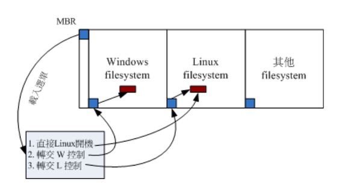

# Linux 的开机流程分析

为什么要了解开机流程？下面又几个常见的场景：

- 如果想多重引导，怎么安全系统？
- 如果你的 root 密码忘记了，如何救援？
- 如果你的默认登录模式为图形界面，如果在开机时直接指定进入纯文本模式？
- 如果因为 `/etc/fstab` 设置错误，导致无法顺利挂载根目录，如何修复 `/etc/fstab` 文件？

笔者当时其实就因为 fstab 文件配置错误，导致开机进入不了系统的问题，当时通过第 3 章中的知识点，还好救援回来了。可见是真的很重要

## 开机流程一览

开机管理程序（Boot Loader），由于各大 Linux distribution 的主流为 grub2，下面就以它为主讲解

简单来说，系统开机的经过可以总结如下的流程：

1. 加载 BISO 的硬件信息与进行自我测试，并根据设置获得第一个可开机的设备

2. 读取并执行第一个开机设备内 MBR 的 boot Loader（grub2、spfdisk 等程序）

3. 根据 boot loader 的设置加载 Kernel，Kernel 会开始检测硬件与加载驱动程序

4. 在硬件驱动成功后，Kernel 会调用 systemd 程序，并以 default.target 的流程开机：

   - systemd 执行 sysinit.target 初始系统以及 bashic.target 准备操作系统

   - systemd 启动 multi-user.target 下的本机与服务器服务

   - systemd 执行 multi-user.target 下的`/etc/rc.d/rc.local` 文件
   - systemd 执行 multi-user.target 下的 `getty.target` 及登录服务
   - systemd 执行 graphical 需要的服务

大概流程如上，会发现 systemd 程序占比非常重，下面来谈谈各个程序的主要内容是什么

## BIOS、boot loader 与 kernel 载入

在第 2 章中简单的讲解过开机流程与 MBR 的功能，以及大容量磁盘需要使用 GPT 分区格式等。这里只把后续会用到的部分专有名词综合解释：

- BIOS：无论传统 BIOS 还是 UEFI BIOS 统称 BIOS
- MBR：分区表有传统 MBR 和新式 GPT，GPT 也保留一块兼容 MBR 的区块，因此后续的说明在安装 boot loader 的部分，都简称 MBR，总之， MBR 就代表该磁盘最前面可安装 boot loader 的哪个区块

### BIOS 开机自我测试与 MBR/GPT

BIOS：在第 0 章的计算机概论中谈过，在个人计算机架构下，要启动整部系统，需要让系统去加载 BIOS （Basic Output System），并通过 BIOS 程序与加载 CMOS 的信息，获取 CMOS 内的设置取得主机的各项硬件配置，例如 CPU 与接口设备的沟通频率、开机设备的搜索顺序、硬盘的大小、系统时间、各周边总线是否启动 Plug and Play （PnP 即插即用设备）等信息

开机自我测试：BIOS 取得上述信息后，会进行开机自我测试（Power-on Self Test，简称 POST）。然后执行硬件检测初始化，并设置 PnP 装置，之后再定义出可开机的设备顺序，接下来会开始进行开机设备的数据读取

MBR：系统软件大多放置在硬盘中，所以 BIOS 会指定开机的设备让我们可以读取磁盘中的操作系统核心文件，但是由于不同的操作系统的文件系统格式不同，因此需要一个开机管理程序来处理核心文件加载 （load）的问题，因此整个 **开机管理程序被称为 Boot Loader **，Boot Loader 程序安装在开机设备的第一个扇区（sector）内，整个扇区也称为 **MBR（Master Boot Record）** 主要启动记录区

每个操作系统的 loader 都可能不同，BIOS 通过硬件的 INT 13 中断功能来读取 MBR 的，也就是说，只要 BIOS 能够检测到你的硬盘（不论该磁盘是 SATA 还是 SAS 接口），它就有办法通过 INT 13 这个信道来读取该磁盘的第一个扇区内的 MBR 软件

注意：如果系统中有两块硬盘，那么查找的是第一启动设备中的 MBR

### Boot Loader 功能

Loader 最主要的功能是认识操作系统的文件格式并根据加载核心到主存储器去执行。由于不同操作系统的文件格式不一致，因此每种操作系统都有自己的 boot loader。

那么多重操作系统：就是在不一部追上安装多中不同的操作系统

1. 必须要使用自己的 loader 才能够加载属于自己的操作系统核心
2. 但是系统的 MBR 只有一个，那么怎么能让同一台主机上安装 windows 与 Linux 呢？

这个问题在第 7 章的磁盘文件系统中有介绍到过。每个文件系统（filesystem 或 partition）都会保留一块启动扇区（boot sector）提供操作系统安装 boot loader，通常操作系统默认会安装一份 loader 到它根目录所在的文件系统的 boot sector 上。

如果在一台主机上安装 Windows 与 Linux 后，boot sector、boot loader 与 MBR 的相关系如下图所示


如上图所示，每个操作系统默认会安装一套 boot loader 到他自己的文件系统中（左下角的蓝色区域）：

- Linux 系统：安装时，你可以选择 boot loader 安装到 MBR 上，也可以选择不安装。如果选择安装到 MBR 的话，理论上你再 MBR 与 boot sector 都会有一份 boot loader 程序。
- Windows：安装时，它默认主动的将 MBR  与 boot sector 都装上一份 boot loader

所以会发现安装多重操作系统时，你的 MBR 常常会被不同的操作系统的 boot loader 所覆盖。

那么怎么解决多重操作系统的问题呢？在第 2 章中提到过，boot loader 的功能

- 提供选单：用户可以选择不同的开机项目，这也是多重引导的重要功能
- 载入核心文件：直接执行可开机的程序区段来开始操作系统
- 转交其他 loader：将开机管理功能转交给其他 loader 负责

由于具有选单功能，可以选择不同的核心来开机。由于具有控制权限转交功能，因此可以加载其他 boot sector 内的 loader。但是 Windows 的 loader 预设不具有控制转交的功能，因此你不能使用 Windows 的 loader 来加载 Linux 的 loader。这也是为什么会强调 **先装 windows，再装 Linux** 的缘故。

上述三个功能图下图所示：



上图，MBR 使用 Linux 的 grub2 开机管理程序，并且设置了 3 个选单：

- 选单 1：MBR（grub2） -> kernel file -> booting
- 选单 2：MBR（grub2） -> boot sector（Windows loader） -> Windows kernel -> booting
- 选单 3：MBR（grub2） -> boot sector（grub2）-> kernel file -> booting

### 加载核心检查硬件与 initramfs 功能

通过 boot loader 的管理而开始读取核心文件后，加下来，Linux 会将核心解压到主存储器中，并利用核心的功能，开始测试与驱动各个周边设备，包括存储设备、CPU、网卡、声卡等。

**此时 Linux 核心会以自己的功能重新检查一次硬件，而不一定会使用 BIOS 检测到的硬件信息，也就是说，核心此时才开始接管 BIOS 后的工作 **。一般来说，核心文件会放到 `/boot` 中，并取名为 `/boot/vmlinuz`

```bash
[root@study ~]# ls --format=single-column -F /boot
config-3.10.0-1062.el7.x86_64																# 此版本核心被编译时选择的功能与模块配置文件
efi/																												# 书上没有这个
grub/																												# 旧版 grub1，不用管
grub2/																											# 开机管理程序 grub2 的目录
initramfs-0-rescue-f228ab37c368416c84c6b27971ba45a9.img			# 虚拟文件系统，用来救援的
initramfs-3.10.0-1062.el7.x86_64.img												# 正常开机会用到的虚拟文件系统
initramfs-3.10.0-1062.el7.x86_64kdump.img										# 核心出问题时会用到的虚拟文件系统；笔者这里没有看到这个文件
System.map-3.10.0-1062.el7.x86_64														# 核心功能放到内存地址的对应表
symvers-3.10.0-1062.el7.x86_64.gz														# 书上没有这个
vmlinuz-0-rescue-f228ab37c368416c84c6b27971ba45a9*					# 救援用的核心文件
vmlinuz-3.10.0-1062.el7.x86_64*															# 核心文件，最重要的
testing.img																									# 书上没有这个
```

上面可知道 CentOS 7.x 的 Linux 核心为 3.10.0-1062.el7.x86_64 版本。为了硬件开发商与其他核心功能开发者的便利，因此 Linux 核心是可以通过动态加载核心模块的（可想象成驱动程序），这些核心模块放在 `/lib/modules/` 目录内。

**由于模块放置到磁盘根目录内（记得 /lib  不可以与 /  分别放在不同的 partition）！，因此在开机的过程中核心必须要挂载根目录，这样才能读取核心模块提供价值驱动程序的功能**。而且为了担心影响到磁盘内的文件系统，因此开机过程中根目录是只读方式来挂载的

一般来说，非必要的功能且可以编译成模块的核心功能，目前的 Linux distribution 都会将它编译成模块。因此 USB、SATA、SCSI 等磁盘设备的驱动程序通常都是以模块的方式存在的。

考虑一种情况：你的 Linux 是安装在 SATA 磁盘上面的，可以通过 BIOS 的 INT 13 获取 boot loader 与 kernel 文件来开机，然后 kernel 会开始接管系统并且检查硬件及长沙挂载根目录来获取额外的驱动程序

问题是：**核心根本不认识 SATA 磁盘**，所以需要加载 SATA 磁盘的驱动程序，否则根本无法挂载根目录。但是 SATA 的驱动程序在 `/lib/modules` 内，你根本无法挂载根目录，就没法读取到 SATA 的驱动程序。

在这种情况下，LInux 是无法顺利开机的，但是可以使用虚拟文件系统来处理这个问题

**虚拟文件系统（Initial RAM Disk 或 Initial RAM Filesystem）** 一般使用 `/boot/initrd` 或 `/boot/initramfs`，该文件特点是，它也可以通过 boot loader 来加载到内存中，然后该文件会被解压缩并且在内存中 **仿真成一个根目录**，且此仿真在内存中的文件系统能够提供一个可执行的程序，通过该程序来 **加载开机过程中所最需要的核心模块**，等载入完成后，会帮助核心重新调用 systemd 来开始后续的正常开机流程

BIOS 与 boot loader 、核心加载流程示意图如下：


如图所示：boot loader 可以加载 kernel 与 initramfs，在内存中让 initramfs 解压缩成为根目录，kernel 借此加载适当的驱动程序，最终释放虚拟文件系统，并挂载实际的根目录文件系统，就可以开始后续的正常开机流程了

下面来了解下 CentOS 7.x 的 initramfs 文件内容

```bash
# 1. 直接看 initramfs 里的内容有哪些
[root@study ~]# lsinitrd /boot/initramfs-3.10.0-1062.el7.x86_64.img 
Image: /boot/initramfs-3.10.0-1062.el7.x86_64.img: 31M
========================================================================
这一部分数据笔者并没有看到有
Early CPIO image
kernel  kernel/x86
========================================================================

========================================================================
Version: dracut-033-564.el7

Arguments: -f

# 开始一堆模块的加载行为
dracut modules:
bash
nss-softokn
...
========================================================================
drwxr-xr-x  12 root     root            0 Oct  4 18:31 .
crw-r--r--   1 root     root       5,   1 Oct  4 18:31 dev/console
crw-r--r--   1 root     root       1,  11 Oct  4 18:31 dev/kmsg
crw-r--r--   1 root     root       1,   3 Oct  4 18:31 dev/null
lrwxrwxrwx   1 root     root            7 Oct  4 18:31 bin -> usr/bin
...
-rwxr-xr-x   1 root     root      1624552 Oct  4 18:31 usr/lib/systemd/systemd
...
-rw-r--r--   1 root     root         1377 Sep  7  2017 usr/share/terminfo/v/vt220
drwxr-xr-x   2 root     root            0 Oct  4 18:31 var
lrwxrwxrwx   1 root     root           11 Oct  4 18:31 var/lock -> ../run/lock
lrwxrwxrwx   1 root     root            6 Oct  4 18:31 var/run -> ../run
========================================================================
# 最后则会列出这个 initramfs 里所有的文件，也就是说，该文件大概存储两部分内容
# 1. 最前面核心文件 # 笔者这个里面没有这些数据
# 2. 被核心取用的全部附加的文件数据
```

下面解压下该 img 的文件，来看看里面的文件内容

提示：笔者机器上与书上一部分对不上，所以暂时不确定是否能正常解压