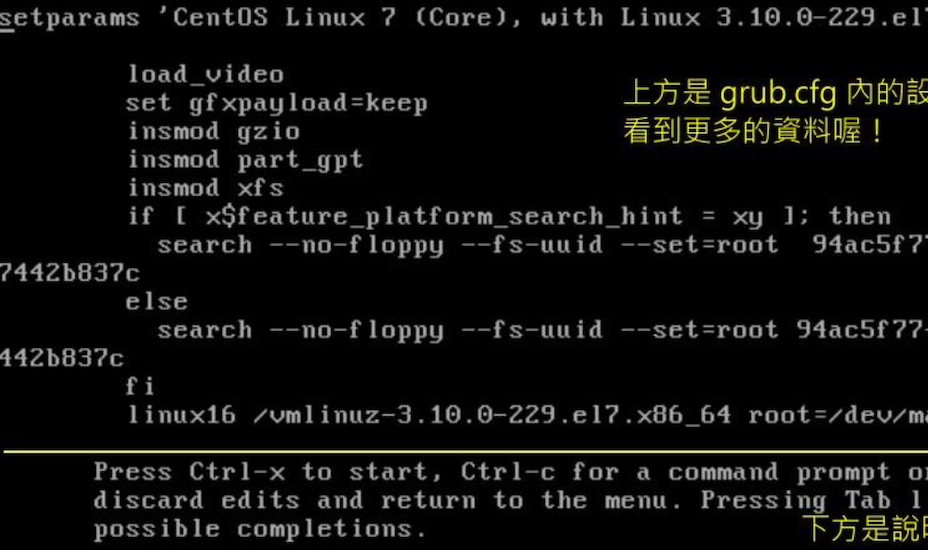

# Boot Loader：Grub2

前面知识点来看，boot loader 是载入核心的重要工具，来讲下 Linux 中最流行的 grub2 这个 boot loader

## boot loader 的两个 stage

曾经讲到，在 BIOS 读完信息后，接下来会到第一个开机设备的 MBR 去读取 boot loader 。该 boot loader 可以具有选单功能、字节加载核心文件以及控制权移交功能等，系统必须要有 loader 才能够加载该操作系统的核心。

但是 MBR 是整个硬盘的第一个 sector 内的一个区块，整个大小才 446 bytes 。即使 GPT 也没有很大的扇区来存储 loader 数据，那么功能强悍的 loader 是怎么放进去的？

为了解决这个问题，Linux 将 boot loader 的程序代码执行与设置值加载分成两个阶段（stage）执行

- Stage 1：执行 boot loader 主程序

  第一阶段执行 boot loader 的主程序，该主程序必须被安装在开机区，即 MBR 或则是 boot sector，但是因为 MBR 是在太小了，所以通常仅安装 boot loader 的最小主程序，并没有安装 loader 的相关配置文件

- Stage 2：主程序加载配置文件

  第二阶段通过 boot loader 加载所有配置文件与相关的环境参数文件，包括文件系统定义与主要配置文件 grub.cfg，一般来说，配置文件都在 /boot 下

与 grub2 相关的都放在 `/boot/grub2`

```bash
[root@study ~]# ls -l /boot/grub2
total 32
-rw-r--r--. 1 root root   84 Oct  4 18:31 device.map			# grub2 的设备对于文件
drwxr-xr-x. 2 root root   25 Oct  4 18:31 fonts						# 开机过程中的画面会使用到的字体数据
-rw-r--r--. 1 root root 4309 Oct  4 18:32 grub.cfg				# grub2 的主配置文件，非常重要
-rw-r--r--. 1 root root 1024 Oct  4 18:32 grubenv					# 一些环境区块的符号
drwxr-xr-x. 2 root root 8192 Oct  4 18:31 i386-pc					# 针对一般 x86 PC 所需要的 grub2 的相关模块
drwxr-xr-x. 2 root root 4096 Oct  4 18:31 locale					# 语系相关数据


[root@study ~]# ls -l /boot/grub2/i386-pc/
acpi.mod				# 电源管理有关的模块
ata.mod					# 磁盘有关的模块
chain.mod·			# 进行 loader 控制全移交的相关模块
command.lst 		# 一些指令相关性的列表
efiemu32.o			# 与 uefi BIOS 先关的模块
efiemu64.o
efiemu.mod
ext2.mod				# EXT w文件系统家族相关模块
fat.mod					# FAT 文件系统模块
gcry_sha256.mod	# 常见的加密模块
iso9660.mod			# 光盘文件系统模块
lvm.mod 				# LVM 文件系统模块
mdraid09.mod		# 软件磁盘阵列模块
minix.mod				# MINIX 相关文件系统模块
msdospart.mod		# 一般 MBR 分区表
part_gpt.mod    # GPT 分区表
part_msdos.mod	# MBR 分区表
scsi.mod				# SCSI 相关模块
usb_keyboard.mod	# usb 模相关模块
usb.mod
vga.mod					# VGA 显卡相关模块
xfs.mod					# XFS 文件系统模块
。。。。 等等很多模块


```

`/boot/grub2` 目录下最重要的是 grub2.cfg 配置文件，以及各种文件系统的定义。所以 loader 读取了这种文件系统定义数据后，就能够认识文件系统并读取在该文件系统内的核心文件了

从上面的文件来看， grub2 认识的文件系统与磁盘分区格式真的非常多，正因为如此，grub2 才会取代 Lio/grub 这个老婆的 boot loader

## grub2 的配置文件 `/boot/grub2/grub.cfg` 初探

Grub2 的有点挺多，包括：

- 认识与支持较多的文件系统，并且可以使用 grub2 的主程序直接在文件系统中搜索核心文件

- 开机时，可以自行编辑与修改改机设置项目，类似 bash 的指令模式

- 可以动态搜索配置文件，而不需要再修改配置文件后重新安装 grub2。

  即修改完配置文件后，下次开机就生效了

上面三个优点，也是 Stage 1、Stage 2 分别安装在 MBR（主程序）与文件系统中（配置文件与定义文件）的原因

### 磁盘与分区槽在 grub2 中的代号

安装在 MBR 的 grub2 的主程序，中重要任务之一是从磁盘中加载核心文件，让核心能顺利驱动整个系统的硬件

grub2 对硬盘的代号设置与传统的 LInux 磁盘代号完全不同，如下所示

```bash
(hd0,1)				# 一般的默认语法，由 grub2 自动判断分区格式
(hd0,msdos1)	# 此磁盘的分区为传统的 MBR 模式
(hd0,gpt1)		# 此磁盘的分区为 GPT 模式
```

从上面看，与 `/dev/sda1` 不相关，只要注意下面几个知识点：

- 硬盘代号以小括号 `()` 包起来
- 硬盘以 hd 表示，后面会接一组数字
- 以搜索顺序作为硬盘的编号（这个很重要）
- 第一个搜索到的硬盘为 0，一次类推
- 每块磁盘的第一个 partition 代号为 1，依序类推

如行 `(hd0,1)` 表示第一块硬盘，第一个分区槽；始终记得，硬盘号最小为 0，分区槽最小为 1

所以整个硬盘代号为：

| 硬盘搜索顺序   | grub2 的代号                       |
| -------------- | ---------------------------------- |
| 第一块磁盘 MBR | (hd0)、(hd0,msdos1)(hd0,msdos2)... |
| 第二块 GPT     | (hd1)、(hd1,gpt1)...               |
| 第三块         | (hd2)、(hd2,1)...                  |

例题：你的系统有一块 SATA 硬盘，请说明该硬盘的第一个逻辑分区槽在 Linux 与 grub2 中的文件名与代号

答：STAT 磁盘，使用逻辑分区槽，因此是 `/dev/sda5` （1-4 保留给 primary 与 extended 使用）。在 grub2 中则是，由于只有一块磁盘，那么 `(hd0,msdos5)`，简易写法 `(hd0,5)`

### `/boot/grub2/grub.cfg` 配置文件（重点了解，不要随意修改）！

```bash
[root@study ~]# vim /boot/grub2/grub.cfg 
# 开始是 00_header 这个脚本执行的结果展示，主要与基础设置与关机有关
### BEGIN /etc/grub.d/00_header ###
set pager=1

if [ -s $prefix/grubenv ]; then
  load_env
fi
...
if [ x$feature_timeout_style = xy ] ; then
  set timeout_style=menu
  set timeout=5			# 菜单显示时间
# Fallback normal timeout code in case the timeout_style feature is
# unavailable.
else
  set timeout=5
fi
### END /etc/grub.d/00_header ###
...

# 开始执行 10_linux ，主要针对实际的 Linux 核心文件的开机环境
# menuentry：表示选单内容，这里有两个，也就是说开机的时候，出现两个选单
### BEGIN /etc/grub.d/10_linux ###
menuentry 'CentOS Linux (3.10.0-1062.el7.x86_64) 7 (Core)' --class centos --class gnu-linux --class gnu --class os --unrestricted $menuentry_id_option 'gnulinux-3.10.0-1062.el7.x86_64-advanced-7b220a88-4e13-4869-9aa9-87031303f3e1' {
        load_video
        set gfxpayload=keep
        insmod gzio
        insmod part_gpt
        insmod xfs
        set root='hd0,gpt2'		
        if [ x$feature_platform_search_hint = xy ]; then
          search --no-floppy --fs-uuid --set=root --hint-bios=hd1,gpt2 --hint-efi=hd1,gpt2 --hint-baremetal=ahci1,gpt2 --hint='hd0,gpt2'  13d0663f-4cbd-412d-aa9f-975eb18da590
        else
          search --no-floppy --fs-uuid --set=root 13d0663f-4cbd-412d-aa9f-975eb18da590
        fi
        linux16 /vmlinuz-3.10.0-1062.el7.x86_64 root=/dev/mapper/centos-root ro crashkernel=auto spectre_v2=retpoline rd.lvm.lv=centos/root rd.lvm.lv=centos/swap rhgb quiet LANG=zh_CN.UTF-8
        initrd16 /initramfs-3.10.0-1062.el7.x86_64.img
}
menuentry 'CentOS Linux (0-rescue-f228ab37c368416c84c6b27971ba45a9) 7 (Core)' --class centos --class gnu-linux --class gnu --class os --unrestricted $menuentry_id_option 'gnulinux-0-rescue-f228ab37c368416c84c6b27971ba45a9-advanced-7b220a88-4e13-4869-9aa9-87031303f3e1' {
        load_video
        insmod gzio
        insmod part_gpt
        insmod xfs
        set root='hd0,gpt2'
        if [ x$feature_platform_search_hint = xy ]; then
          search --no-floppy --fs-uuid --set=root --hint-bios=hd1,gpt2 --hint-efi=hd1,gpt2 --hint-baremetal=ahci1,gpt2 --hint='hd0,gpt2'  13d0663f-4cbd-412d-aa9f-975eb18da590
        else
          search --no-floppy --fs-uuid --set=root 13d0663f-4cbd-412d-aa9f-975eb18da590
        fi
        linux16 /vmlinuz-0-rescue-f228ab37c368416c84c6b27971ba45a9 root=/dev/mapper/centos-root ro crashkernel=auto spectre_v2=retpoline rd.lvm.lv=centos/root rd.lvm.lv=centos/swap rhgb quiet
        initrd16 /initramfs-0-rescue-f228ab37c368416c84c6b27971ba45a9.img
}

### END /etc/grub.d/10_linux ###

### BEGIN /etc/grub.d/20_linux_xen ###
### END /etc/grub.d/20_linux_xen ###

### BEGIN /etc/grub.d/20_ppc_terminfo ###
### END /etc/grub.d/20_ppc_terminfo ###

### BEGIN /etc/grub.d/30_os-prober ###
### END /etc/grub.d/30_os-prober ###

### BEGIN /etc/grub.d/40_custom ###

```

基本上，grub2 不希望你自己修改 grub.cfg 这个配置文件，取代他们的是修改几个特定的配置文件，由  grub2-mkconfig 指令来产生新的 grub.cfg 文件，这里需要了解下 grub2.cfg 的大致内容

- ` set root='hd0,gpt2'`

  root  指定 grub2 的配置文件所在的设备。测试机来说，当初安装的时候分区出 `/` 与 `/boot` 两个设备，而 grub2 是在 `/boot/grup2` 位置，该位置的磁盘文件名为 `/dev/sda2` 因此就是 `(hd0,2)`，又因为是 gpt 分区，所以是 `(hd0,gpt2)`

- `linux16 /vmlinuz-3.10.0-1062.el7.x86_64 root=/dev/mapper/centos-root `

  Linux 核心文件以及核心执行时下达的参数。我们的核心文件应该是 `/boot/vmlinuz-xx`，这里怎么会在根目录呢？这与上面的 root 有关：

  - 如果没有 /boot 分区，仅有 / 分区：所以文件名是：

    `/boot/vmlinuz-xxx  ---> (/)/boot/vmlinuz-xxx --> (hd0,msdos1)/boot/vmlinuz-xx`

  - 如果 /boot 是独立分区，则·

    `/boot/vmlinuz-xxx --> (/boot)/boot/vmlinuz-xx --> (hd0,msdos1)/vmlinuz-xxx`

  因此 linux16 后面接的文件名与上面的 root 搭配在一起，才是完整的绝对路径，至于文件名后面的 root=/dev/xx，中的 root 指 linux 文件系统中根目录是在哪个涉笔上的意思

- `initrd16/initramfs-3.10..`

  就是 initramfs 所在的文件名，与 linux16 哪个 vmlinuz-xxx 相同，也需要搭配 root，才是正确的位置

## grub2 的配置文件维护 `/etc/default/grub 与 /etc/grub.d`

### `/etc/default/grub` 主要配置文件

```bash
[root@study ~]# cat /etc/default/grub 
GRUB_TIMEOUT=5								# 指定预设倒数读秒数，也就是只给出 n 秒让你操作
GRUB_DISTRIBUTOR="$(sed 's, release .*$,,g' /etc/system-release)"
GRUB_DEFAULT=saved						# 指定默认由哪一个选单来开机
GRUB_DISABLE_SUBMENU=true			# 是否隐藏次选单，通常是隐藏起来的
GRUB_TERMINAL_OUTPUT="console"	# 数据输出的终端机格式，默认是通过文字终端机
# 在 menuentry 括号内的 linux16 项目后续的核心参数
GRUB_CMDLINE_LINUX="crashkernel=auto spectre_v2=retpoline rd.lvm.lv=centos/root rd.lvm.lv=centos/swap rhgb quiet"
GRUB_DISABLE_RECOVERY="true"		# 取消救援选单的制作

```

下面讲解几个重要的设置（详情通过 info grub 6.1 章节阅读）

- 倒数时间参数：GRUB_TIMEOUT

  不想等待操作则输入 0，如果一定要求手动选择，则输入 -1，输入大于 0 秒的数值，则表示等待操作时间

- 是否隐藏选单：GRUB_TIMEOUT_STYLE

  可设置的值有：

  - menu：显示选单（默认）
  - countdown：不显示选单，但是还显示读秒
  - hidden ：不显示选单，且不显示读秒

  等

- 信息输出终端机模式：GRUB_TERMINAL_OUTPUT

  ​	输出的画面应该使用哪一个终端机来显示

  - console
  - serial
  - gfxterm
  - vag_text

  等

- 默认开机选单：GRUB_DEFAULT

  默认使用哪一个选单（menuentry）来作为开机项目。能使用的设置值为

  - saved
  - 数值
  - title
  - ID

  等，假设你有三个 menuentry

  ```bash
  menuentry  '1st linux system' --id 1lst-linux-system {...}
  menuentry  '2nd linux system' --id 2nd-linux-system {...}
  menuentry  '3rd linux system' --id 3rd-linux-system {...}
  
  几个常见的设置如下含义：
  # 表示使用第 2 个 menuentry 开机，数值编号以 0 开始
  GRUB_DEFAULT=1
  
  # 表示使用第 3 个
  GRUB_DEFAULT=3rd linux system
  
  # 表示使用 grub2-set-default 来设置哪一个 menuentry。通常预设为 0
  GRUB_DEFAULT=saved
  ```

- 核心的外加参数功能：GRUB_CMDLINE_LINUX

  可以在核心启动时加入额外的参数，在这里加入。比如，除了预设的核心参数外，还需要让你的磁盘读写机制为 deadline 时，可以这样处理

  ```bash
  GRUB_CMDLINE_LINUX="... crashkernel=atuo rhgb quiet elevator=deadline"
  ```


这个主要环节配置文件配置完成后，必须使用 grub2-mkconfig 来重建 grub.cfg 才可以。因为主配置文件是 grub.cfg，我们是通过许多脚本来协助完成 grub.cfg 的自动建立。另外，额外自己设置的项目，写入 `/etc/default/grub` 文件内

下面进行联系

问题：达成以下要求

1. 开机选单等待 40 秒
2. 预设使用第一个选单开机
3. 选单请显示出来，不要隐藏
4. 核心外带参数 `elevator=deadline` 

直接编辑主要环节配置文件后，再以 grub2-mkconfg 来重建 grub.cfg

```bash
# 1. 编辑主要环节配置文件
[root@study ~]# cat /etc/default/grub 
GRUB_TIMEOUT=40
GRUB_DISTRIBUTOR="$(sed 's, release .*$,,g' /etc/system-release)"
GRUB_DEFAULT=0
GRUB_DISABLE_SUBMENU=true
GRUB_TERMINAL_STYLE=menu
GRUB_TERMINAL_OUTPUT="console"
GRUB_CMDLINE_LINUX="crashkernel=auto spectre_v2=retpoline rd.lvm.lv=centos/root rd.lvm.lv=centos/swap rhgb quiet elevator=deadline"
GRUB_DISABLE_RECOVERY="true"


# 2. 重建 grub.cfg
[root@study default]# grub2-mkconfig -o /boot/grub2/grub.cfg
Generating grub configuration file ...
Found linux image: /boot/vmlinuz-3.10.0-1062.el7.x86_64
Found initrd image: /boot/initramfs-3.10.0-1062.el7.x86_64.img
Found linux image: /boot/vmlinuz-0-rescue-f228ab37c368416c84c6b27971ba45a9
Found initrd image: /boot/initramfs-0-rescue-f228ab37c368416c84c6b27971ba45a9.img
done


# 3. 检查是否生效
[root@study default]# grep timeout /boot/grub2/grub.cfg 
if [ x$feature_timeout_style = xy ] ; then
  set timeout_style=menu
  set timeout=40

# from /etc/grub.d and settings from /etc/default/grub
   set default="${next_entry}"
   set default="0"
   
[root@study default]# grep linux16 /boot/grub2/grub.cfg 
        linux16 /vmlinuz-3.10.0-1062.el7.x86_64 root=/dev/mapper/centos-root ro crashkernel=auto spectre_v2=retpoline rd.lvm.lv=centos/root rd.lvm.lv=centos/swap rhgb quiet elevator=deadline 
        linux16 /vmlinuz-0-rescue-f228ab37c368416c84c6b27971ba45a9 root=/dev/mapper/centos-root ro crashkernel=auto spectre_v2=retpoline rd.lvm.lv=centos/root rd.lvm.lv=centos/swap rhgb quiet elevator=deadline 
```

通过以上测试，可以知道给我们一个配置文件，然后通过指令去刷新主配置文件，这能降低我们手动操作主配置文件的难度

### 选单建立的脚本 `/etc/grub.d/*`

执行 `grub2-mkconfig -o /boot/grub2/grub.cfg` 后，显示信息去抓取了 linux 核心等信息，这是因为 grub2-mkconfig 去分析 `/etc/grub.d/*` 中的文件，然后执行该文件来建立 grub.cfg 文件。该目录下一般或存储以下文件

- `00_header:`

  主要在建立初始的显示项目，包括需要加载的模块分析、屏幕终端机的格式、倒数描述、选单是否需要隐藏等，大部分在 `/etc/default/grub` 里所设置的变量，大概都会在该脚本中被利用来写入 grub.cfg 中

- `10_linux`

  根据分析 `/boot` 下的文件，尝试找到正确的 Linux 核心与读取该核心需要的文件系统模块与参数等信息，都在该脚本运行后找到并设置到 grub.cfg 中。

  因为该脚本会将所有在 `/boot` 下的每一个核心文件都对应到一个选单上，因此核心文件数量越多，你的开机选单项目就越多

  如果不需要旧的核心出现在选单上，可以通过移除旧核心来处理

- `30_os-prober`

  默认会到系统上找其他的 partition 里面可能含有的操作系统，然后将该操作系统做成选单来处理。

  如果不想要让其他操作系统被检测到并制作开机选单，可以在 `/etc/default/grub` 中加上 `GRUB_DISABLE_OS_PROBER=true` 来取消该文件的运行

- `40_custom`

  如果还有其他自定义加上的选单项目，或则其他需求，可以在这里进行补充

  

一般来说，我们会修改 40_custom 文件。现在我们知道 menuentry 是一个选单，它的功能有如下：

- 直接指定核心开机

  基本上如果是 Linux 的核心要直接被用来开机，直接通过 grub2-mkconfg 去抓取 `10_linux` 脚本来制作即可，但是如果你有额外比较特别的参数需要进行，可以这样做

  1. 先到 grub.cfg 取得你要制作的核心选单项目，让后将它复制到 40_custom 中
  2. 再到 40_custom 中根据你的需求修改即可

  问题：如果你想要使用第一个原有的 menuentry 取出来后，增加一个选单，该选单可以强制 systemd 使用 graphical.target 来启动 linux 系统，让选单一定可以使用图形界面而不用理会 default.target 的连结。如何做？

  ```bash
  在核心外带参数中，有个选项 systemd.unit=???，可以做到。因此先到 grub.cfg 中，复制一个 menuentry
  [root@study default]# vim /etc/grub.d/40_custom
  #在这里修改我们的选单名称
  menuentry 'My graphical CentOS' --class centos --class gnu-linux --class gnu --class os --unrestricted --id 'mygraphical' {   # 这里再设置一个 --id
          load_video
          set gfxpayload=keep
          insmod gzio
          insmod part_gpt
          insmod xfs
          set root='hd0,gpt2'
          if [ x$feature_platform_search_hint = xy ]; then
            search --no-floppy --fs-uuid --set=root --hint-bios=hd0,gpt2 --hint-efi=hd0,gpt2 --hint-baremetal=ahci0,gpt2  13d0663f-4cbd-412d-aa9f-975eb18da590
          else
            search --no-floppy --fs-uuid --set=root 13d0663f-4cbd-412d-aa9f-975eb18da590
          fi
          linux16 /vmlinuz-3.10.0-1062.el7.x86_64 root=/dev/mapper/centos-root ro crashkernel=auto spectre_v2=retpoline rd.lvm.lv=centos/root rd.lvm.lv=centos/swap rhgb quiet elevator=deadline systemd.unit=graphical.target  # 这里再增加 systemd.unit=graphical.target 配置
          initrd16 /initramfs-3.10.0-1062.el7.x86_64.img
  }
  
  # 然后重建下
  [root@study default]# grep linux16 /boot/grub2/grub.cfg 
  # 下次重新开机的时候就会出现该选单给你选择了
  ```

  ### 通过 chainloader 的方式移交 loader 控制权

  chain loader ：开机管理程序的连结，仅是在将控制权交给下一个 boot loader。所以 grub2 并不需要认识与找出 kernel 的文件，只是将 boot 的控制权交给下一个 boot sector 或 MBR 内的 boot loader 而已，所以通常它也不需要去检查下一个 boot loader 的文件系统

  一般来说，chain loader 的设置值要两个就够了：

  1. 预计要前往的 boot sector 所在的分区槽代号
  2. 设置 chainloader 在那个分区槽的 boot sector （第一个扇区）上

  假设 windows 分区槽在 `/dev/sda1` ,但是我只有一块硬盘，那么要 grub 将控制权交给 windows loader 需要这样做

  ```bash
  menuentry "Windows" {
  	insmod chain		# 加载 chainloader 的模块
  	insmod ntfs			# 建议加入 windows 所在的文件系统模块较好
  	set root=(hd0,1)	# 是在哪一个分区槽？
  	chainloader +1 		# 去 boot sector 将 loader 软件读取出来的意思
  }
  # 通过以上配置，就可以让 grub2 叫出控制权了
  ```

  问题：假设你的测试系统上使用 MBR 分区槽，并且出现如下数据

  ```bash
  [root@study ~]# fdisk -l /dev/sda 
  Device Boot         Start           End    	Blocks  		Id    System
  /dev/sda1 					   2048         6143     44444			83		Linux
  /dev/sda2 *					   6144      2103295     999999			7		  HPFS/NTFS/exFAT
  /dev/sda3 					2103296     65026047     222222			84		Linux
  
  # 其中 /dev/sda2 是 windows 7 操作系统，现在需要增加两个开机选项
  # 1. 获取 windows7 的开机选单
  # 2. 回到 MBR 的预设环境
  
  
  win7 在 /dev/sda2，因此是 hd0,msdos2，而 MBR 则是 hd0 即可，因此设置如下
  
  vim /etc/grub.d/40_custom
  menuentry 'Go to Windows 7' --id 'win7'  {
  	insmod chain		
  	insmod ntfs			
  	set root=(hd0,2)	
  	chainloader +1 		
  }
  
  menuentry 'go to MBR' --id 'mbr' {
  	insmod chain			
  	set root=(hd0)
  	chainloader +1
  }
  
  # 如果每次都想要 windows 变成默认的开机选项，
  # 那么在 /etc/default/grub 中设置 GRUB_DEFAULT=win7
  # 再使用 grub2-mkconfig 即可，通过 --id 来处理，不需要去计算  menuentry 的顺序
  ```

  ## initramfs 的重要性与监理新 initramfs 文件

  在前面提到过 initramfs，它的目的是在于提供开机过程中所需要的最重要核心模块，让系统开机过程可以顺利完成。

  一般来说，需要 initramfs 的时刻有：

  - 根目录所在磁盘为 STAT、USB 或 SCSI 等连接接口
  - 根目录所在文件系统为 LVM、RAID 等特殊格式
  - 根目录所在文件系统为非传统 LInux 认识的文件系统时
  - 其他必须要在核心加载时提供的模块

  一般来说，各 distribution 提供的核心都会附上 initramfs 文件，但是如果你有特殊需要想重新制作 initramfs 文件的话，可以使用 `dracut\mkinitrd ` 来处理

  在 CentOS 7 下应该使用 dracut，这里也主要介绍它

  ```bash
  dracut [-fv] [--add-drivers 列表] initramfs 文件名 核心版本
  
  选项与参数：
  
  	-f：强迫编译出 initramfs，如果 initramfs 文件已经存在，则覆盖旧文件
  	-v：显示 dracut 的运行过程
  	--add-drivers 列表：在原本的默认核心模块中，增加某些你想要的模块，模块维护核心所在目录 `/lib/modules/$(uname -r)/kernel/*`
  	initramfs 文件名：你需要的文件名，开头最好以 initramfs，后面接版本与功能
  	核心版本：默认是目前运行中的核心版本，也可以手动输入其他不同版本
  	
  	dracut 还有很多功能。例如下面的几个参数：
  	--modules：将 dracut 所提供的开机锁需模块（核心模块）加载，可用模块在 /usr/lib/dracut/modules.d/ 目录
  	--gzip|--bzip2|--xz：尝试使用哪一种压缩方式来进行 initramfs 压缩，默认使用 gzip
  	--filesystem：加入某些额外的文件系支持 
  	
  # 范例 1：以 dracut 的默认功能建立一个 initramfs 虚拟盘文件
  [root@study ~]# dracut -v initramfs-test.img $(uname -r)
  Executing: /sbin/dracut -v initramfs-test.img 3.10.0-1062.el7.x86_64
  dracut module 'busybox' will not be installed, because command 'busybox' could not be found!
  ...
  dracut module 'cifs' will not be installed, because command 'mount.cifs' could not be found!
  *** Including module: bash ***
  *** Including module: nss-softokn ***
  *** Including module: i18n ***
  *** Including module: network ***
  *** Including module: ifcfg ***
  *** Including module: drm ***
  *** Including module: plymouth ***
  *** Including module: dm ***
  Skipping udev rule: 64-device-mapper.rules
  ....
  
  # 范例 2：额外加入 e100e 网卡驱动与 ext4/nfs 文件系统在新的 initramfs 内
  [root@study ~]# dracut -v --add-drivers "e10001" --filesystems "ext4 nfs" initramfs-new.img $(uname -r)
  [root@study ~]# lsinitrd initramfs-new.img | grep -E '(e1000|ext4|nfs)'
  Arguments: -v --add-drivers 'e10001' --filesystems 'ext4 nfs'
  nfs
  -rw-r--r--   1 root     root           15 Mar 29 21:52 etc/modprobe.d/nfs.conf
  ...
  
  ```

  建立完成之后，同时核心也处理完成后，就可以使用 grub2 来建立选单了。下面继续

## 测试与安装 grub2

如果你的 Linux 主机本来就使用 grub2 作为 loader 的话，就不需要重新安装了，如果并非使用 grub2，那么需要安装

首先：必须使用 grub-install 将一些必要的文件复制到 /boot/grub2 中，应该这样做

```bash
grub2-install [-boot-directory=DIR] INSTALL_DEVIVCE

--boot-directory=DIR：DIR 是实际的目录，使用 grub2-install 默认会将 grub2 所有的文件都复制到 `/boot/grub2/*` ，如果想复制到其他目录与设备，需要使用该参数
INSTALL_DEVIVCE：安装设置代号
```

```bash
# 范例 1： 将 grub2 安装在目录系统的 MBR 下，我的系统为 /dev/sda
[root@study ~]# grub2-install /dev/sda
# 如果原来就是 grub2，所以可能不会有什么特别的信息
# 但是去查看相关文件更新日期会发现被更新过了，因为是重装
# 但是我们并没有配置文件，需要自己创建
```

基本上，grub2-install 大概仅安装 grub2 主程序与相关软件到 `/boot/grub2` 目录，如果后面的设备是整个系统 (/dev/sda、/dev/vds ...)，那 loader 的程序才会写入到 MBR 中去。

如果 XFS 文件系统的 /dev/sda2 设备（个别 partition），那么 grub2-install 就会告诉你，该文件系统并不支持 grub2 的安装。

下面强迫写入试试

```bash
# 尝试看看你的系统中是否有 xfs 文件系统，且为传统的 parition 类型
[root@study ~]# df -T | grep -i xfs
/dev/mapper/centos-root xfs       10475520 5475932   4999588  53% /
/dev/sda2               xfs        1038336  184348    853988  18% /boot
/dev/mapper/centos-home xfs        5232640  949064   4283576  19% /home
# 笔者这里没有其他的分区。直接把书上的分区列出来
/dev/vda4							  xfs        5232640  949064   4283576  19% /srv/myproject

# 那么下面使用 /dev/vda4 来安装
[root@study ~]# grub2-install /dev/vda4
grub2-install: error: hostdisk/dev/vda appears to con...... (--skip-fs-probe ....)
# 报错了，恐怕不支持你的 boot sector ，这应该是误判，使用强制安装

[root@study ~]# grub2-install --skip-fs-probe /dev/vda4
Installing for i386-pc platform.
grub2-install:warning: FIle system 'xfs' doesn‘t support embedding
....
grub2-install:error: will not proceed with blocklists

# 还是失败，因为还是担心 xfs 被搞死，使用如下参数再测一次
[root@study ~]# grub2-install --force --recheck --skip-fs-probe /dev/vda4
Installing for i386-pc platform.
grub2-install:warning: FIle system 'xfs' doesn‘t support embedding
....
Installation finished.NO error reporled
# 安装好了，只出现了警告信息，但是错误没有了
```

上面这样将 grub2 的主程序安装到 /dev/vda4 以及重新安装到 MBR 里面去了。

思考下：grub2 主程序会找 grub.cfg 文件，大多是在 /boot/grub2/grub.cfg 里。那么我们的 MBR 与 /dev/vda4 都是到 /boot/grub2/grub.cfg 去抓设置吗？如果是多重操作系统怎么办？

```bash
# 问：假设你的测试系统上使用 MBR 分区槽，并且出现如下数据
[root@study ~]# fdisk -l /dev/sda 
Device Boot         Start           End    	Blocks  		Id    System
/dev/sda1 					   2048         6143     44444			83		Linux
/dev/sda2 *					   6144      2103295     999999			7		  HPFS/NTFS/exFAT
/dev/sda3 					2103296     65026047     222222			84		Linux

sda1 与 sda3 是两个 CentOS 7 系统。
sda2 是一个 windows7 系统
安装流程是 sda1、sda2、sda3 ，因此安装好而且重启后，系统其实是默认进入 sda3 这个 CentOS 7 系统的。此时 MBR 会去读取的配置文件在 (/dev/sda3)/boot/grub2/grub.cfg

因为 sda1 应该是用来管理开机选单的，而 sda2 以及 sda3 在规划中就是用来让学生操作的，因此默认情况下  sda1 内的 CentOS 系统应该只会在开机的使用用到，或则是出问题时才会用到。
而 sd2 与 sd3 则可能因为学生无用，因此未来可能会升级或删除或重装等，
那如何让系统永远都是使用 /dev/sda1 开机？

答：因为 MBR 的 boot loader 应该去 (/dev/sda1)/boot/grub2/grub.cfg 读取相关设置才是正常的，所以可以使用集中基本的方式来处理：

1. 因为 CentOS 7 会主动找其他操作系统，因此可以在 sda3 的开机选单中找到 sda1 的开机选项，使用该选项进入系统，就可以进入 sda1 了
2. 假设没能抓到 sda1，那可以在 sda3 下使用 chroot 来进入 sda1
3、 使用救援光盘去抓到正确的 sda1.然后去的 sda1 的系统

等进入到系统之后，修改 /etc/default/grub 以及 /etc/grub.d/40_custom 后，使用 grub2-mkconfig -o / boot/grb2/grub.cfg. 然后重新  grub2-install/dev/sda 就能够让你的 MBR 去获取 /dev/sda1 内的配置文件了
```

```bash
# 问：前面的练习，测试机目前为 40 秒倒数，且有一个强制进入图形界面 My graphical CentOS 7 的选单
# 现在需要多加两个选单，一个是回到 MBR 的 chainloader 
# 一个使用 sda4 的 chainloadder 该如何处理？

vim /etc/grub.d/40_custom
vim /etc/grub.d/40_custom
menuentry 'Goto MBR'{
	insmod chain		
	insmod part_gpt			
	set root=(hd0)	
	chainloader +1 		
}

menuentry 'Goto /dev/sda4'{
	insmod chain			
	insmod part_gpt			
	set root=(hd0.gpt4)
	chainloader +1
}

grub2-mkconfig -o /boot/grub2/grub.cfg
```

最后总结：

1. 如何是从其他 boot loader 转成 grub2 时，需要先使用 grub2-install 安装 grub2 配置文件

   如果安装到 partition 时，可能需要加上额外的许多参数才能够顺利安装

2. 开始编辑 `/etc/default/grub 以及 /etc/grub.d/*` 重要的配置文件

3. 使用 `grub2-mkconfig -o /boot/grub2/grub.cfg` 来建立开机的配置文件

## 开机前的额外功能修改

前面部分由于没有额外的分区，没有跟着做，导致这里无法显示没有做的那一部分选单，该章节直接使用书上的截图


上面的 ‘e’ ，表示按 e 键可以进入编辑模式，直接对该选项进行编辑



上面就是我们在 grub.cfg 里的配置的内容，这里可以直接修改。下半部分则是一些说明，可以使用 ctrl + x 重启，ctrl + c 或 esc 可返回上个画面

问题：在线编辑，让系统进入救援模式 （rescue），而不像要进入系统后使用 systemctl rescue 时，怎么做？

答：可使用在线编辑模式，找到下图的 linux16 的项，然后添加服务参数


修改之后，再重启就可以直接进入救援模式了


进入 runlevel 需要输入密码？后续会讲解如何处理（不输入密码）

## 关于开机画面与终端机画面的图形显示方式

如果想用开机画面使用图形显示方式，如使用中文来显示开机画面。我们预设的 locale 的语系是 `zh_CN.UTF-8`，所以理论上会显示中文才对，可以修改 grub.cfg 来达成

```bash
[root@study ~]# vim /etc/default/grub
.....
GRUB_TERMINAL=gfxterm					# 设置主要的终端机显示为图形界面
GRUB_GFXMODE=1024x768x24			# 图形界面的 x、y、彩度信息
GRUB_GFPAYLOAD_LINUX=keep			# 保留图形界面，不要使用 text

# 重新建立配置文件
[root@study ~]# grub2-mkconfig -o /boot/grub2/grub.cfg 
```

重启时，就能看到如下的画面了


后面这个开机选单中的中文是修改 menuentry 出来的，不是自动出来的哈

## 为个别选单加上密码

前面在讲解可以在开机时进入 grub2 的指令画面进入修改选单参数等，如果是在公共教室情况下，想要加密某个选单还是有必要的

grub2 的控制有：

1. grub2 的选单指令列修改

2. 进入选择的选单开机流程

要使用密码的话，就涉及到 grub2 的账户机制了

### grub2 的账户、密码与选单设置

在 grub2 的选单管理中，针对两种身份进行密码设置：

- superusers：

  设置系统管理员与相关参数还有密码等，使用这个密码的用户，将可再 grub2 内具有所有修改的权限。但一旦设置了这个参数，则所有的指令修改将会受到限制

- users

  设置一般账户的相关参数与密码，可以设置多个账户，使用该密码的用户可以选择要进入某些选单项目。不过，选单项目也需要搭配相对应的账户才可以

  一般来说，使用这种密码的账户并不能修改选单的内容，仅能选择进入选单去开机

下面的例子，不能用在测试机上面，笔者也直接抄下来了

假设系统有三个操作系统，分别安装在 `(hd0,1)、(hd0,2)、(hd0,3)`

- `(hd0,1)`：所有人都可以进入
- `(hd0,2)`：只有系统管理员可进入的系统
- `(hd0,3)`：另一个一般用户与管理员可以进入的系统

系统管理员账户密码设置为 `mrcode/123456`，一般账户为 `mrcode2/456789`

如上的需求，没有用到 Linux 的 linux16 与 initrd16 的项目，只需要 chainloader 的项目，因此，整个 grub.cfg 类似如下内容

```bash
# 1. 先设置好管理员与一般账户的名称与密码
set superusers='mrcode'		# 管理员账户名
password mrcode 123456		# 设置账户名和密码
password mrcode2 456789		# 一般账户名密码

menuentry "大家都可以选择开机" --unrestricted{
	set root(hd0,1)
	chainloader +1
}

menuentry "只有管理员的密码才有办法使用" --users ""{
	set root(hd0,1)
	chainloader +1
}

# 可以看到这里使用 --users 声明了 mrcode2 账户
menuentry "只有管理员与  mrcode2 才可以使用" --users mrcode2 {
	set root(hd0,3)
	chainloader +1
}
```

如上所示：使用 superusers 声明管理员账户，使用 password 来设置账户密码，密码有以下两种

- password_pbkdf2 账户 「使用 grub2-mkpasswd-pbkdf2 所产生的密码」
- password 账号「 没有加密的明文密码」

上面的内容不要手动去修改 grub.cfg 文件，而是放到相关环境配置文件下，下面开始讲解

### grub2 密码设置的文件位置与加密密码

前几小节讲到主要的环境设置在 `/etc/grub.d/*` 里面有一个 `00_header` 文件，但是不建议修改它，所以可以自己建立一个 `01_user` 的文件，要注意是两个数字开头的前缀才可以，表示优先级被读取的顺序

```bash
# 1. 先获取两个账户的加密密码
[root@study ~]# grub2-mkpasswd-pbkdf2 
Enter password: 
Reenter password: 
PBKDF2 hash of your password is grub.pbkdf2.sha512.10000.DB145873C4E3C7ACD4A549416F8F15751EBC79D6C91F78356239AB277D0A0D89790F7CF98EA8C435ACD51C019D36AF945FCE41228AD8B0C43055ADCE4A61D7E4.37ABF2CA07512796ED302DF38C9C0CC7E407B16E5B656E49770F89E65CC590EC2F30E9160237FEE6F520D1EBACA97A7160D576B33F58AFEFE50857A849DFA8E6
# 这个加密密码可真长

# 2. 将密码与账户写入到 01_users 文件内
[root@study ~]# vim /etc/grub.d/01_users
cat << eof
set superusers='mrcode'		
password_pbkdf2 mrcode grub.pbkdf2.sha512.10000.DB145873C4E3C7ACD4A5...
password_pbkdf2 mrcode2 grub.pbkdf2.sha512.10000.DB145873C4E3C7ACD4A5x...		
eof

# 特别注意，因为 /etc/grub.d/ 下的文件应该是执行文件
# 所以不能直接写账户密码，而是通过 cat 或 echo 等指令方式将密码数据显示出来

# 3. 因为是执行文件，给执行权限
[root@study ~]# chmod a+x  /etc/grub.d/01_users
```

### 为个别的选单设置账户密码的使用模式

回写之前的设置，目前测试机器的 Linux 系统选单应该有 5 个：

- 来自 `/etc/grub.d/10_linux`  文件主动检测到的两个 menuentry
- 来自 `/etc/grub.d/40_custom` 文件我们自己主动设置的三个 menuentry

由于上述在 `/etc/grub.d/01_users` 设置了管理员，那么只有知道管理员密码的情况下，才可以修改每个选单内的参数等信息了

设置 10_linux 制作出来的 menuentry 的选单，正常开机，所以不要使用密码，设置如下

```bash
[root@study ~]# vim /etc/grub.d/10_linux 
CLASS="--class gnu-linux --class gnu --class os --unrestricted"
# 上述配置是该文件默认就有的配置
# --unrestricted 不受限制，如果要受限制可将 --unrestricted 修改为 --users "账户名称"
# 默认选单的我们建议不修改
```

现在假设需要在 `40_custom` 里，添加一个可以进入救援模式 rescue 的环境，并且放到最后一个选单中，同时只有知道 mrcode2 的密码才可以使用，应该这样做

```bash
[root@study ~]# vim /etc/grub.d/40_custom
....
menuentry 'Rescue CentOS7,with Linux 3.xx' --users mrcode2 {
        load_video
        set gfxpayload=keep
        insmod gzio
        insmod part_gpt
        insmod xfs
        set root='hd0,gpt2'
        if [ x$feature_platform_search_hint = xy ]; then
          search --no-floppy --fs-uuid --set=root --hint-bios=hd0,gpt2 --hint-efi=hd0,gpt2 --hint-baremetal=ahci0,gpt2  13d0663f-4cbd-412d-aa9f-975eb18da590
        else
          search --no-floppy --fs-uuid --set=root 13d0663f-4cbd-412d-aa9f-975eb18da590
        fi
        linux16 /vmlinuz-3.10.0-1062.el7.x86_64 root=/dev/mapper/centos-root ro crashkernel=auto spectre_v2=retpoline rd.lvm.lv=centos/root rd.lvm.lv=centos/swap rhgb quiet elevator=deadline systemd.unit=rescue.target  # 这里配置救援环境
        initrd16 /initramfs-3.10.0-1062.el7.x86_64.img
}

[root@study ~]# grub2-mkconfig -o /boot/grub2/grub.cfg
```

上面由于太多笔者没有跟着敲，导致这里设置开机选单也有不生效，感觉这一章是全军覆没了

