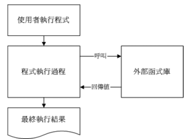
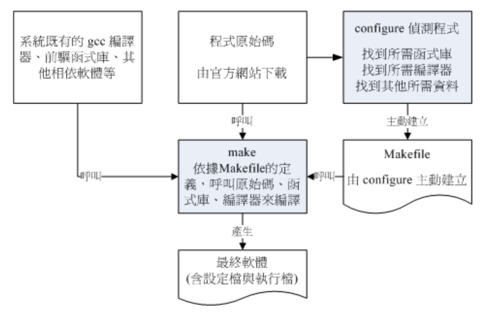

# 开放源码的软件安装与升级简介

在 windows 上安装软件的时候，大多数都是下一步下一步，会很简单，因此在 WIndows 系统上的软件都是一模一样的，也就是说，你无法修改该软件的源码，因此当软件出现 bug 时，或新增/减少一些功能时，就只能等软件开发商来做这些事情。

那么这就体现了 Linux 的优点了，因为 Linux 上面的软件几乎都是经过 GPL 的授权，所以每个软件几乎都提供源代码，并且你可以自行修改该程序代码

那么：

1. 可执行的相关软件与开放源码之间是如何转换的？
2. 不同版本的 Linux 之间能不能使用同一个执行文件？
3. 该执行文件需要由源代码的部分重新进行转换？

以上概念都是需要了解的

## 什么是开放源码、编译程序与可执行文件

在 LInux 系统上，一个文件能否被执行，看的是可执行的哪个权限（具有 x 权限），但是，Linux 系统上真正认识的可执行文件是二进制文件（binary program），例如 `/usr/bin/passwd`、`/bin/touch` 这些二进制程序代码

sheell scripts 并不是一个 binary 程序，它只是利用 shell（例如 bash）这个程序的功能进行一些判断，而最终执行的除了 bash 提供的功能外，认识调用一些已经变异好的二进制程序来执行的

想判定一个文件是否是一个 binary，可以使用在第 6 章提到过的 file 指令

```bash
# 用系统文件测试看看是什么类型
[root@study ~]# file /bin/bash
/bin/bash: ELF 64-bit LSB executable, x86-64, version 1 (SYSV), dynamically linked (uses shared libs), for GNU/Linux 2.6.32, BuildID[sha1]=7e644dee920bc3ba797c38e05383286563712b49, stripped

# 如果是系统提供的 network 呢？
[root@study ~]# file /etc/init.d/network 
/etc/init.d/network: Bourne-Again shell script, ASCII text executable
```

可以看到，如果是 binary 而且是可执行文件的时候，会显示执行文件类别：`ELF 64-bit LSB executable`，同时或说明是否使用 **动态函数库（shared libs）**

如果是一般的 script 则会显示 `ASCII text executable`，`Bourne-Again shell script` 信息则是因为在 script 的第一行申明了 `#!/bin/bash` 的缘故

那么想要做出这样一个 binary program 则需要经过：

1. 编写代码：纯文本的文件
2. 编译：编译为操作系统看得懂的 binary program

举个例子：在 Linux 上最标准的程序语言为 C，使用 C 的语法进行源代码的编写之后，使用 Linux 上标准的 C 语言编译程序 gcc 来编译，就可以制作一个可以执行的 binary program

在编译的过程中还会产生所谓的 **目标文件（Object file）**，这些文件是以 `*.o` 的扩展名存在的。 C 语言的源码文件通常以 `*.c` 作为扩展名。

总之：

- 开放源码：就是程序代码，写给人类看的程序语言，但机器并不认识，所以无法执行
- 编译程序：将程序代码转译成机器能看懂的语言
- 可执行文件：经过编译变成二进制程序后，机器看得懂所以可以执行的文件

## 什么是函数库

简单说，就像是是 JAVA 中的 jar 包，别人开发好的功能，你只要引用，然后调用即可。

函数库分为动态与静态函数库（详细的后面小节讲解）。这里以一个简单的流程图，来示意一个有调用外部函数库的程序执行情况



如果要在程序中加入引用的函数库，就需要上图那样，也就是在编译的过程中，就需要加入函数库的相关设置。

事实上， Linux 的核心提供很多的核心相关函数库与外部参数，这些核心功能在设计硬件的驱动程序的时候是相当有用的信息，这些核心相关的信息大多放在 `/usr/include`、`/usr/lib`、`/usr/lib64` 里面，这些在后续小节来讨论。这里可以这样理解：函数库类似子程序的角色，可以被调用来执行一段功能函数

## 什么是 make 与 configure

使用类似 gcc 编译程序来进行编译的过程并不简单，因为一套软件并不会仅有一个程序，而是有一堆程序代码文件。所以除了每个主程序与子程序均需要写上一个编译过程的指令外，还需要写上最终的链接程序。当程序代码越来越多的时候，光是编译指令的编写就会累死你了，这个时候就可以使用 **make** 指令的相关功能来进行 **编译过程的指令简化**

当执行 make 时，make 会在当时的目录下搜索 Makefile（or makefile）文本文件，里面记录了原始码如何编译的详细信息，make 会自动判断原始码是否经过变动了，而自动更新执行文件，是软件工程师相当好的一个辅助工具

通常软件开发商都会写一个检测程序来检测用户的系统环境，以及该环境是否有软件开发商所需要的其他功能，检测完毕后，**会主动建立这个 Makefile 的规则文件**，通常这个检测程序的文件名为 **configure** 或 **config**

为什么要有以上的检测过程？不同的 distribution 使用的软件可能不同，每个软件所需要的函数库也不相同，同时软件开发商不会仅针对 Linux 开发，而是会针对整个 Unix-Like 做开发，所以必须检测操作系统平台有没有提供合适的编译程序才行，一般来说，检测程序会检测的数据大约有：

- 是否有适合的编译程序可以编译本软件的程序代码
- 是否依据存在本软件所需要的函数库，或其他需要的相依软件
- 操作系统平台是否适合本软件，包括 Linux 的核心版本
- 核心的表头定义文件（hearder include）是否存在（驱动程序必须要的检测）

make 与 configure 运行流程如下图所示



在上图中，你要执行的任务只有两个：先执行 configure 来建立 Makefile，成功之后，再执行 make 来编译

理论上，在 CentOS 7.x 上编译出 binary program 后，不能将它拿到 SuSE 上去执行。由上述描述来看，有太多的不确定因素了

## 什么是 Tarball 软件

Tarball 文件：将软件的所有源码文件以  tar 打包，然后再压缩（通常是 gzip），所以 tarball 文件一般的扩展名为 `*.tar.gz` 或是简写为 `*tgz`。不过，近来由于 bzip2 与 xz 的压缩率较佳，因此它对应的后缀名为 `*.tar.bz2` 、`*.tar.xz` 。

所以，tarball 是一个软件包，将它解压之后，里面的文件通常会有：

- 源代码文件
- 检测程序（可能是 configure 或 config）
- 本软件的简易说明与安装说明（INSTALL 或 README）

其中最重要的是 INSTALL 或 README 文件，通常只要能参考这两个文件，Tarball 软件的安装是很简单的

后续章节会继续介绍 Tarball

## 如何安装与升级软件

安装时因为你需要且系统上没有该软件，为何要升级呢？

- 需要新的功能
- 旧版本的软件上可能有安全方面的漏洞
- 旧版的软件执行效率不佳

那么更新的方法可以分为两大类：

- 直接以原始码通过编译来安装与升级
- 直接以编译好的 binary program 来安装与升级

第一点很简单，直接以 Tarball 在自己的机器上面进行检测、编译、安装与设置。这个过程可以让使用者有很高的自由定制弹性，但是会很麻烦，所以就有 Linux distribution 厂商针对自己平台先进行编译等过程，再将编译好的 binary program 释出，由于我的系统与该 Linux distribution 的环境是相同的，所以可以直接拿来安装，省略了检测与编译等繁杂的过程

这个预先编译好程序的机制存在于很多 distribution，包括有 Red Hat 系统（含 Fedora/CentOS 系列）发展的 RPM 软件管理机制与 yum 在线更新模式；Debian 使用的 dpkg 软件管理机制与 APT 在线更新模式等

那么一个软件的 Tarball 是如何安装的呢？基本流程如下：

1. 将 Tarball 由厂商的网页下载下来
2. 将 Tarball 解开，产生很多的源码文件
3. 开始以 gcc 进行源码的编译（会产生目标文件 object files）
4. 以 gcc 进行函数库、主、子程序的链接，以形成主要的 binary file
5. 将上述的 binary file 以及相关的配置文件安装到自己的主机上

上面的第 3、4 步骤可以通过 make 来简化，所以至少需要 gcc 以及 make 这两个软件在你的 Linux 系统上